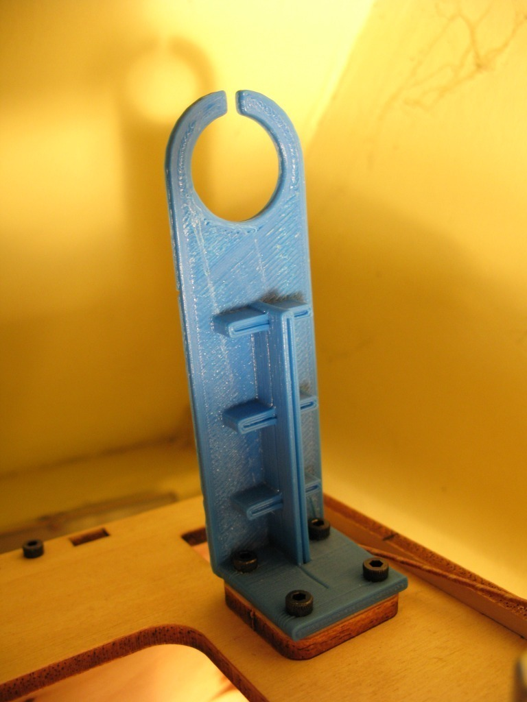
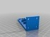
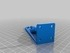
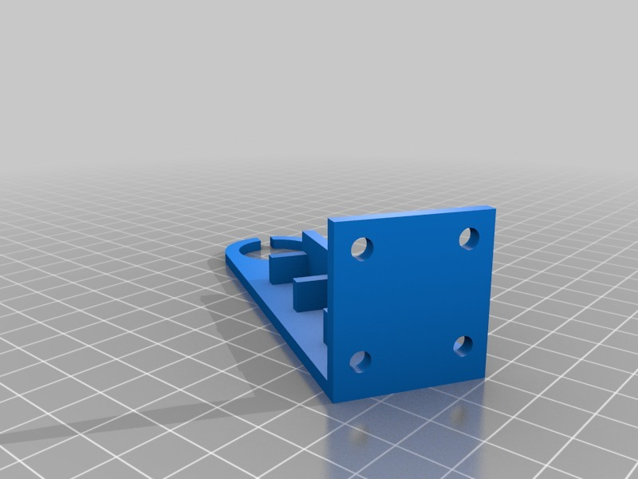
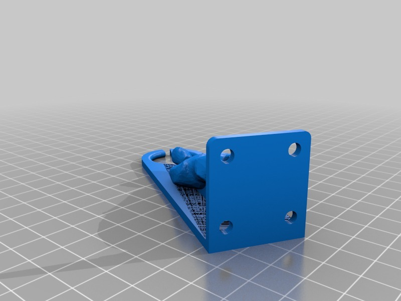

ToM filament guide
===============
**Please note: This thing is part of a list that was [automatically generated](https://github.com/carlosgs/export-things) and may have been updated since then. Make sure to check for the current license and authorship.**  

ToM filament guide  by MakeALot , published Apr 25, 2011

Description
--------
I needed a little more support around the base and to stop any twisting, so I added a few simple cubes to the original. 
 
<b>Dank je wel Paul!</b>

Instructions
--------
Unfortunately, OpenSCAD couldn't re-render the original STL, so I had to re-do the main parts, it isn't nearly as well finished as Paul De Bra's original, but it'll do me for the time being...

Files
--------

 [ GuideSta.scad](GuideSta.scad)  

 [ filamentLoop.stl](filamentLoop.stl)  

 [ GuideSta.stl](GuideSta.stl)  

 [ filament-loop.scad](filament-loop.scad)  

Pictures
--------

Tags
--------
gangsta , openscad  

  

License
--------
ToM filament guide by MakeALot is licensed under the Public Domain license.  

By: Mark Durbin (MakeALot)
--------
<http://NestedCube.com/>