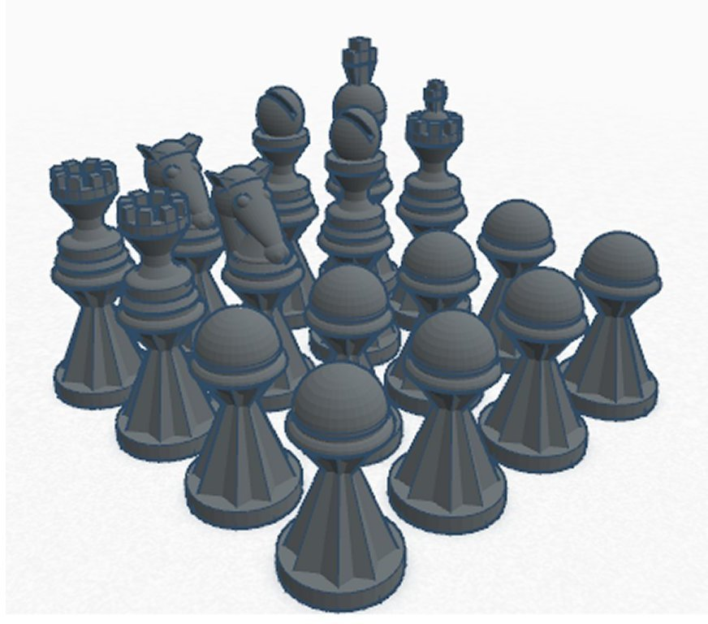
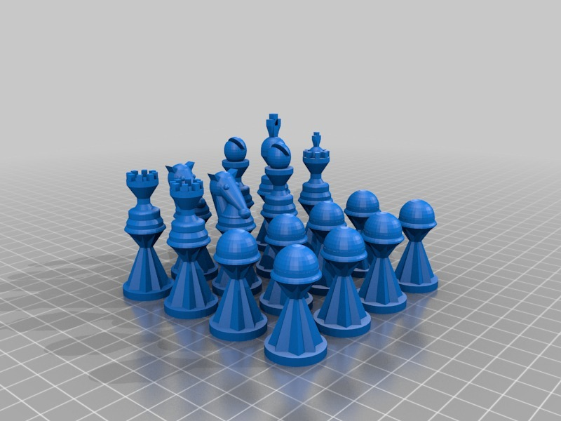
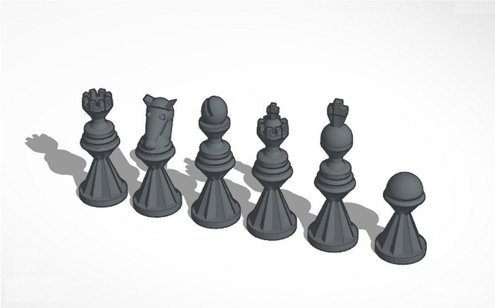

Trad #Chess
===============
**Please note: This thing is part of a list that was [automatically generated](https://github.com/carlosgs/export-things) and may have been updated since then. Make sure to check for the current license and authorship.**  

Trad #Chess  by MakeALot , published Mar 22, 2012

Description
--------
This part was made with Tinkercad. Edit the part online at: <a href="https://tinkercad.com/things/k5p2sqedQ4R" target="_blank" rel="nofollow">tinkercad.com/things/k5p2sqedQ4R</a>

Instructions
--------
Print, play.

Files
--------

 [ polysoup.stl](polysoup.stl)  

Pictures
--------

Tags
--------
Chess , TinkerCAD  

  

License
--------
Trad #Chess by MakeALot is licensed under the Creative Commons - Attribution license.  

By: Mark Durbin (MakeALot)
--------
<http://NestedCube.com/>