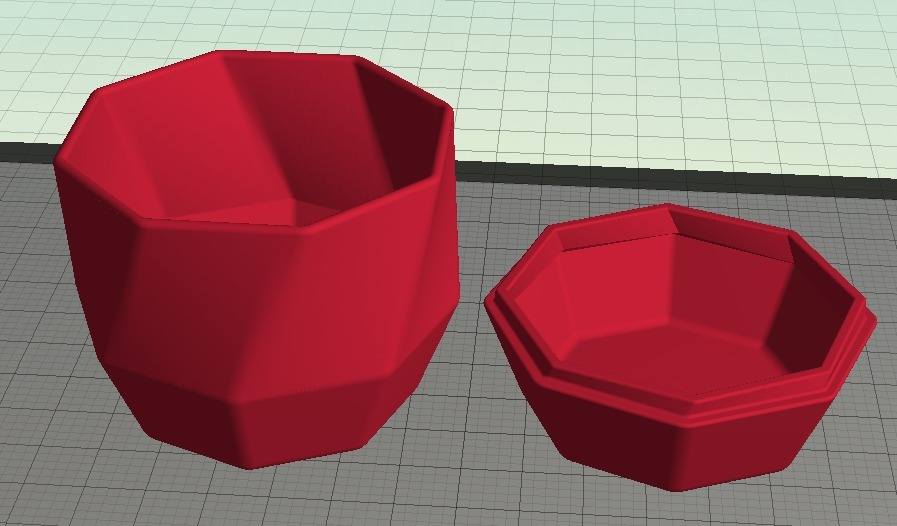
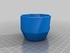
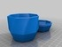
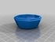
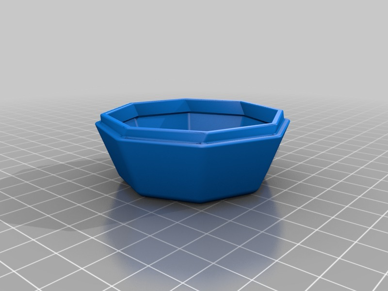
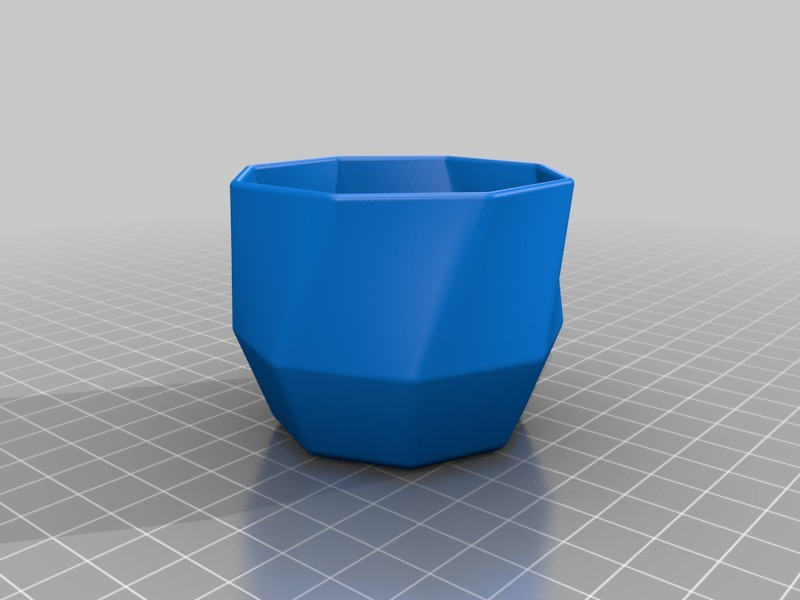
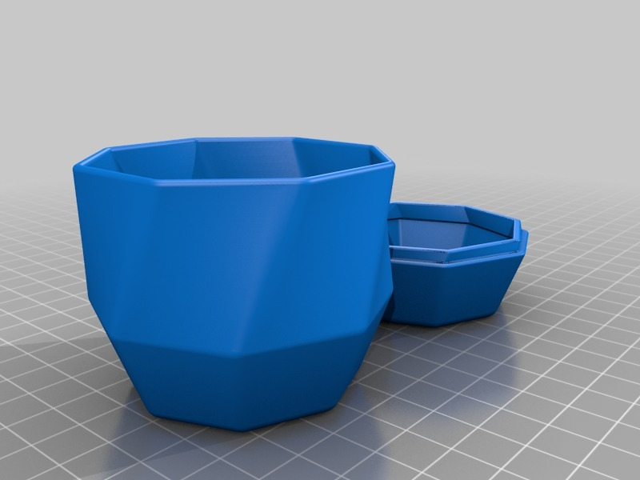
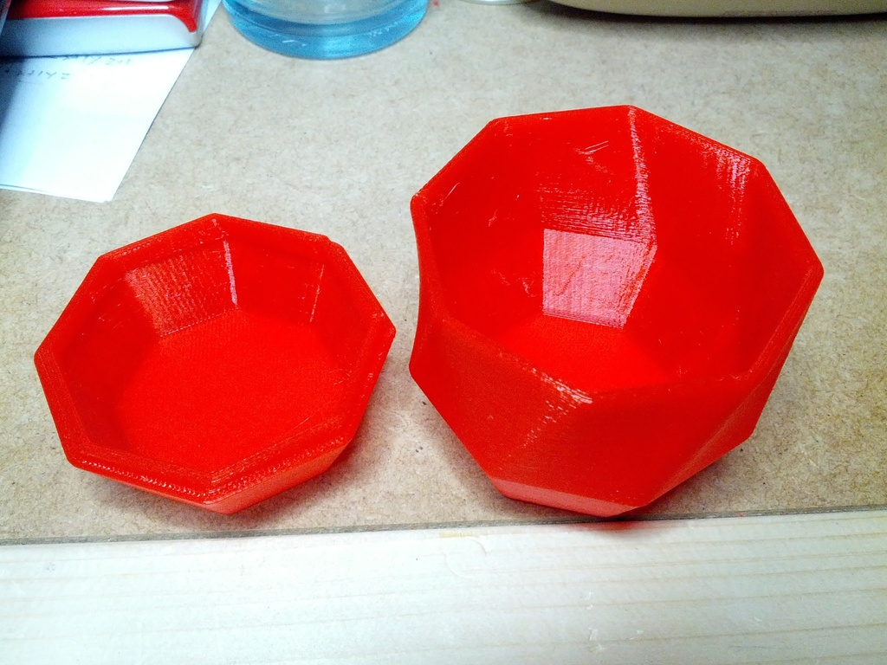
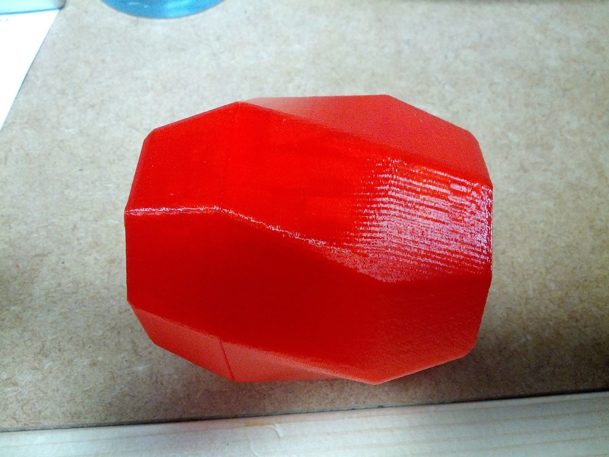

Twisted Octagonal Pot with Lid
===============
**Please note: This thing is part of a list that was [automatically generated](https://github.com/carlosgs/export-things) and may have been updated since then. Make sure to check for the current license and authorship.**  

Twisted Octagonal Pot with Lid  by MakeALot , published Sep 2, 2013

Description
--------
Small twisted octagonal container with straight tapered lid and base.   
 
Twist on lip of lid helps keep container closed.    
 
Approx 57 mm diameter 63 mm high with 2 mm walls.   
 
__ __   
 
Should scale up well if you'd like it bigger.   
 
Geomagic Design files included if you want to play.   
 
The one pictured was printed using Makerware with standard settings on a Replicator 2.

Instructions
--------
None

Files
--------

 [ LittleLid.AD_PRT](LittleLid.AD_PRT)  

 [ LittlePot.stl](LittlePot.stl)  

 [ LittlePot.AD_PRT](LittlePot.AD_PRT)  

 [ Little_Pot_and_Lid.stl](Little_Pot_and_Lid.stl)  

 [ LittleLid.stl](LittleLid.stl)  

Pictures
--------

Tags
--------
Box , Lid , Octagon , Octagonal , Pot , Twist  

  

License
--------
Twisted Octagonal Pot with Lid by MakeALot is licensed under the Creative Commons - Attribution license.  

By: Mark Durbin (MakeALot)
--------
<http://NestedCube.com/>