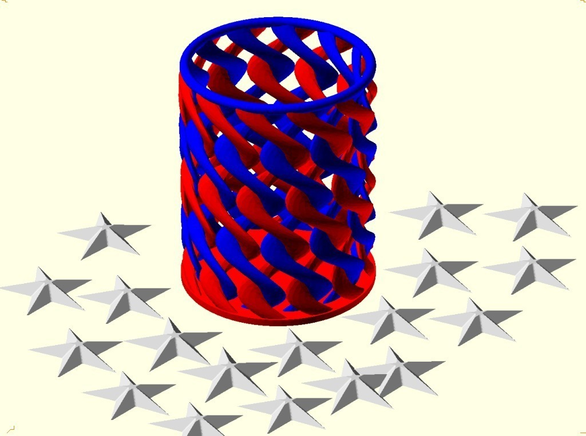
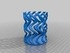
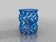
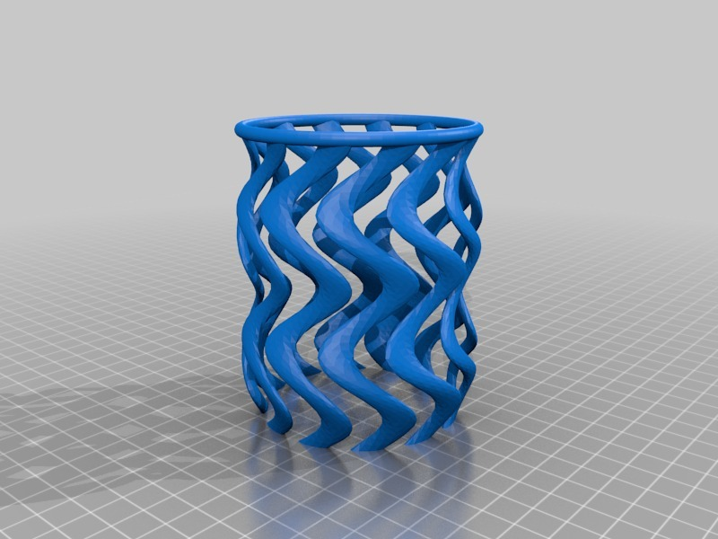
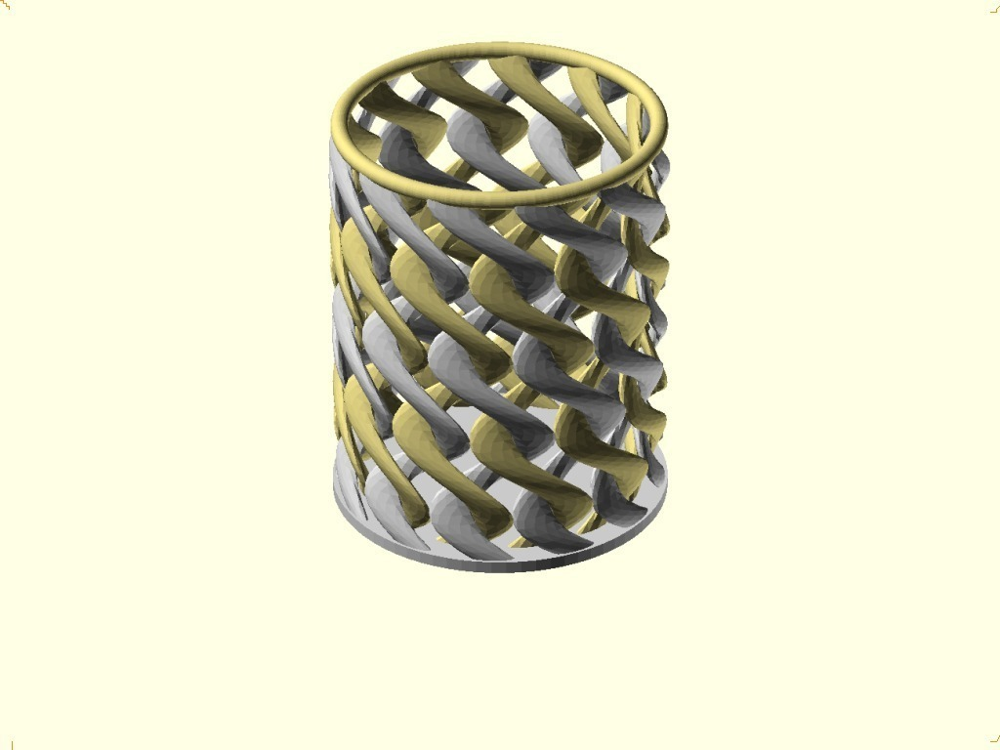
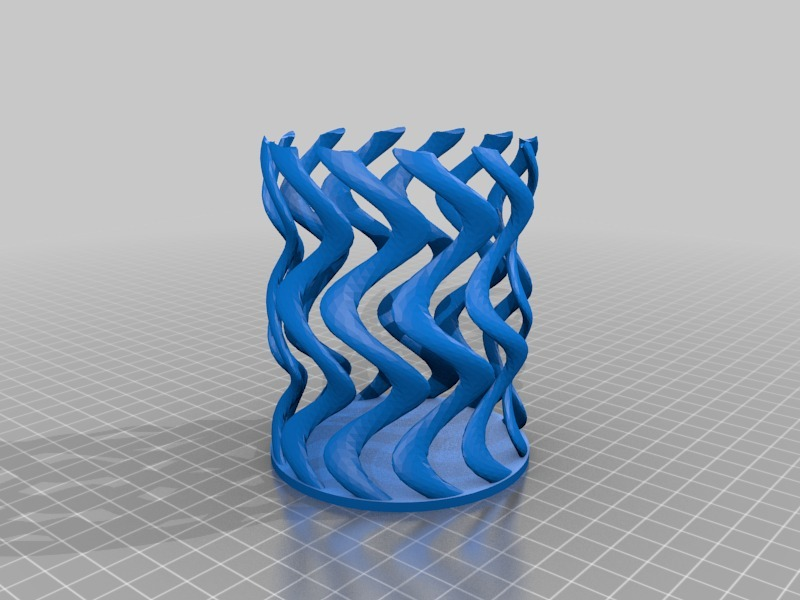

Two Colour(Color) Spiral Cup
===============
**Please note: This thing is part of a list that was [automatically generated](https://github.com/carlosgs/export-things) and may have been updated since then. Make sure to check for the current license and authorship.**  

Two Colour(Color) Spiral Cup  by MakeALot , published Sep 19, 2011

Description
--------
An updated version of the spiral cup for those of you lucky enough to be able to print in <b>stereo 3D!</b> 
 
You could print it in red and blue and fill with silver (or white) starts for US based patriotic occasions. see:  <a href="http://www.thingiverse.com/thing:5014" target="_blank" rel="nofollow">thingiverse.com/thing:5014</a> for stars - scale at 50%. imprint your phone number or a stick a QRCode on the back of each star as a hand out, or fill with star shaped candies/mints. 
 
Or maybe print in Silver and Gold... 
 
<b><big>Note for "would be" stereo STL generators:</big></b> 
I originally uploaded the base and top STL files after generating them using OpenSCAD. It quickly occurred to me that I hadn't thought about any overlapping regions between the two STLs.  In the original combined STL, any overlapping objects in the scene would automatically become union-ed. But, in a two colour print, these areas would have both materials dispensed.  I revised the base STL by subtracting (difference) the top STL from it prior to uploading.  
 
so, instead of: 
<b>pencilCup(true);</b> in one STL and  
<b>pencilCup(false);</b> in the other. 
 
I should have used:  
<b>pencilCup(true);</b> in one STL and  
<b>difference() { pencilCup(false); pencilCup(true); } </b> in the other.

Instructions
--------
As far as I can see, the experimental ToM MK7++++ dualtastic revision to RepG takes two (yes two!) STL files.  These combine to become more than the sum of their parts... 
 
<i>alternatively: Print them separately and spend hours trying to weave the two parts together, then glue all the broken bits and the joins together. </i>

Files
--------

 [ linkCupBase.stl](linkCupBase.stl)  

 [ linkCup.scad](linkCup.scad)  

 [ linkCupTop.stl](linkCupTop.stl)  

Pictures
--------

Tags
--------
candle , dual , openscad , pencil , spiral , toothbrush , 2color , cup , dual extruder , dual extrusion , dual material , dualstrusion , featured  

  

License
--------
Two Colour(Color) Spiral Cup by MakeALot is licensed under the Creative Commons - Attribution - Non-Commercial license.  

By: Mark Durbin (MakeALot)
--------
<http://NestedCube.com/>