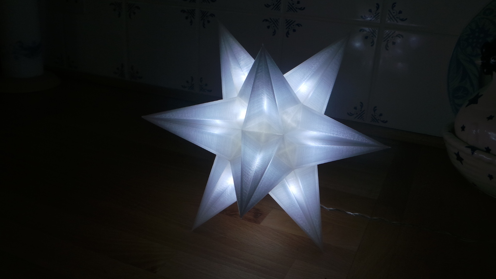
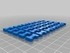
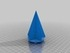
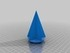
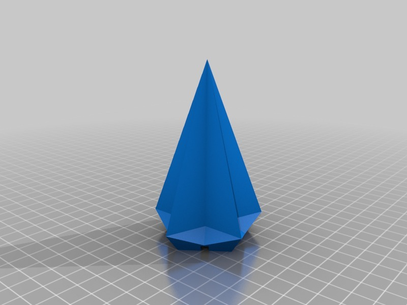
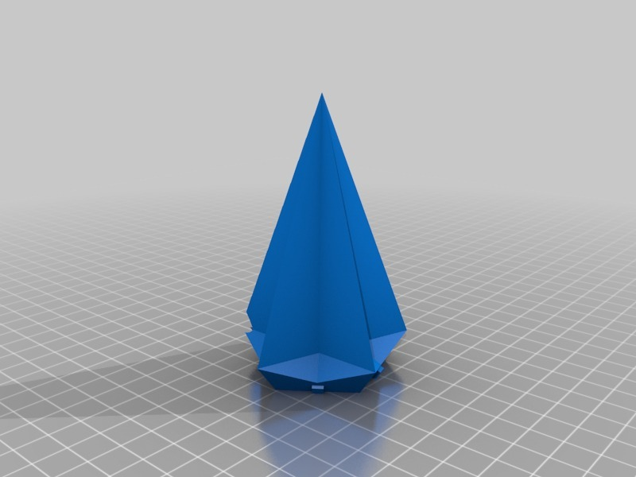
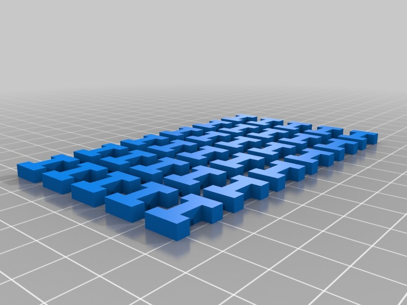
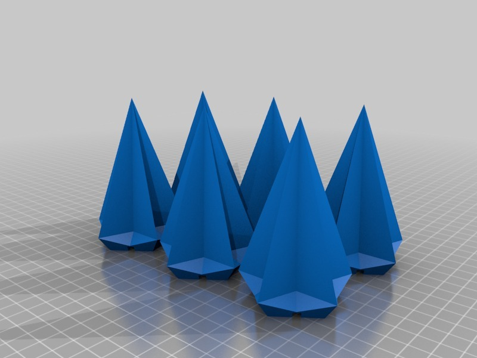
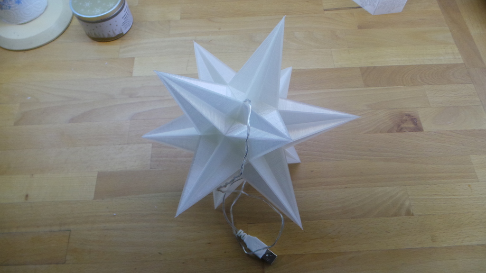
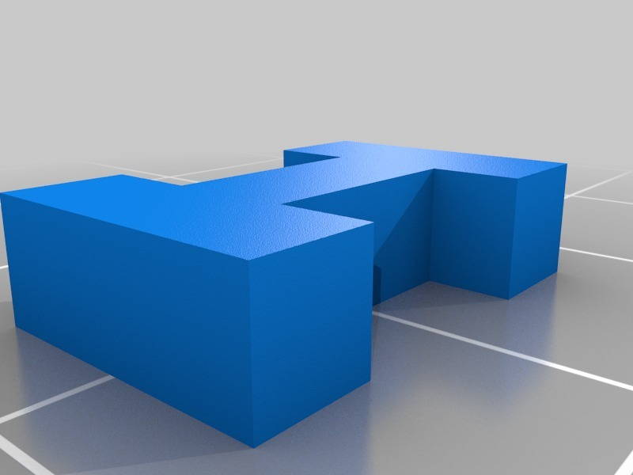

USB Christmas star - No Glue + LED holes
===============
**Please note: This thing is part of a list that was [automatically generated](https://github.com/carlosgs/export-things) and may have been updated since then. Make sure to check for the current license and authorship.**  

USB Christmas star - No Glue + LED holes  by MakeALot , published Dec 24, 2012

Description
--------
Just a quick mash-up in OpenSCAD of Paul Murrin's excellent star to enable me to join the pieces together without glue and insert LEDs into the points 
 
I printed this with %0 fill, 3 shells at 0.2mm layer height, 120mm/s travel on a Replicator2 in natural PLA. Each point takes about an hour.

Instructions
--------
Print 11 points, 1 base, 25 connectors. 
Get one cheap (2.99) set of USB 20 LED fairy lights like these: 
<a href="http://www.lights4fun.co.uk/i/q/USB-04-W/20-led-white-usb-fairy-lights-19m-length" target="_blank" rel="nofollow">lights4fun.co.uk/i/q/USB-04-W/20-led-white-usb-fairy-lights-19m-length</a> 
 
Insert an LED into each point as you push the connectors between the points. 
Finish by inserting the 8 spare LEDs into the cavity and then push the base into place making sure you place the cable in the slot. 
 
If you want to modify the SCAD file, you will need to download Paul's original STL file.

Files
--------

 [ ChrsistmasStarConX30.stl](ChrsistmasStarConX30.stl)  

 [ ChrsistmasStarX6.stl](ChrsistmasStarX6.stl)  

 [ ChrsistmasStar.scad](ChrsistmasStar.scad)  

 [ ChrsistmasStarBase.stl](ChrsistmasStarBase.stl)  

 [ ChrsistmasStarConX1.stl](ChrsistmasStarConX1.stl)  

 [ ChrsistmasStar.stl](ChrsistmasStar.stl)  

Pictures
--------

Tags
--------
christmas , lamp , LED , OpenSCAD , star  

  

License
--------
USB Christmas star - No Glue + LED holes by MakeALot is licensed under the Creative Commons - Attribution license.  

By: Mark Durbin (MakeALot)
--------
<http://NestedCube.com/>