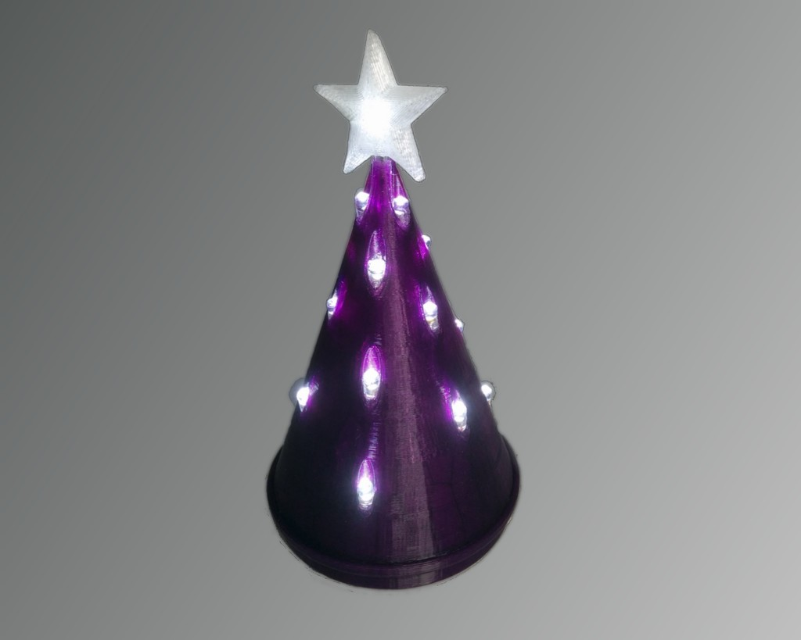
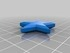
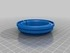
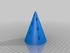
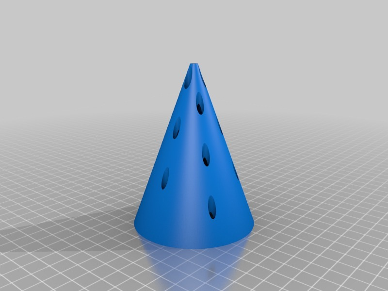
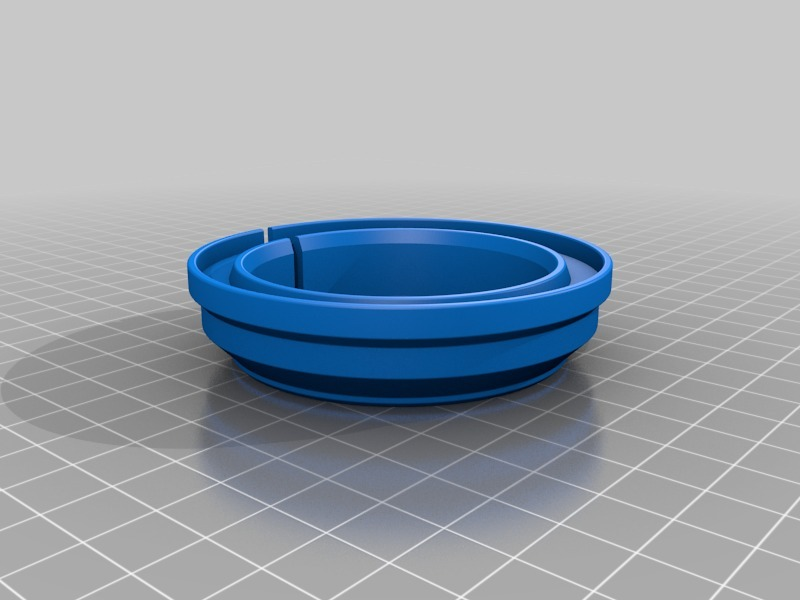
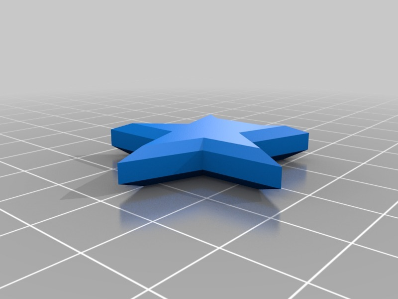
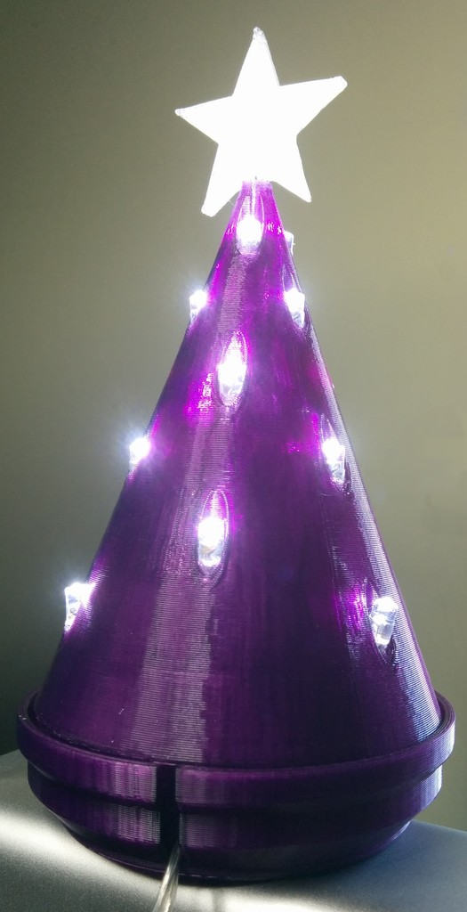

USB LED Cone
===============
**Please note: This thing is part of a list that was [automatically generated](https://github.com/carlosgs/export-things) and may have been updated since then. Make sure to check for the current license and authorship.**  

USB LED Cone  by MakeALot , published Nov 22, 2013

Description
--------
In preparation for December, take a USB 20 LED set and insert it into this cone for a festive desktop.   
 
It will look good with white or multi-colour LEDs   
 
I printed this one with Makerbot Translucent Purple and Talman T-Glase for the star.  I'm sure it would look equally good with an opaque cone and clear PLA star.

Instructions
--------
I used some cheap LEDs something like these:   
<a href="http://www.lights4fun.co.uk/i/q/USB-04-W/20-led-white-usb-fairy-lights-19m-length" target="_blank" rel="nofollow">lights4fun.co.uk/i/q/USB-04-W/20-led-white-usb-fairy-lights-19m-length</a>  
 
Insert the top LED and place the Star on it, then insert the remaining LEDs working from the top to the base.  Place the spare LED in inside the tree and align the wire with the slot in the base before placing on your desk - the envy of all your colleagues.

Files
--------

 [ LEDStar.AD_PRT](LEDStar.AD_PRT)  

 [ ConeBase.AD_PRT](ConeBase.AD_PRT)  

 [ LEDStar.stl](LEDStar.stl)  

 [ ConeAssy.AD_ASM](ConeAssy.AD_ASM)  

 [ LedCone.AD_PRT](LedCone.AD_PRT)  

 [ ConeBase.stl](ConeBase.stl)  

 [ LedCone.stl](LedCone.stl)  

Pictures
--------

Tags
--------
Christmas , Cone , Desktop , Holiday , LED , MakerBotOrnaments , Ornament , USB , XMAS  

  

License
--------
USB LED Cone by MakeALot is licensed under the Creative Commons - Attribution license.  

By: Mark Durbin (MakeALot)
--------
<http://NestedCube.com/>