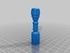

Who #Chess
===============
**Please note: This thing is part of a list that was [automatically generated](https://github.com/carlosgs/export-things) and may have been updated since then. Make sure to check for the current license and authorship.**  

Who #Chess  by MakeALot , published Mar 23, 2012

Description
--------
This part was made with Tinkercad. Edit the part online at: <a href="https://tinkercad.com/things/0MwyiZlIbb8" target="_blank" rel="nofollow">tinkercad.com/things/0MwyiZlIbb8</a> 
 
I've added a picture of the first print of the Dalek, this came out much better than I expected, could do with a little tweak, but not bad.   
 
My son now wants an army of these!

Instructions
--------
Print, try and find someone in the same time to play with. 
 
I found some of the bases of the items were a little messy once converted to gcode, so I ran the full set through netfabb and I've uploaded the "fixed" version which prints much more cleanly. (in the zip file)

Files
--------

 [ who_chess_rook.stl](who_chess_rook.stl)  

 [ who_chess_pawn.stl](who_chess_pawn.stl)  

 [ who_chess_queen.stl](who_chess_queen.stl)  

 [ who_chess_bishop.stl](who_chess_bishop.stl)  

 [ FullSet_fixed.zip](FullSet_fixed.zip)  

 [ who_chess_full_plate.stl](who_chess_full_plate.stl)  

 [ polysoup.stl](polysoup.stl)  

 [ who_chess_king.stl](who_chess_king.stl)  

 [ who_chess_knight.stl](who_chess_knight.stl)  

Pictures
--------

Tags
--------
Chess , Doctor_who , Dr_Who , TinkerCAD  

  

License
--------
Who #Chess by MakeALot is licensed under the Creative Commons - Attribution license.  

By: Mark Durbin (MakeALot)
--------
<http://NestedCube.com/>