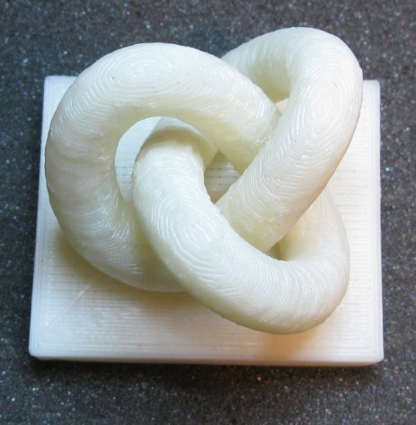
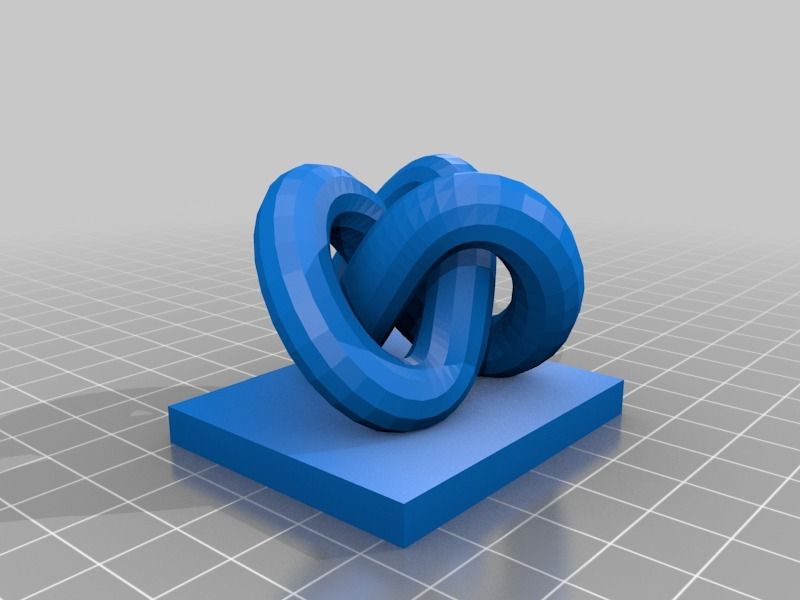

3D Knot
===============
**Please note: This thing is part of a list that was [automatically generated](https://github.com/carlosgs/export-things) and may have been updated since then. Make sure to check for the current license and authorship.**  

3D Knot  by MakeALot , published Jan 9, 2011

Description
--------
3d Knot printed on a Thing-O-Matic 50x40x40 mm

Instructions
--------
just load the STL, generate the GCode and print. Oh, and then clean up the print...

Files
--------

 [ 3D_Knot.stl](3D_Knot.stl)  

Pictures
--------

Tags
--------
Knot , Knot Theory  

  

License
--------
3D Knot by MakeALot is licensed under the BSD License license.  

By: Mark Durbin (MakeALot)
--------
<http://NestedCube.com/>