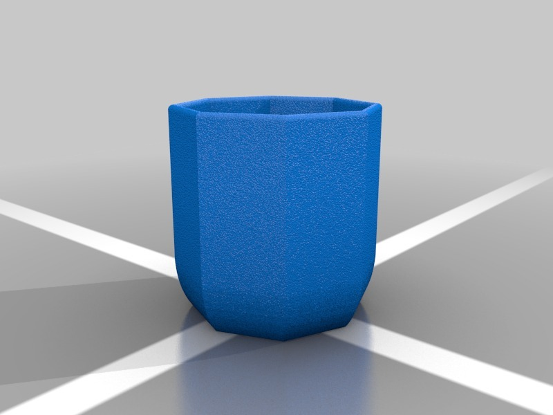

8 Sided Plant Pot - Customizer-able Containers
===============
**Please note: This thing is part of a list that was [automatically generated](https://github.com/carlosgs/export-things) and may have been updated since then. Make sure to check for the current license and authorship.**  

8 Sided Plant Pot - Customizer-able Containers  by MakeALot , published Jan 9, 2013

Description
--------
Customized version of <a href="http://www.thingiverse.com/thing:41148" target="_blank" rel="nofollow">thingiverse.com/thing:41148</a> 
 
Created with Customizer! <a href="http://www.thingiverse.com/apps/customizer/run?thing_id=41148" target="_blank" rel="nofollow">thingiverse.com/apps/customizer/run?thing_id=41148</a> 
 

Instructions
--------
Using the following options: 
 
numberSides = 8 
potShape = 7 

Files
--------

 [ receptacle.scad20130109-26476-1efgwb9-0.stl](receptacle.scad20130109-26476-1efgwb9-0.stl)  

Tags
--------
customized  

  

License
--------
8 Sided Plant Pot - Customizer-able Containers by MakeALot is licensed under the Creative Commons - Attribution - Share Alike license.  

By: Mark Durbin (MakeALot)
--------
<http://NestedCube.com/>