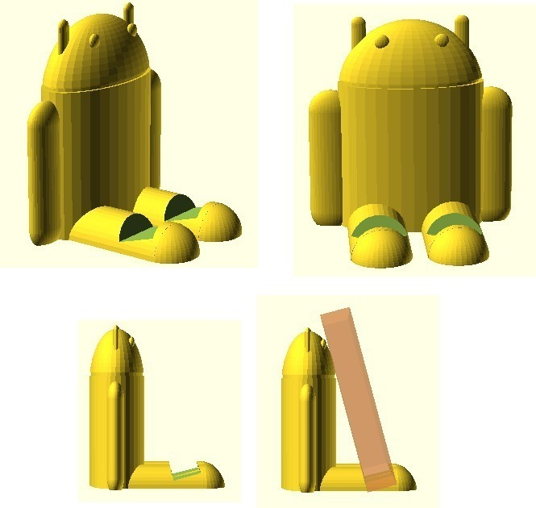
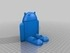
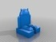
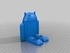
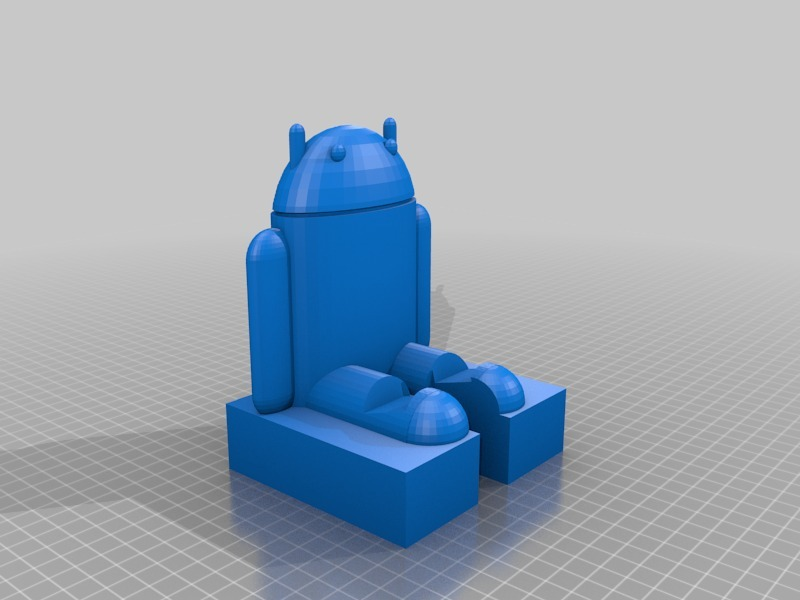
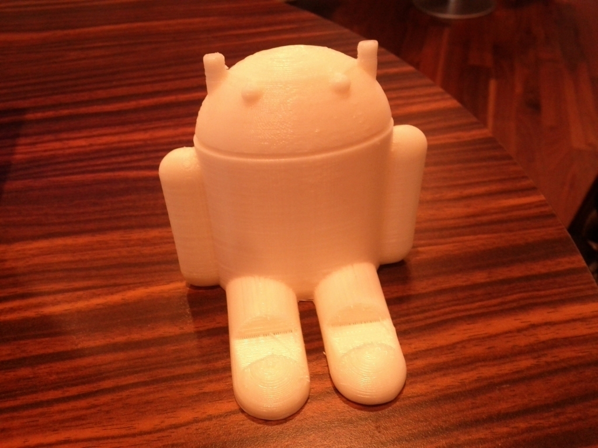
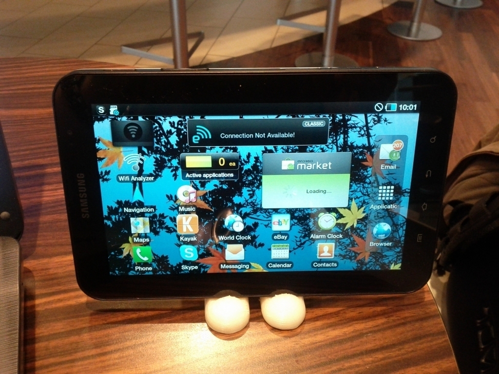
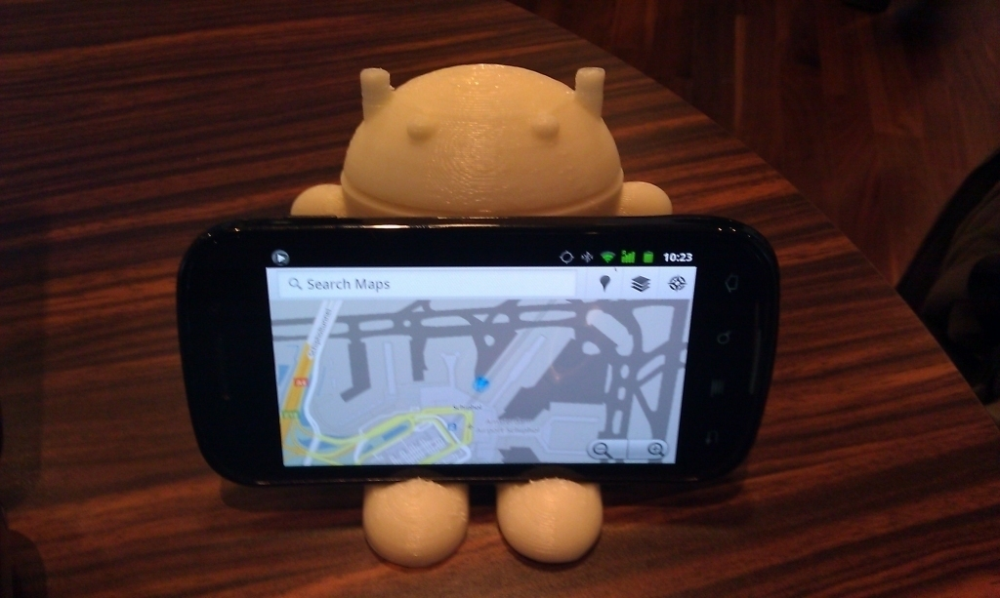
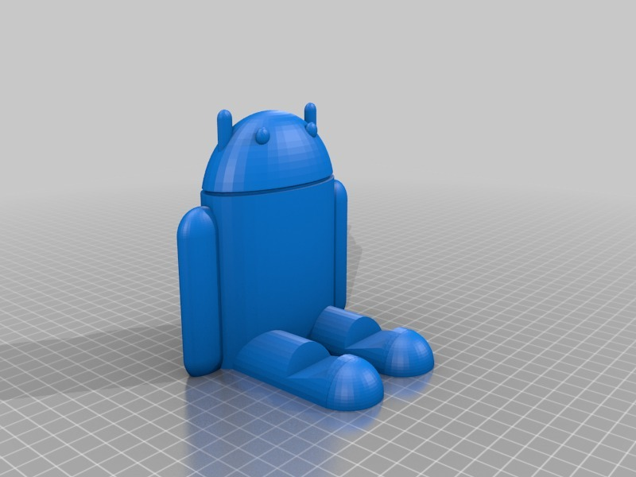
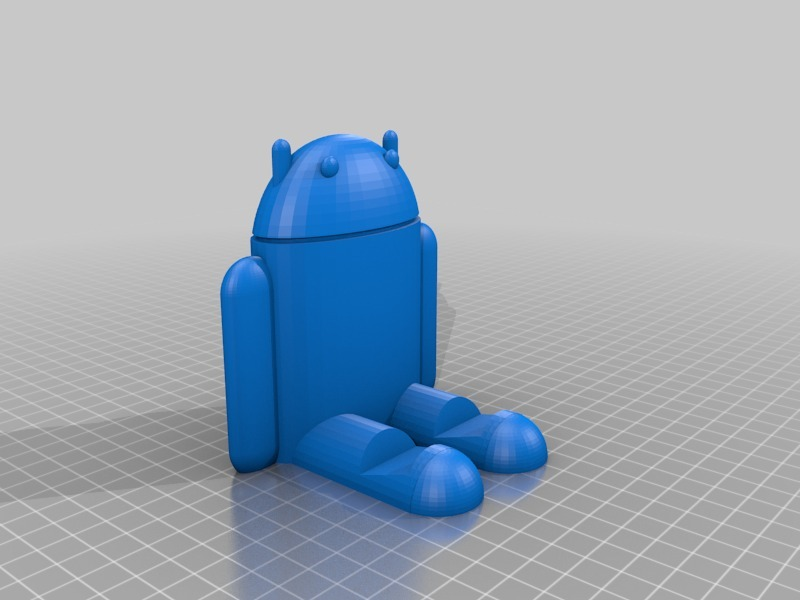

Android Device Rest
===============
**Please note: This thing is part of a list that was [automatically generated](https://github.com/carlosgs/export-things) and may have been updated since then. Make sure to check for the current license and authorship.**  

Android Device Rest  by MakeALot , published Jan 30, 2011

Description
--------
Stand for Android devices (full of lovely Honeycomb)

Instructions
--------
Print and use...

Files
--------

 [ AndroidDeviceRest.scad](AndroidDeviceRest.scad)  

 [ AndroidDeviceRest_100x100x100.stl](AndroidDeviceRest_100x100x100.stl)  

 [ AndroidDeviceRestOnBlock.scad](AndroidDeviceRestOnBlock.scad)  

 [ DroidOnBlock.stl](DroidOnBlock.stl)  

 [ AndroidDeviceRest.stl](AndroidDeviceRest.stl)  

Pictures
--------

Tags
--------
android , openscad , stand  

  

License
--------
Android Device Rest by MakeALot is licensed under the BSD License license.  

By: Mark Durbin (MakeALot)
--------
<http://NestedCube.com/>