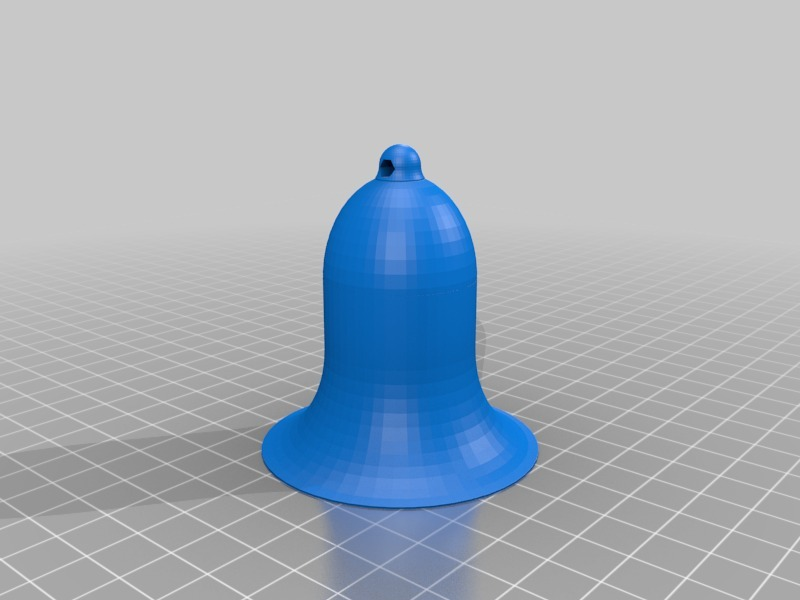
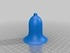
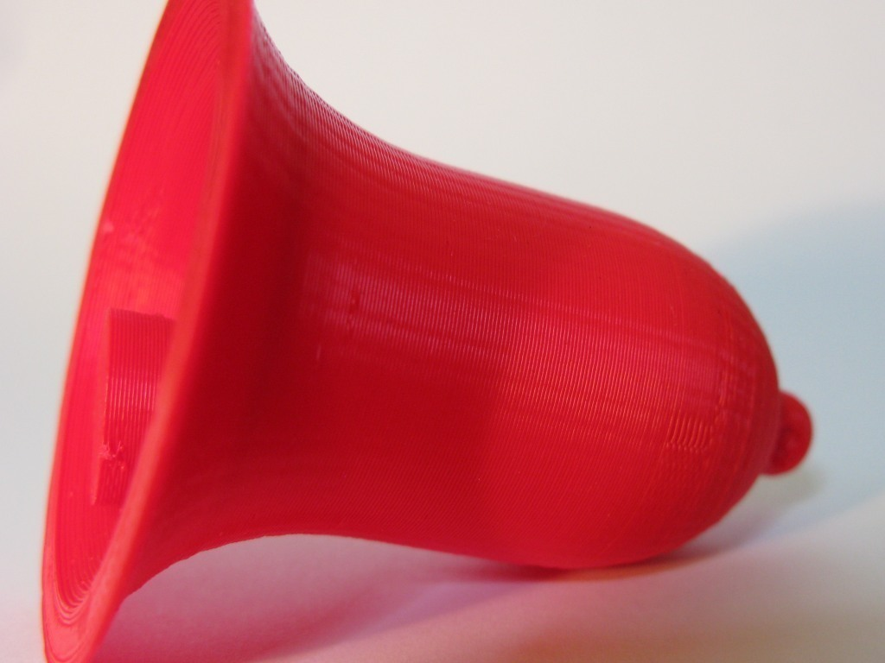
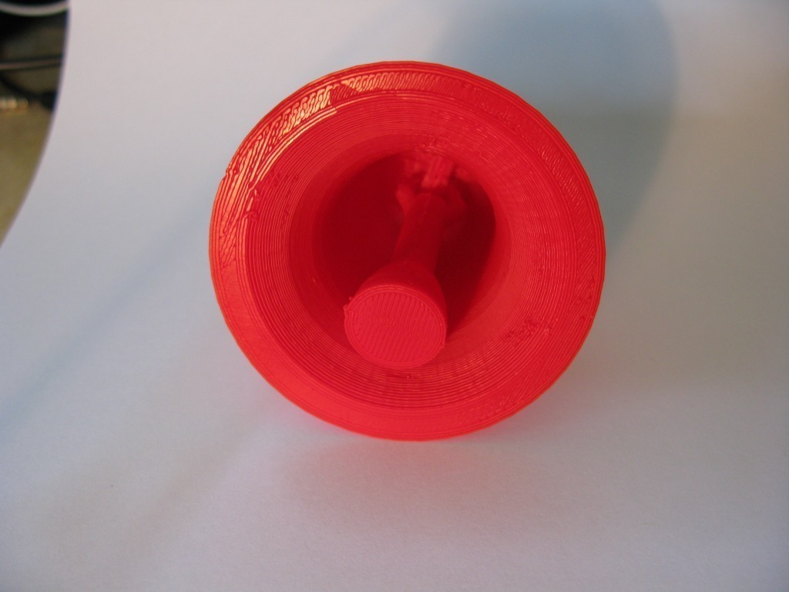
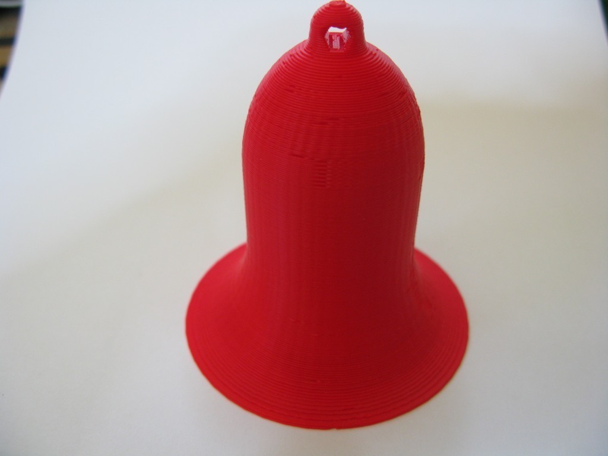
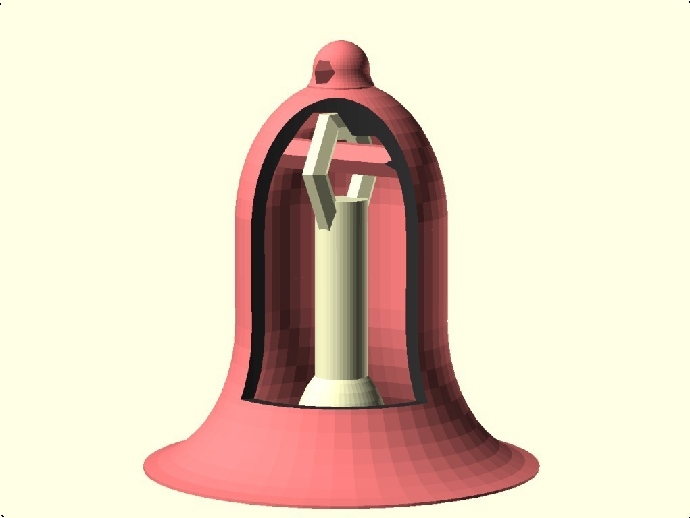
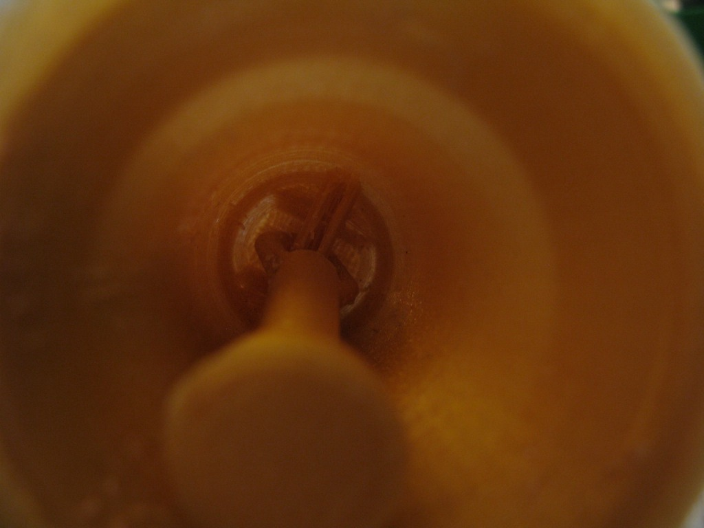
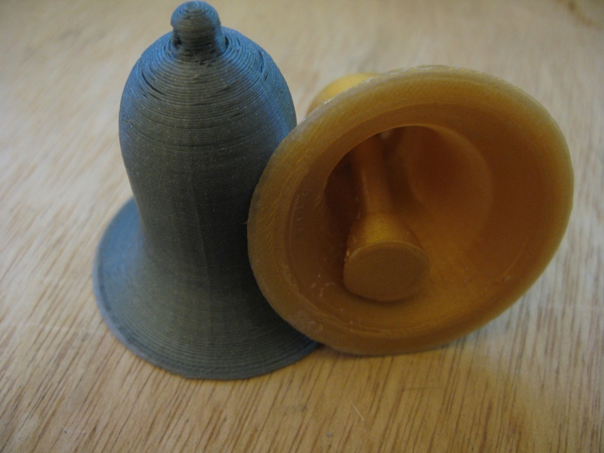

Bell with integral clapper
===============
**Please note: This thing is part of a list that was [automatically generated](https://github.com/carlosgs/export-things) and may have been updated since then. Make sure to check for the current license and authorship.**  

Bell with integral clapper  by MakeALot , published Sep 14, 2011

Description
--------
Bell with integral clapper - print in one piece.

Instructions
--------
print and ring (well, rattle).

Files
--------

 [ BellWithClapper.stl](BellWithClapper.stl)  

 [ BellWithClapper.scad](BellWithClapper.scad)  

Pictures
--------

Tags
--------
bell , featured , openscad  

  

License
--------
Bell with integral clapper by MakeALot is licensed under the Creative Commons - Attribution license.  

By: Mark Durbin (MakeALot)
--------
<http://NestedCube.com/>