Bells or Bowls
===============
**Please note: This thing is part of a list that was [automatically generated](https://github.com/carlosgs/export-things) and may have been updated since then. Make sure to check for the current license and authorship.**  

Bells or Bowls  by MakeALot , published Sep 13, 2011

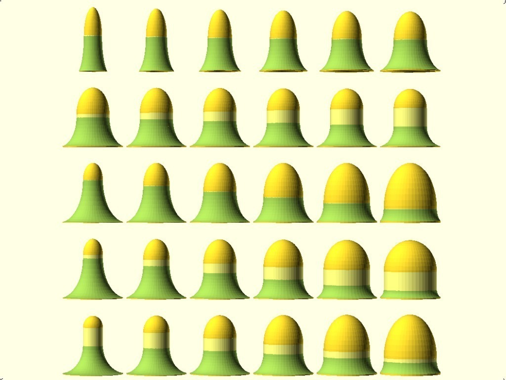

Description
--------
Bell function for adding to other OpenSCAD models. 
Not particularly elegant, but functional...

Instructions
--------
using the scad file, bell module: 
set <b>height</b> to the overall height of the bell in mm 
set <b>radius</b> to the outer radius of bell in mm 
set <b>thickness</b> to the thickness of bell wall in mm 
set <b>ratio</b> to the the ratio of top to bottom curves (between 0.4 and 1.75) 
set <b>centersectionlength</b> to the length of straight section inserted between the top and bottom in mm 
 
bell(20,10,2,1,0);

Files
--------
[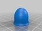](bell_20_10_2_1.6_4.stl)
 [ bell_20_10_2_1.6_4.stl](bell_20_10_2_1.6_4.stl)  

 [ bell_20_10_2_1_0.stl](bell_20_10_2_1_0.stl)  

[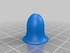](bell_20_10_2_1.2_2.stl)
 [ bell_20_10_2_1.2_2.stl](bell_20_10_2_1.2_2.stl)  

[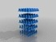](bells.stl)
 [ bells.stl](bells.stl)  

[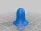](bell_20_10_2_1_4.stl)
 [ bell_20_10_2_1_4.stl](bell_20_10_2_1_4.stl)  

[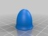](bell_20_10_2_1.6_0.stl)
 [ bell_20_10_2_1.6_0.stl](bell_20_10_2_1.6_0.stl)  

 [ Bell.scad](Bell.scad)  

Pictures
--------
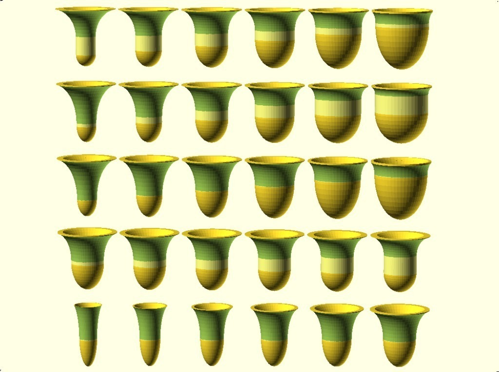
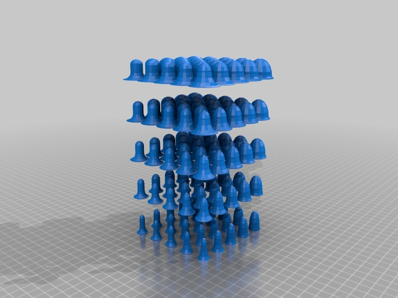
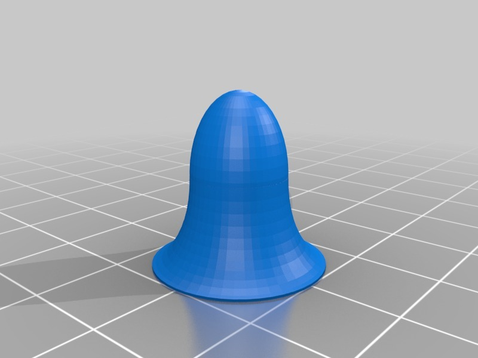
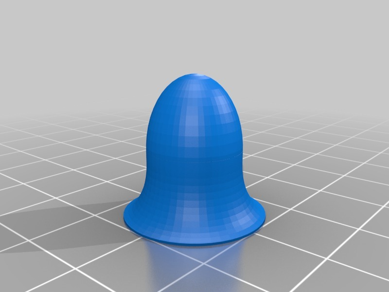
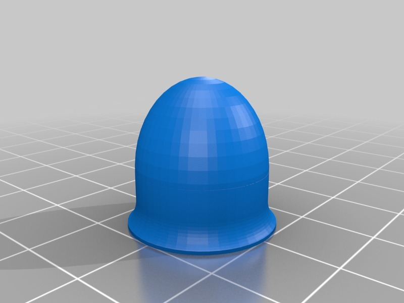
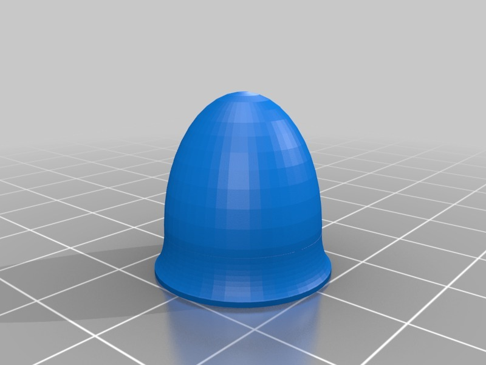
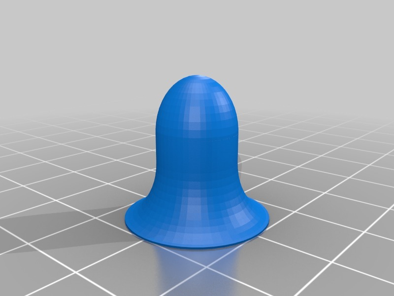

Tags
--------
bell , bowl , openscad  

  

License
--------
Bells or Bowls by MakeALot is licensed under the Creative Commons - Attribution license.  

By: Mark Durbin (MakeALot)
--------
<http://NestedCube.com/>