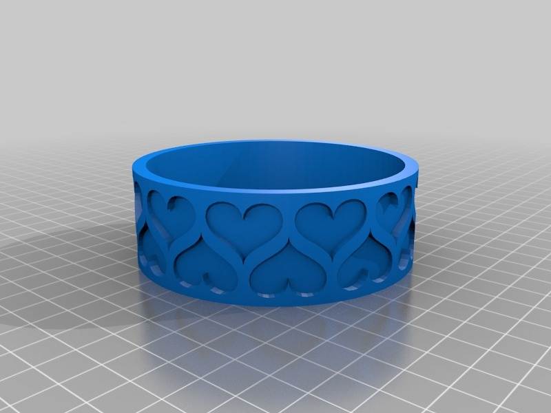
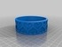
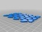
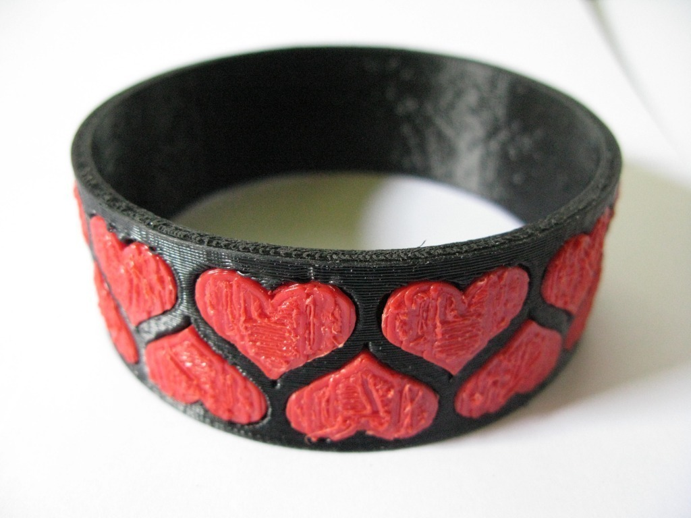
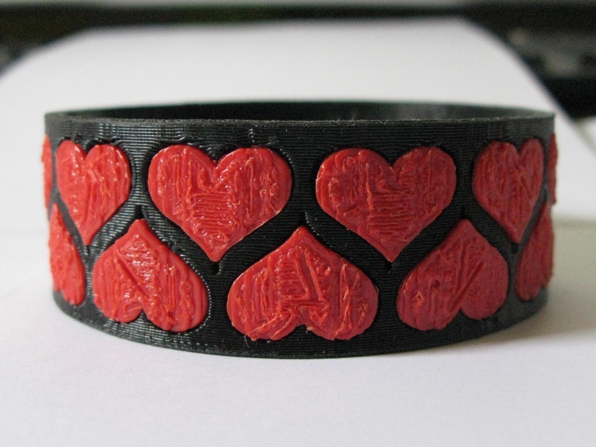
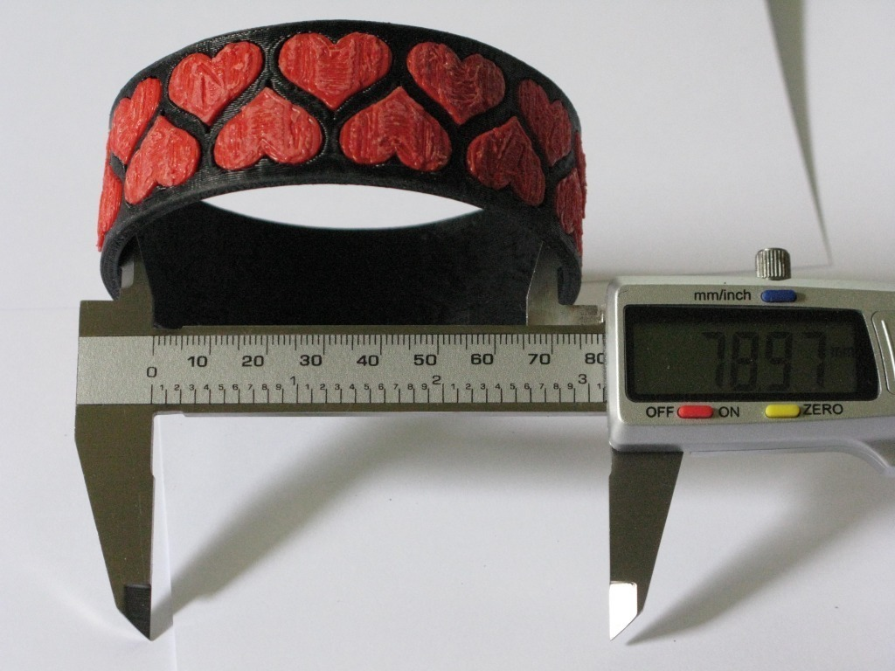

Bezier Heart Bracelet in OpenScad
===============
**Please note: This thing is part of a list that was [automatically generated](https://github.com/carlosgs/export-things) and may have been updated since then. Make sure to check for the current license and authorship.**  

Bezier Heart Bracelet in OpenScad  by MakeALot , published May 14, 2011

Description
--------
Hearts placed around a plain bracelet

Instructions
--------
Print raftless and trim the small amount of melt around the bottom of each heart.  The hearts have a flat back and the holes in the bracelet are flat backed.

Files
--------

 [ heartBracelet.stl](heartBracelet.stl)  

 [ heartsForBracelet.stl](heartsForBracelet.stl)  

 [ demo_heart.scad](demo_heart.scad)  

Pictures
--------

Tags
--------
bezier , heart , 2color , bracelet , openscad  

  

License
--------
Bezier Heart Bracelet in OpenScad by MakeALot is licensed under the Creative Commons - Attribution - Share Alike license.  

By: Mark Durbin (MakeALot)
--------
<http://NestedCube.com/>