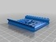
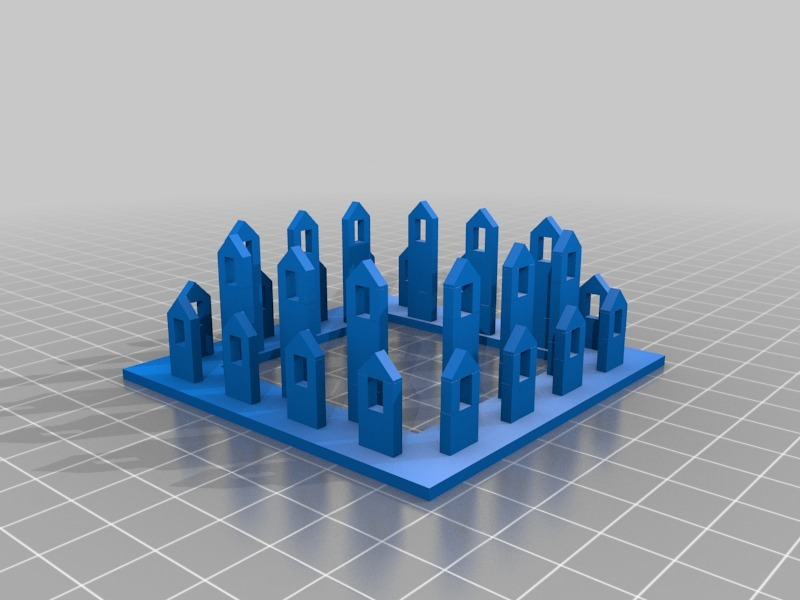

Big Ben
===============
**Please note: This thing is part of a list that was [automatically generated](https://github.com/carlosgs/export-things) and may have been updated since then. Make sure to check for the current license and authorship.**  

Big Ben  by MakeALot , published Nov 7, 2012

Description
--------
"Big Ben is the nickname for the great bell of the clock at the north end of the Palace of Westminster in London, often extended to refer to the clock and the clock tower, officially named Elizabeth Tower" - <a href="http://en.wikipedia.org/wiki/Big_Ben" target="_blank" rel="nofollow">en.wikipedia.org/wiki/Big_Ben</a>  
 

Instructions
--------
Print each part of the tower and 4 of each of the clock face parts. 
 
I'm still working on this and plan to have a LED in the clock, maybe even a working clock mechanism.  I'm sure there will be plenty of ideas for money box / lamp / clock and maybe even the rest of the palace of Westminster in time. 
 
It should print well enough on most printers. 
 
The finished model is approximately 600 mm tall, so scaled for a Replicator 2 it could be printed out around a meter tall! 
 
update: I've split the roof into 4 parts 8a-8d two gold and two grey. 
another update: I didn't like the originals when I printed them, I've adjusted the proportions and fixed a couple of missing fillets. 
 
The clock face is now thickened and split into 3 parts, white for the background, gold for the centre detail and black for the clock. 
 
The stonework is printed in buttercream PLA from Faberdashery. 
 
I've now finished printing it and posted all the updated files, so I've removed the work-in-progress flag. 
 
All the stl files are in the "Big Ben Parts.rar" file. 
 
See the exploded view for assembly.

Files
--------

 [ BigBen_Part2.stl](BigBen_Part2.stl)  

 [ BigBen_Part1.stl](BigBen_Part1.stl)  

 [ Big_Ben_Parts.rar](Big_Ben_Parts.rar)  

 [ BigBen_Part8c-2.stl](BigBen_Part8c-2.stl)  

 [ BigBen_Part4.stl](BigBen_Part4.stl)  

 [ BigBen_Part6.stl](BigBen_Part6.stl)  

 [ BigBen_Part5.stl](BigBen_Part5.stl)  

 [ BlackBigBenFace.stl](BlackBigBenFace.stl)  

 [ BigBen_Part8b-2.stl](BigBen_Part8b-2.stl)  

 [ GoldBigBenFace.stl](GoldBigBenFace.stl)  

 [ BigBenTop.stl](BigBenTop.stl)  

 [ BigBenBottom.stl](BigBenBottom.stl)  

 [ BigBen_Part7.stl](BigBen_Part7.stl)  

 [ BigBenAssembled.stl](BigBenAssembled.stl)  

 [ WhiteBigBenFace.stl](WhiteBigBenFace.stl)  

 [ BigBen_Part8a-2.stl](BigBen_Part8a-2.stl)  

 [ BigBen_Part3.stl](BigBen_Part3.stl)  

 [ BigBen_Part8d-2.stl](BigBen_Part8d-2.stl)  

Pictures
--------

Tags
--------
bigben , big_ben , clock , large , London  

  

License
--------
Big Ben by MakeALot is licensed under the Creative Commons - Attribution - Share Alike license.  

By: Mark Durbin (MakeALot)
--------
<http://NestedCube.com/>