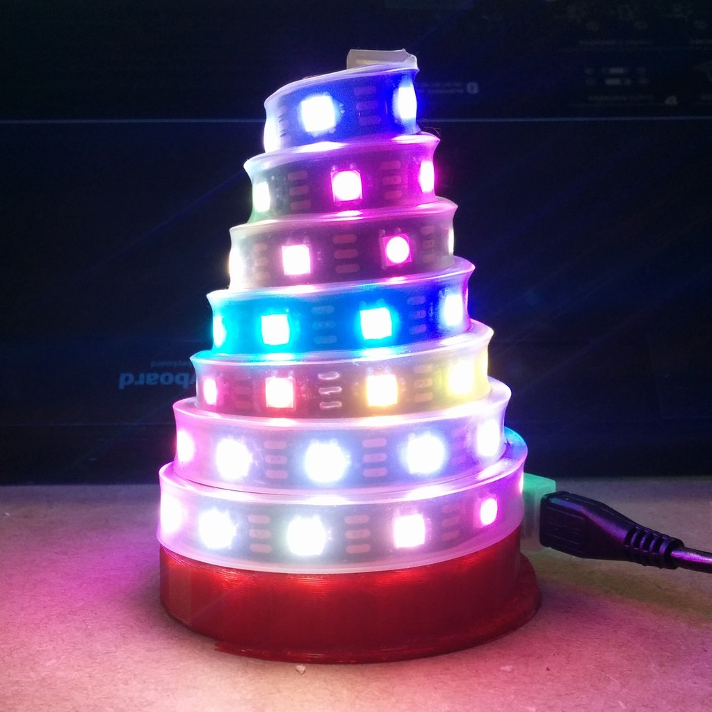
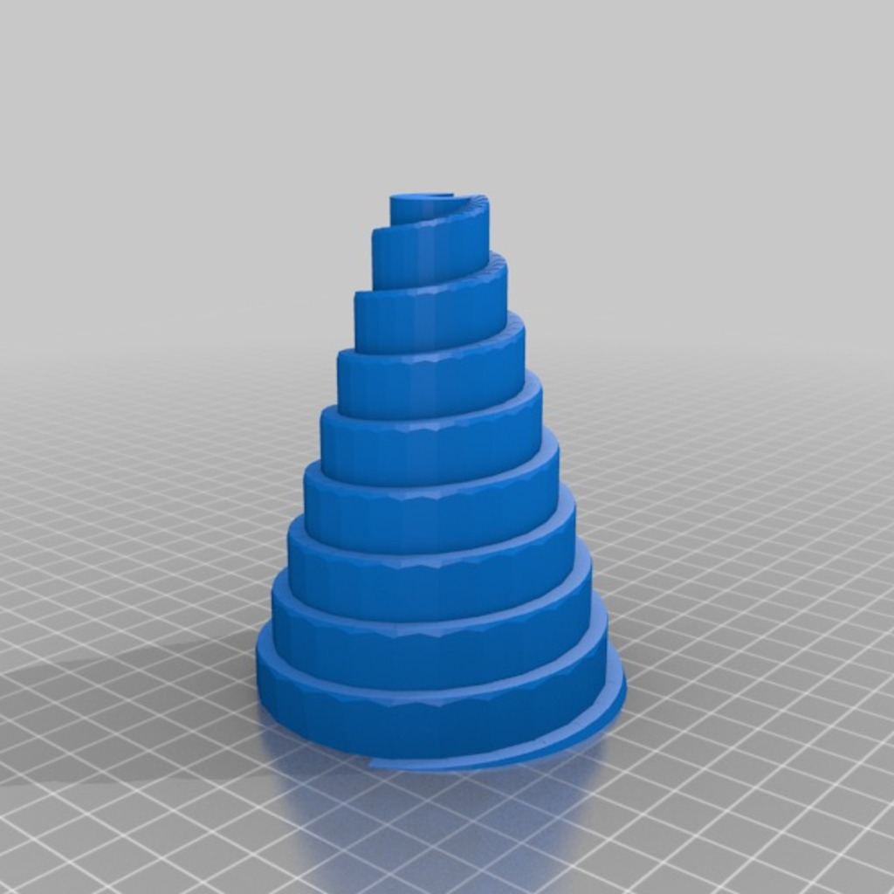
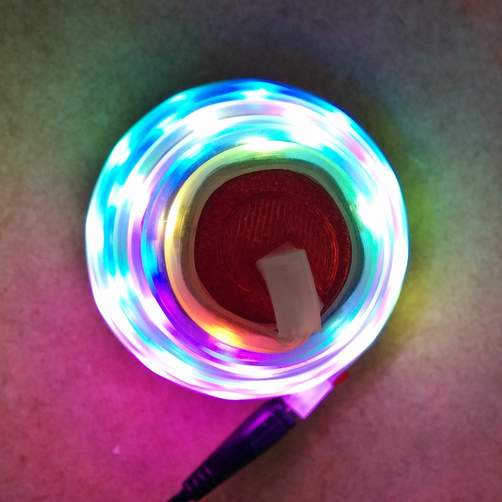
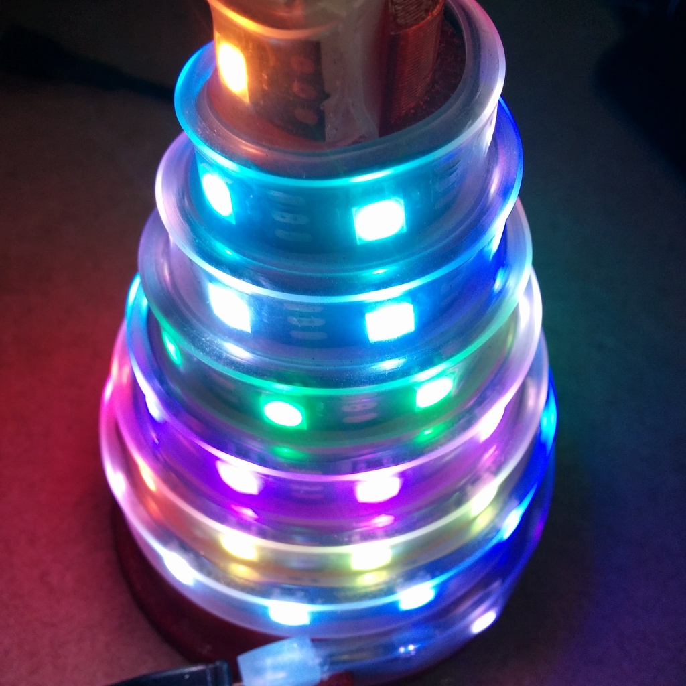

BlinkyTape Cone
===============
**Please note: This thing is part of a list that was [automatically generated](https://github.com/carlosgs/export-things) and may have been updated since then. Make sure to check for the current license and authorship.**  

BlinkyTape Cone  by MakeALot , published Dec 9, 2013

Description
--------
OK, so you've got your BlinkyTape and you need a BlinkyTape Christmas Tree decoration.   
 
Here's the structure, now program those sequences....   
 
<a href="http://blinkinlabs.com/blinkytape/" target="_blank" rel="nofollow">blinkinlabs.com/blinkytape/</a>  
 
I won't get a chance to program these until the weekend, but I'm thinking of sequencing the lights up and down the tree then in columns round the tree. I'd love to see any others you come up with (if you're that way inclined).   

Instructions
--------
I printed it with 2 perimeters and 0% fill at 0.32mm layer height in PLA on a Replicator 2

Files
--------

 [ BlinkyCone.stl](BlinkyCone.stl)  

 [ BlinkyCone.scad](BlinkyCone.scad)  

Pictures
--------

Tags
--------
Blinky , BlinkyLabs , BlinkyTape , Christmas , Cone , LED , Light , Tape , USB  

  

License
--------
BlinkyTape Cone by MakeALot is licensed under the Creative Commons - Attribution license.  

By: Mark Durbin (MakeALot)
--------
<http://NestedCube.com/>