Bolt Pencil Case
===============
**Please note: This thing is part of a list that was [automatically generated](https://github.com/carlosgs/export-things) and may have been updated since then. Make sure to check for the current license and authorship.**  

Bolt Pencil Case  by MakeALot , published Mar 13, 2011

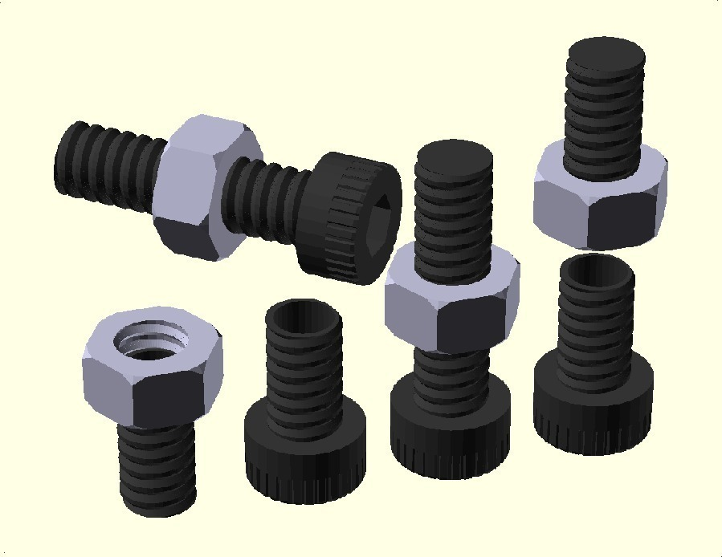

Description
--------
A bolt shaped pencil case 
 
After spending the weekend building and testing my new MK6 extruder, I had seen quite a few of these and needed to exorcize thoughts of them rolling across the floor. 
 
If you don't have an MK6, save up for one - they're fantastic!

Instructions
--------
<b>Print 2 @ ThreadedTube.stl 
Print 1 @ BoltHead.stl 
Print 1 @ Nut.stl</b> 
 
Don't print OneThread.stl, this is for use in OpenSCAD. 
 
Screw one tube into the head (blocking off the Hex slot with the blanked end of the tube) and screw the nut half onto the open end of the other tube.  Glue these in place (or leave them, for a 4 part pencil case). 
 
I printed the first threaded tube and found the sides of the thread a little too shallow causing too much overhang. I have adjusted the slope and regenerated the STL files.  Note, the Nut and Bolt Head are now threaded. 
 
I have now printed these revised versions so I have uploaded an image of the finished Bolt. I've uploaded all the files, I did need to adjust my feed rate down to stop the overhang strings (1.8) and I reduced the fill to 20% for the nut and the bolt head. 
 
Oh, my daughter insisted on blue, maybe one day, I'll have a black one of my own, I may even spray the nut silver, when I've got another 12 hours...

Files
--------
[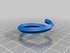](OneThread.stl)
 [ OneThread.stl](OneThread.stl)  

[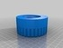](BoltHead.stl)
 [ BoltHead.stl](BoltHead.stl)  

[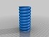](ThreadedTube.stl)
 [ ThreadedTube.stl](ThreadedTube.stl)  

 [ BoltPencilCase.scad](BoltPencilCase.scad)  

[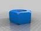](Nut.stl)
 [ Nut.stl](Nut.stl)  

Pictures
--------
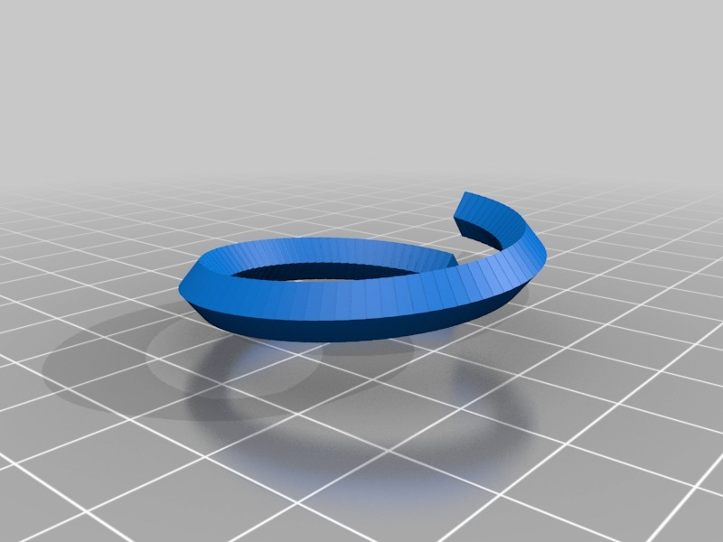
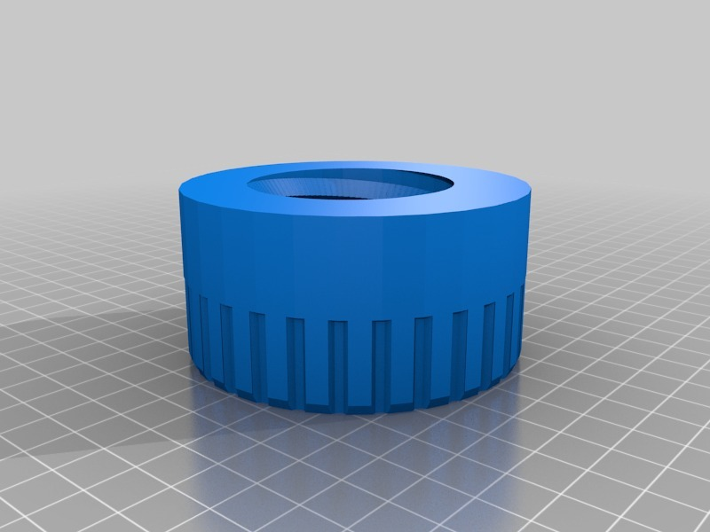
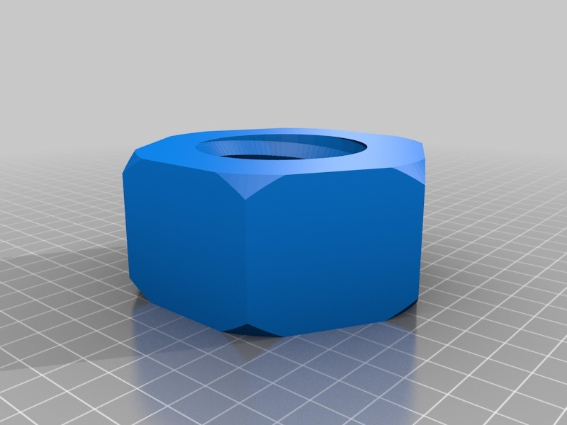
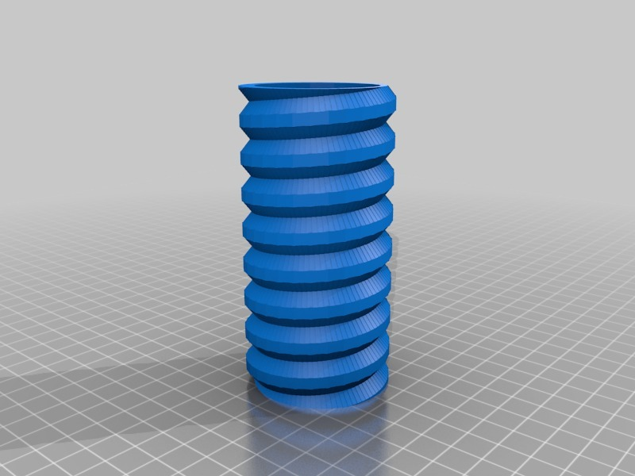
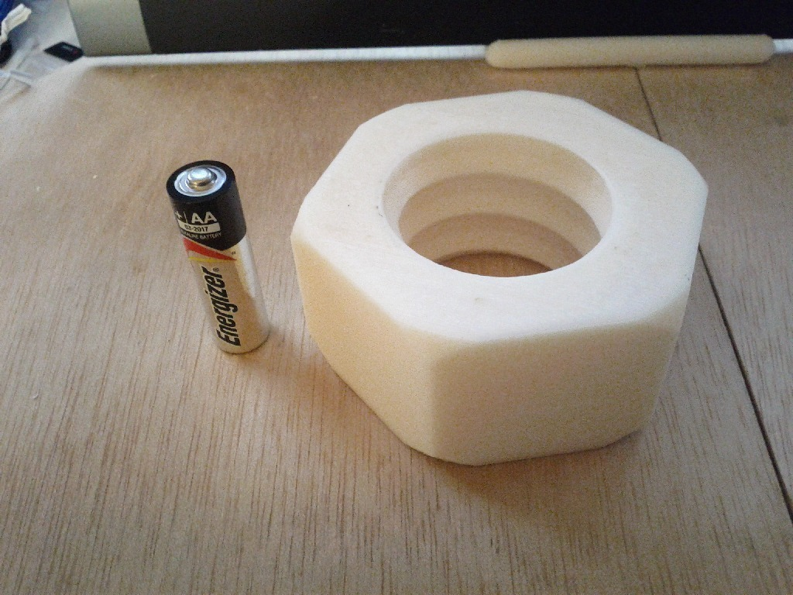
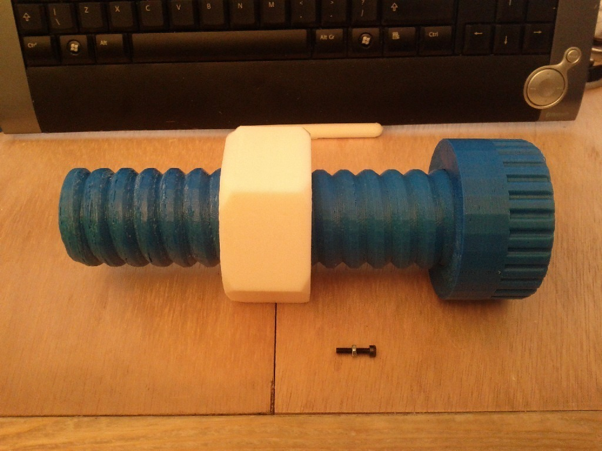

Tags
--------
Bolt , Case , openscad , Pencil , thread  

  

License
--------
Bolt Pencil Case by MakeALot is licensed under the BSD License license.  

By: Mark Durbin (MakeALot)
--------
<http://NestedCube.com/>