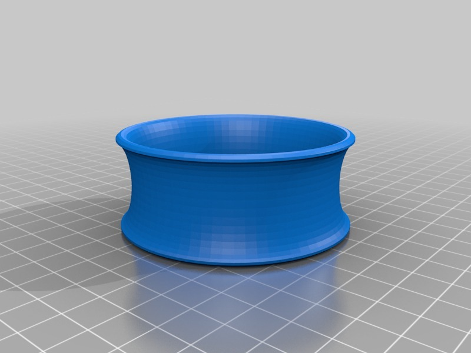
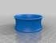
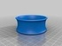
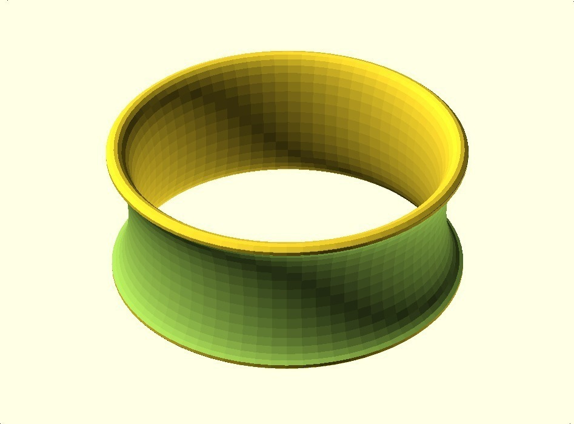
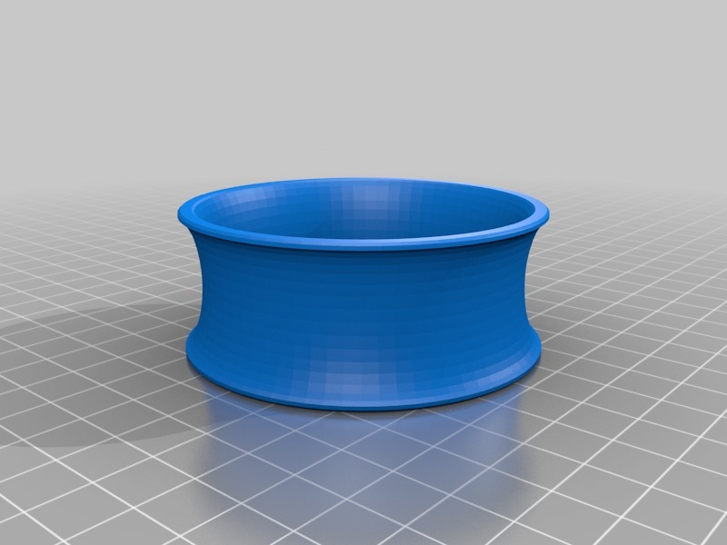

Bracelet III
===============
**Please note: This thing is part of a list that was [automatically generated](https://github.com/carlosgs/export-things) and may have been updated since then. Make sure to check for the current license and authorship.**  

Bracelet III  by MakeALot , published Mar 27, 2011

Description
--------
Concave bracelet

Instructions
--------
I can't see any reason why it wouldn't print well, but I'm away from my printer at the moment and so it's a work in progress.

Files
--------

 [ plainBracelet.scad](plainBracelet.scad)  

 [ plainBracelet_FlatEdges.stl](plainBracelet_FlatEdges.stl)  

 [ plainBracelet.stl](plainBracelet.stl)  

Pictures
--------

Tags
--------
bracelet , openscad  

  

License
--------
Bracelet III by MakeALot is licensed under the BSD License license.  

By: Mark Durbin (MakeALot)
--------
<http://NestedCube.com/>