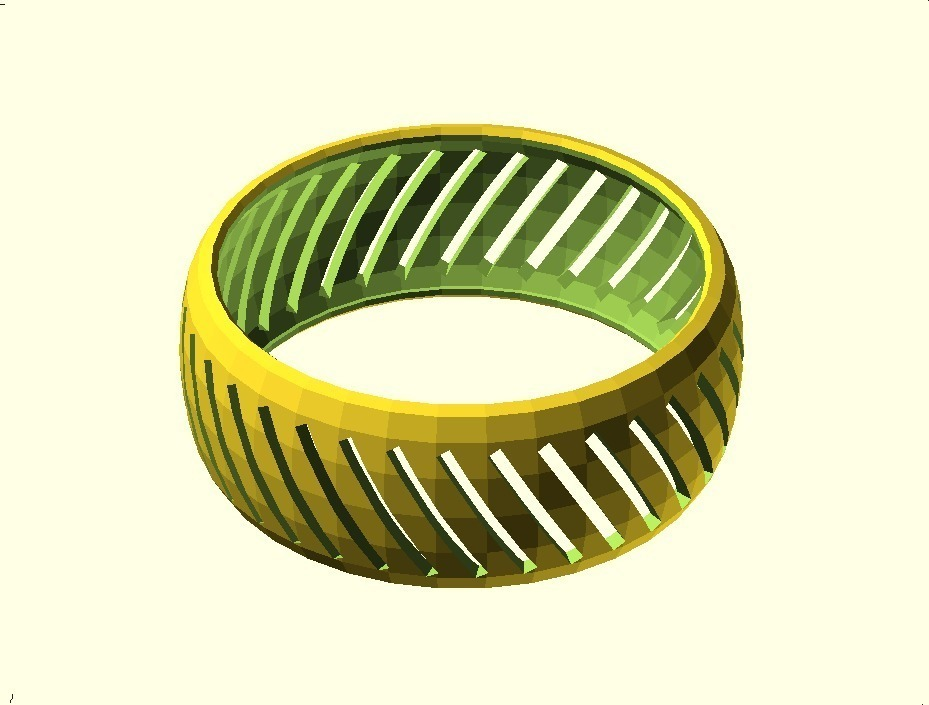

Bracelet VII
===============
**Please note: This thing is part of a list that was [automatically generated](https://github.com/carlosgs/export-things) and may have been updated since then. Make sure to check for the current license and authorship.**  

Bracelet VII  by MakeALot , published Mar 27, 2011

Description
--------
Slotted Convex bracelet

Instructions
--------
Unprinted as yet...

Files
--------

 [ slottedConvexBracelet.scad](slottedConvexBracelet.scad)  

 [ slottedConvexBracelet_FlatEdges.stl](slottedConvexBracelet_FlatEdges.stl)  

 [ slottedConvexBraceletLeft.stl](slottedConvexBraceletLeft.stl)  

Pictures
--------

Tags
--------
bracelet , openscad  

  

License
--------
Bracelet VII by MakeALot is licensed under the BSD License license.  

By: Mark Durbin (MakeALot)
--------
<http://NestedCube.com/>