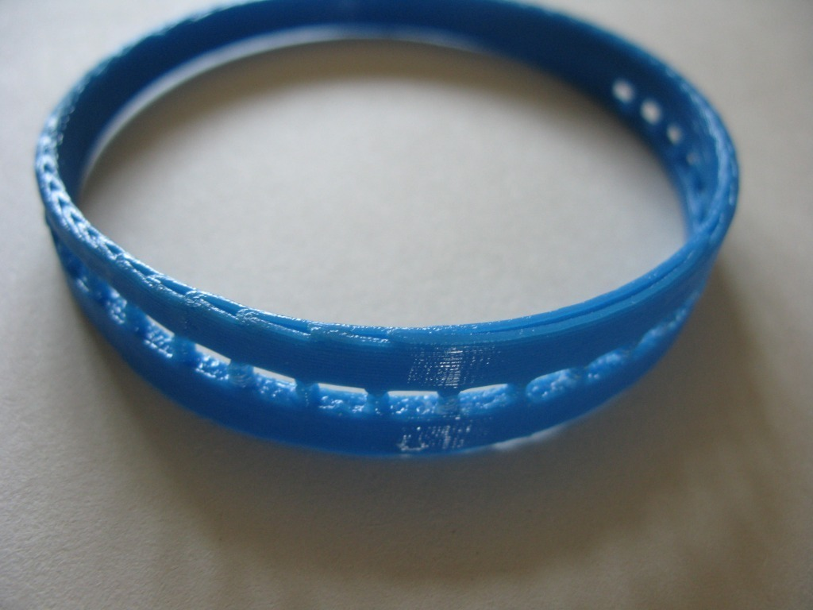

BraceletX
===============
**Please note: This thing is part of a list that was [automatically generated](https://github.com/carlosgs/export-things) and may have been updated since then. Make sure to check for the current license and authorship.**  

BraceletX  by MakeALot , published Apr 25, 2011

Description
--------
Another printable bangle 60,70 or 80mm diameter.

Instructions
--------
Print, wear.

Files
--------

 [ braceletX.scad](braceletX.scad)  

 [ braceletX.stl](braceletX.stl)  

 [ braceletX_60.stl](braceletX_60.stl)  

 [ braceletX_70.stl](braceletX_70.stl)  

 [ braceletX_80.stl](braceletX_80.stl)  

Pictures
--------

Tags
--------
openscad  

  

License
--------
BraceletX by MakeALot is licensed under the Creative Commons - Attribution license.  

By: Mark Durbin (MakeALot)
--------
<http://NestedCube.com/>