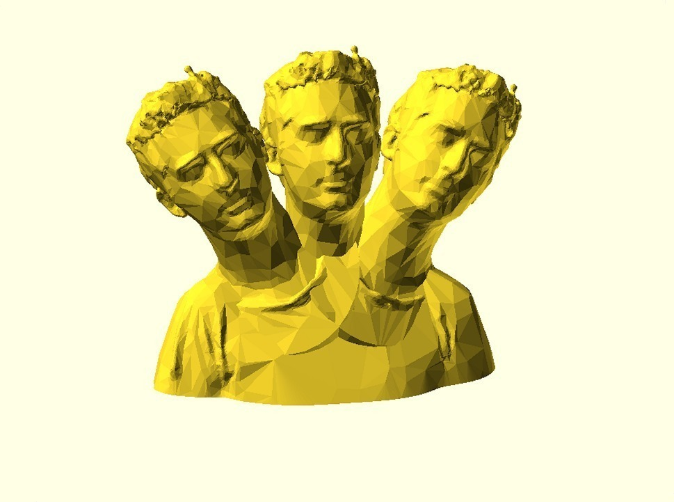
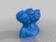
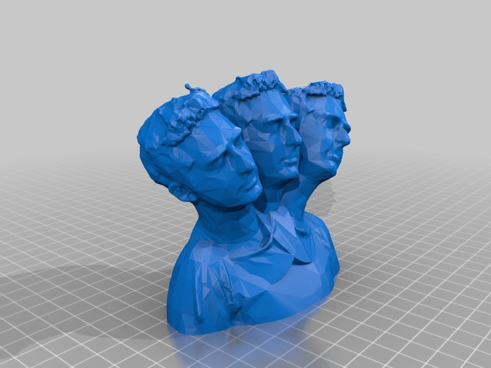

Bre heads are better than one
===============
**Please note: This thing is part of a list that was [automatically generated](https://github.com/carlosgs/export-things) and may have been updated since then. Make sure to check for the current license and authorship.**  

Bre heads are better than one  by MakeALot , published Jun 3, 2011

Description
--------
For those busy days... 
 
because it's there.

Instructions
--------
I've used the more flexible "can attach to animals" license on this...

Files
--------

 [ Bre_heads_are_better_than_one.stl](Bre_heads_are_better_than_one.stl)  

 [ breheads_are_better_than_one.scad](breheads_are_better_than_one.scad)  

Pictures
--------

Tags
--------
bre pettis , bre , brepettis , openscad , recursive mashup  

  

License
--------
Bre heads are better than one by MakeALot is licensed under the Creative Commons - Attribution license.  

By: Mark Durbin (MakeALot)
--------
<http://NestedCube.com/>