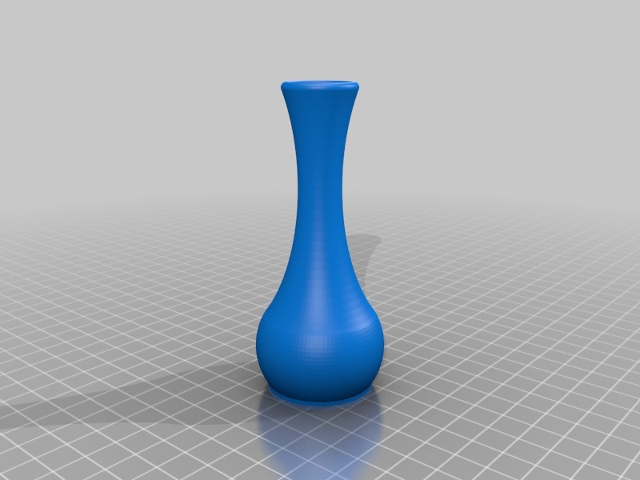
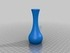

Bud Vase
===============
**Please note: This thing is part of a list that was [automatically generated](https://github.com/carlosgs/export-things) and may have been updated since then. Make sure to check for the current license and authorship.**  

Bud Vase  by MakeALot , published Mar 19, 2012

Description
--------
A vase for a bud :)

Instructions
--------
Print watertight - I printed 80% fill with 0 extra shells

Files
--------

 [ budVase.scad](budVase.scad)  

 [ budVase.stl](budVase.stl)  

Tags
--------
None  

  

License
--------
Bud Vase by MakeALot is licensed under the Creative Commons - Attribution license.  

By: Mark Durbin (MakeALot)
--------
<http://NestedCube.com/>