Checked Gingham 2 Part Picnic Parisian Goblet
===============
**Please note: This thing is part of a list that was [automatically generated](https://github.com/carlosgs/export-things) and may have been updated since then. Make sure to check for the current license and authorship.**  

Checked Gingham 2 Part Picnic Parisian Goblet  by MakeALot , published Sep 20, 2011

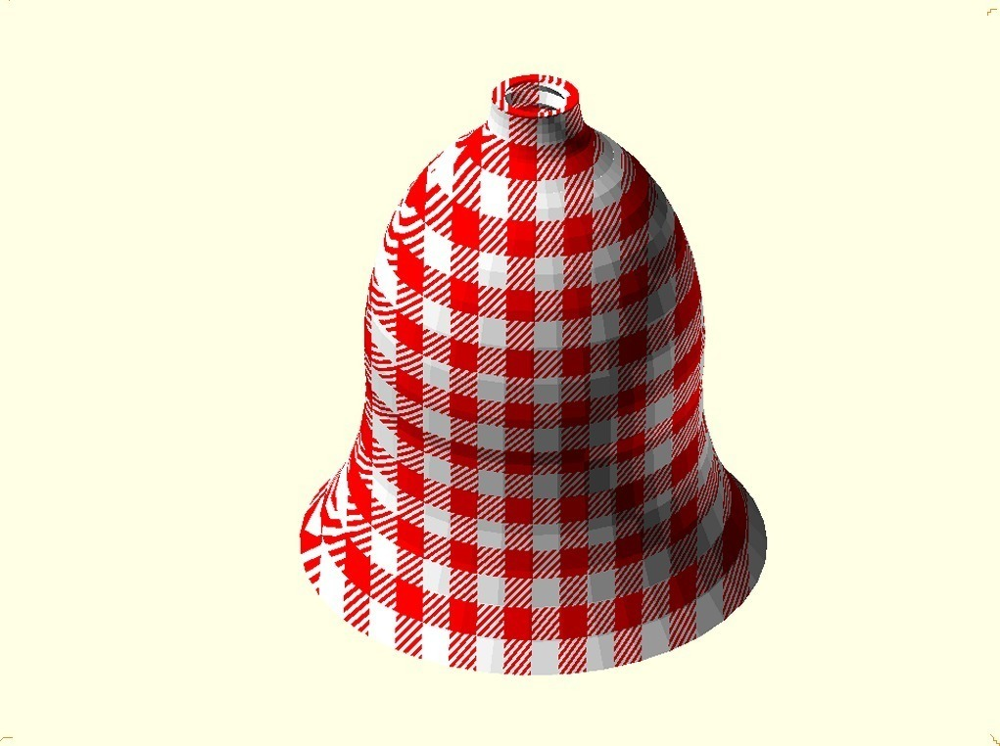

Description
--------
This is my entry in the New Museum Challenge.  
I hope that the experimental dual extrusion is included in the rules under "...and printable on a MakerBot Thing-O-Matic." 
 
A two colour gingham picnic goblet that can be dismantled, inverted and re assembled for convenience when stored or travelling, and once closed should stop any sticky residue from the day's drinks messing up the inside of your bag, to save you washing it before you pack it away to come home. 
 
A QRCode can be embedded in the base layers and serves as both the identifier for retail purposes and shows the whole provenance of the item, its constituents and any recycling information and can point to unique URL when used as a gift, promotion, etc. 
 
Can be assembled into sets of 6 with a printable connector.

Instructions
--------
Print 2 parts using one STL for each colour: 
 
Part 1 - White - PicnicGobletTop1.stl 
Part 1 - Colour - PicnicGobletTop2.stl 
 
Part 2 - White - PicnicGobletBase1.stl 
Part 2 - Colour - PicnicGobletBase2.stl 
 
<big><b>History</b></big> 
This is also a derivative work of XOR-able objects <a href="http://www.thingiverse.com/thing:11714" target="_blank" rel="nofollow">thingiverse.com/thing:11714</a> by MakeALot 

Files
--------
[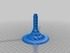](PicnicGobletBase1.stl)
 [ PicnicGobletBase1.stl](PicnicGobletBase1.stl)  

[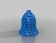](PicnicGobletTop2.stl)
 [ PicnicGobletTop2.stl](PicnicGobletTop2.stl)  

[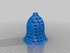](PicnicGobletTop1.stl)
 [ PicnicGobletTop1.stl](PicnicGobletTop1.stl)  

[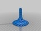](PicnicGobletBase2.stl)
 [ PicnicGobletBase2.stl](PicnicGobletBase2.stl)  

Pictures
--------
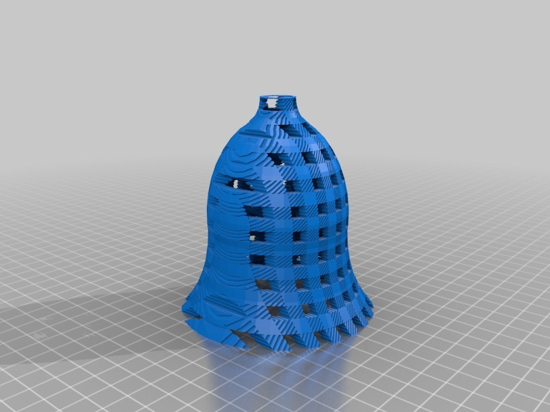
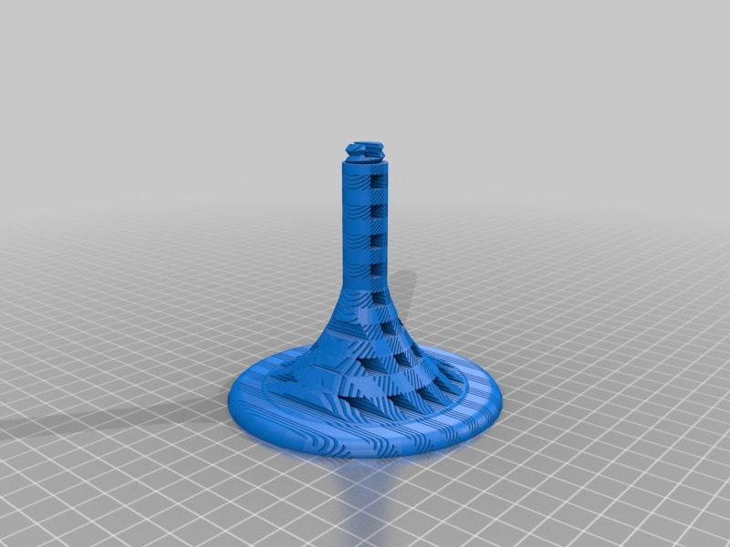
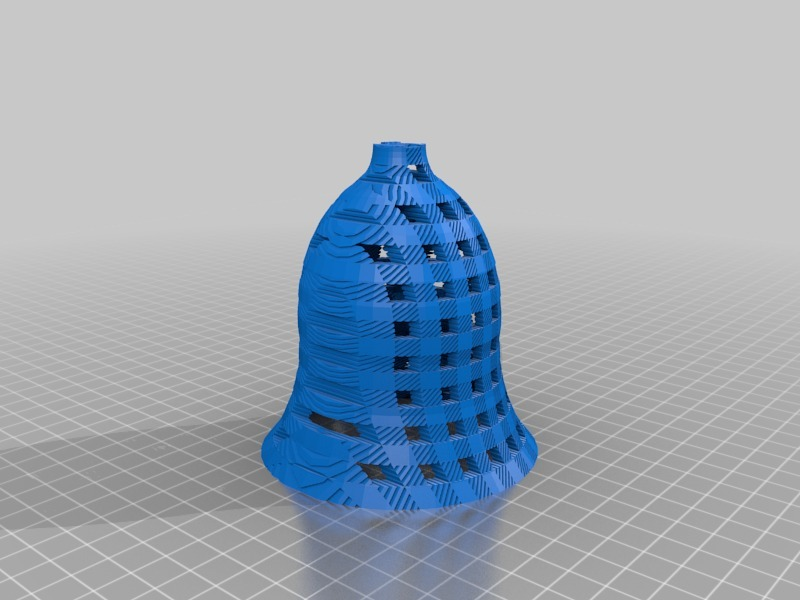
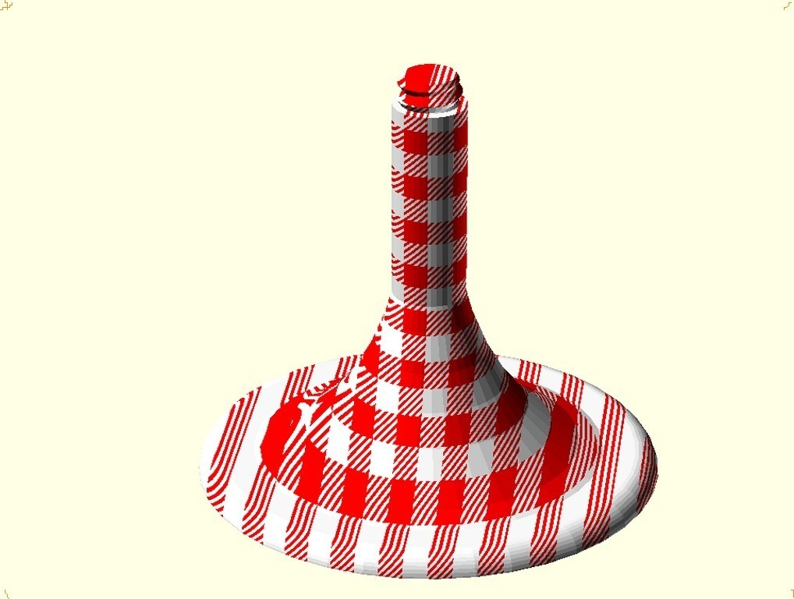
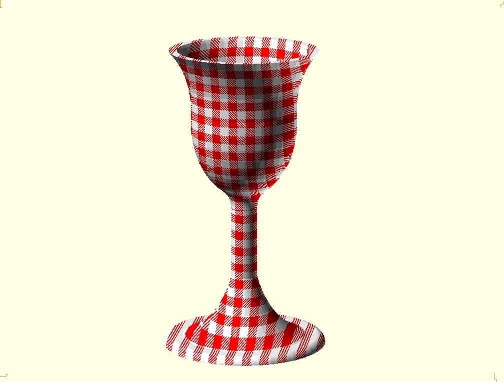
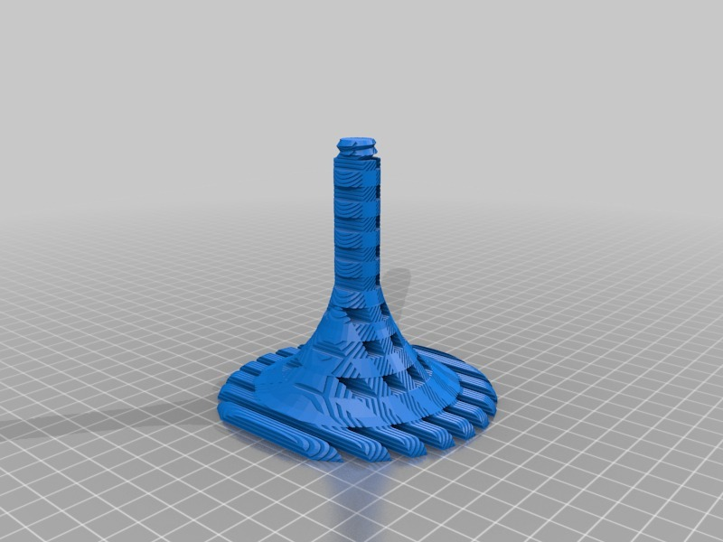
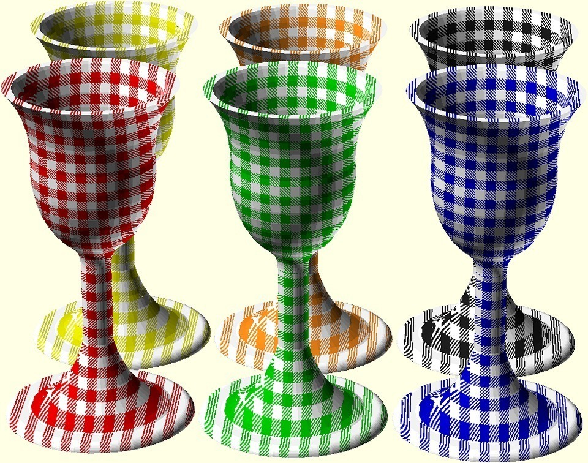
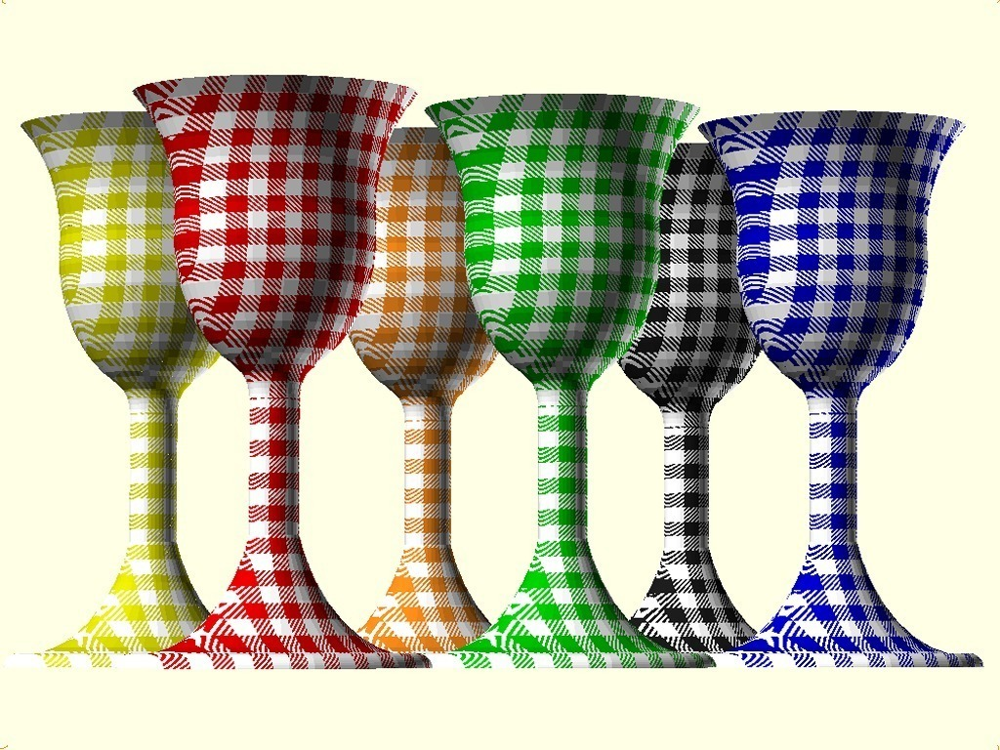
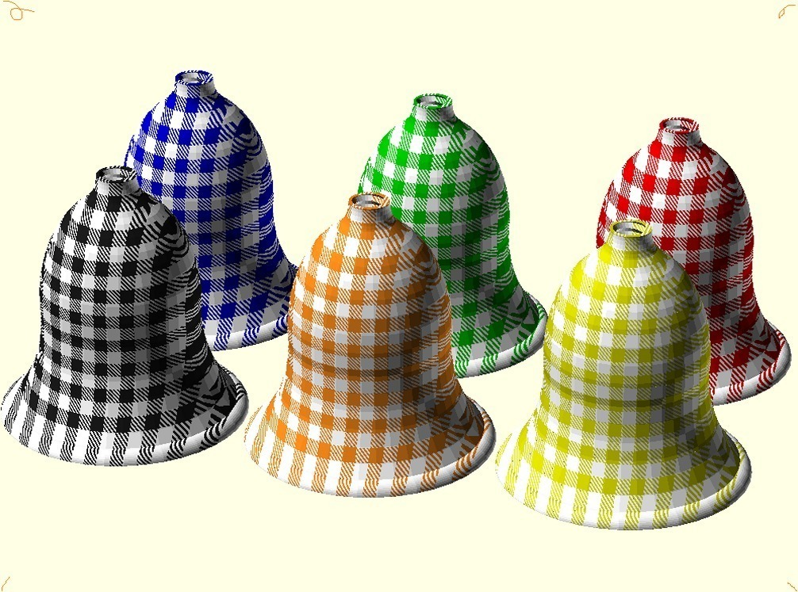
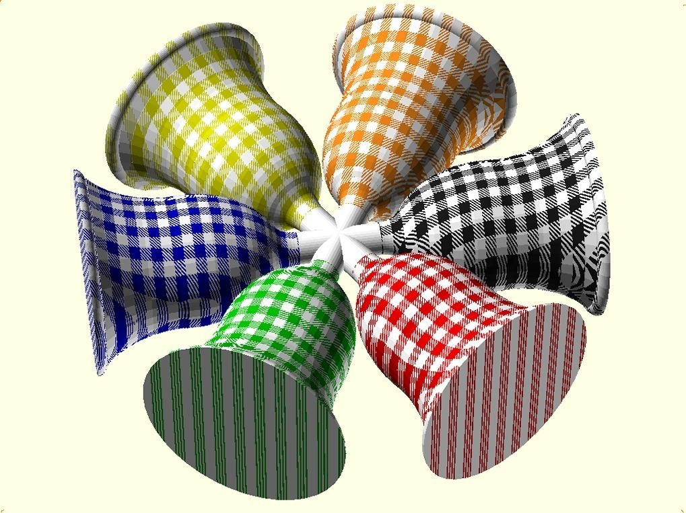

Tags
--------
2color , Dual , dual extrusion , NewMuseumChallenge  

  

License
--------
Checked Gingham 2 Part Picnic Parisian Goblet by MakeALot is licensed under the Creative Commons - Attribution license.  

By: Mark Durbin (MakeALot)
--------
<http://NestedCube.com/>