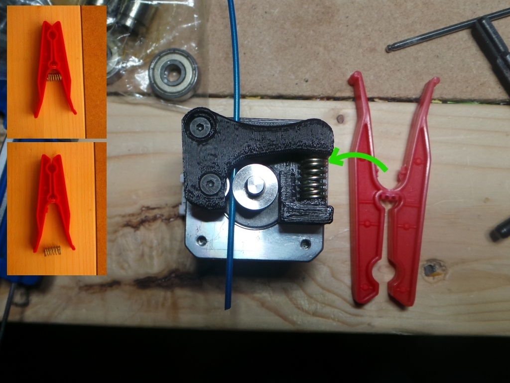
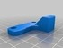
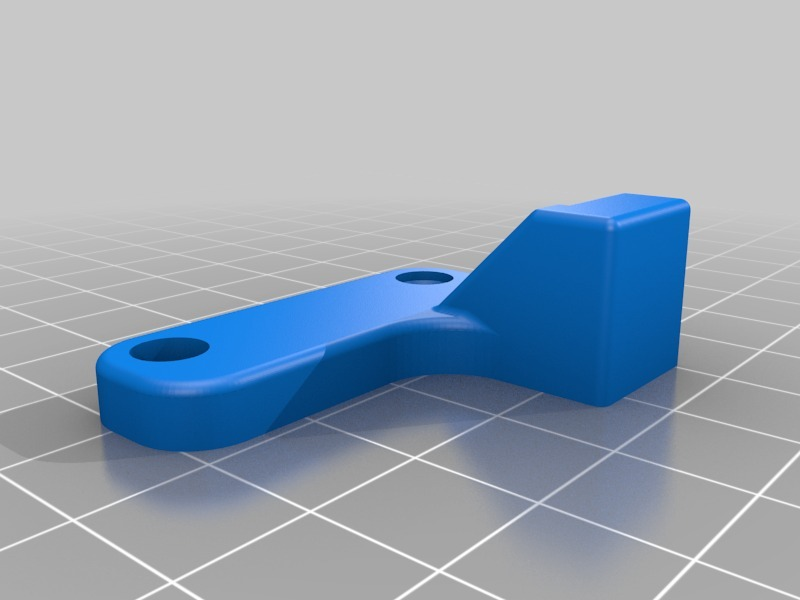

Clothespeg(pin) Spring Rep2 Extruder
===============
**Please note: This thing is part of a list that was [automatically generated](https://github.com/carlosgs/export-things) and may have been updated since then. Make sure to check for the current license and authorship.**  

Clothespeg(pin) Spring Rep2 Extruder  by MakeALot , published Jan 21, 2013

Description
--------
Updated "Replicator 2 Extruder Upgrade" move the bottom spring support so that I could use the spring from a clothes peg (clothespin)

Instructions
--------
I couldn't get hold of the recommended spring, So I did a quick hack in OpenSCAD to move the spring mount closer to the arm and use a clothes peg spring instead. 
 
I had initially expected to find traditional wooden pegs with a lever-arm spring: 
<a href="http://en.wikipedia.org/wiki/File:Clothespin-2459e.jpg" target="_blank" rel="nofollow">en.wikipedia.org/wiki/File:Clothespin-2459e.jpg</a> 
I thought I would have to design the mechanism from scratch, imagine my delight when I found this modern peg with a spring of just about perfect size.   
<a href="http://commons.wikimedia.org/wiki/File:Red_clothes_peg.jpg" target="_blank" rel="nofollow">commons.wikimedia.org/wiki/File:Red_clothes_peg.jpg</a> 
 
All I had to do was clip out the spring support and move it up a bit. marvellous! 
 
Go and steal a spring from the clothes line...

Files
--------

 [ BaseMod.scad](BaseMod.scad)  

 [ Mk8-Upgrade-2mmShorter_Base-v2.stl](Mk8-Upgrade-2mmShorter_Base-v2.stl)  

Pictures
--------

Tags
--------
None  

  

License
--------
Clothespeg(pin) Spring Rep2 Extruder by MakeALot is licensed under the Creative Commons - Attribution license.  

By: Mark Durbin (MakeALot)
--------
<http://NestedCube.com/>