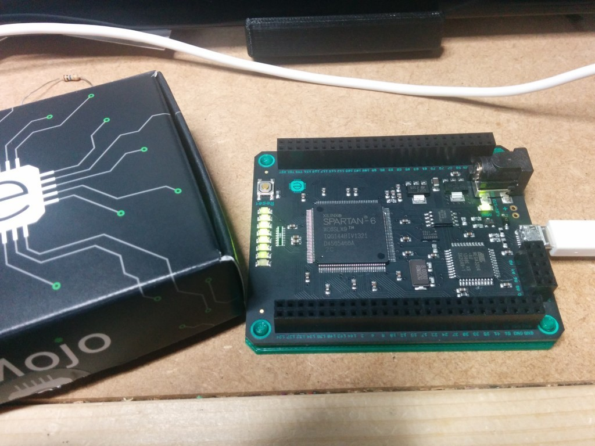
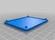
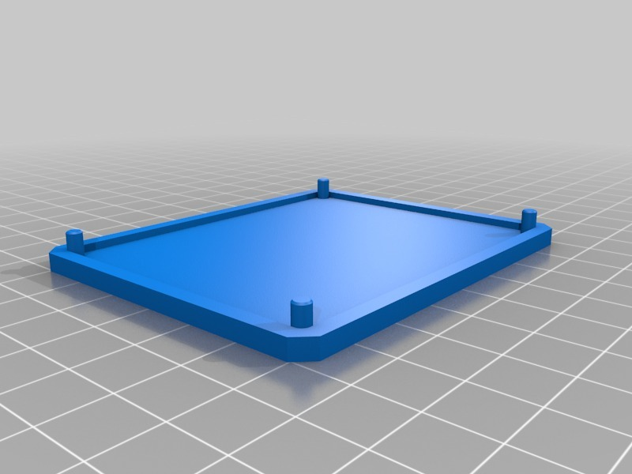

Coaster for Mojo FPGA dev. board
===============
**Please note: This thing is part of a list that was [automatically generated](https://github.com/carlosgs/export-things) and may have been updated since then. Make sure to check for the current license and authorship.**  

Coaster for Mojo FPGA dev. board  by MakeALot , published Apr 25, 2014

Description
--------
Printed a coaster for Mojo FPGA development board so that the wires on my bench don't short out the contacts on the back.   
 
Here's a link for anyone interested in the board:   
<a href="http://embeddedmicro.com/development-boards.html" target="_blank" rel="nofollow">embeddedmicro.com/development-boards.html</a>  
 
I do like the fact that the print matches the colour of the PCB  silk screen :)

Instructions
--------
None

Files
--------

 [ MojoCoaster.stl](MojoCoaster.stl)  

Pictures
--------

Tags
--------
coaster , FPGA , FPGS , Mojo  

  

License
--------
Coaster for Mojo FPGA dev. board by MakeALot is licensed under the Creative Commons - Attribution license.  

By: Mark Durbin (MakeALot)
--------
<http://NestedCube.com/>