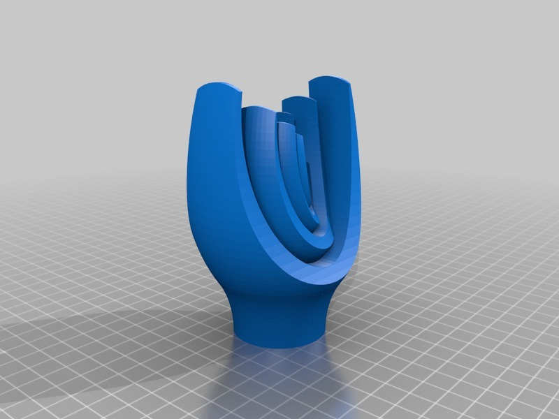
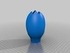
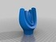
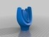
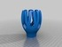
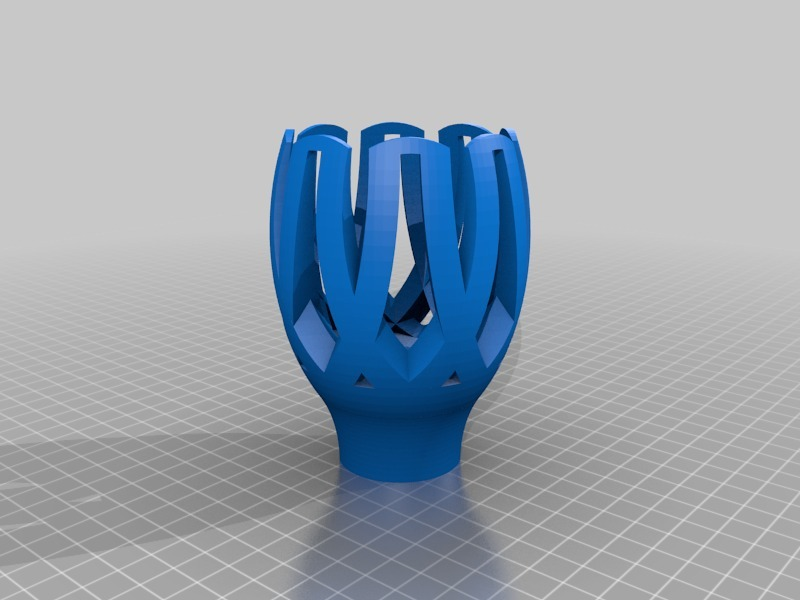
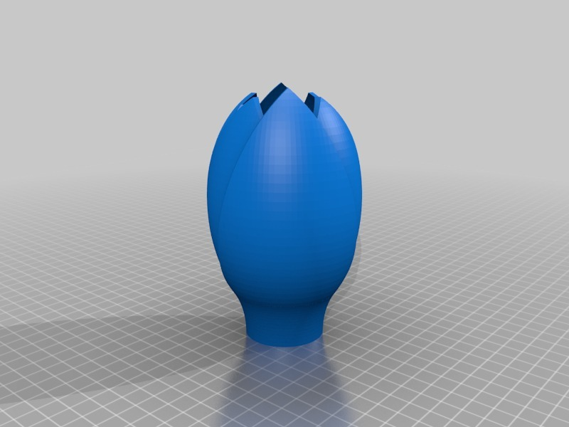
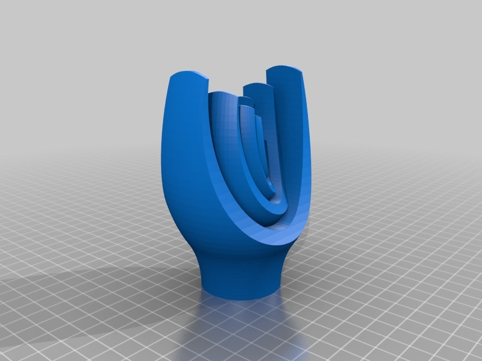
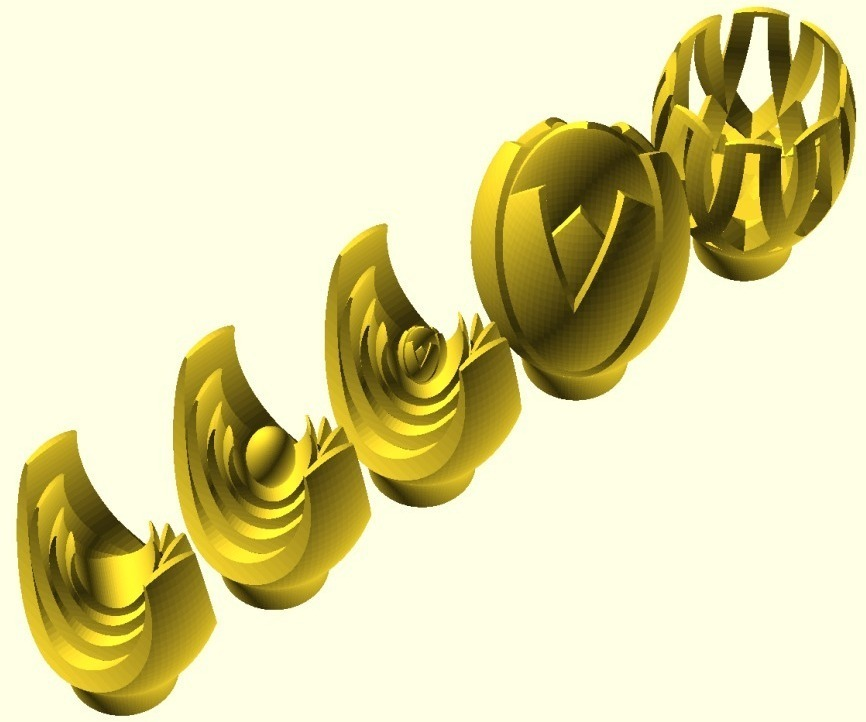

Cupped Sculptures
===============
**Please note: This thing is part of a list that was [automatically generated](https://github.com/carlosgs/export-things) and may have been updated since then. Make sure to check for the current license and authorship.**  

Cupped Sculptures  by MakeALot , published Oct 17, 2011

Description
--------
Themed sculptures using a tulip like shape 
 
I've had these for a while, just some doodles based on a printable shape I found ascetically pleasing. The SCAD is a serious mess, so I was waiting to post them until I sorted it out - yes, you guessed. 
 
So I posted them anyway, hopefully someone else will also like them. 
 
There are a couple more, I need to print a few now... 
 
BTW, the Z position seems to be all over the place with these models, make sure you put them on the platform before printing! 
 
If you want the SCAD file, let me know, it may give me the impetus to clean it up.

Instructions
--------
1. Print 
2. Contemplate 
3. Do something useful

Files
--------

 [ t1Tulip.stl](t1Tulip.stl)  

 [ nestarms.stl](nestarms.stl)  

 [ CuppedTulip.stl](CuppedTulip.stl)  

 [ nestarmswithbulb.stl](nestarmswithbulb.stl)  

 [ t2Tulip.stl](t2Tulip.stl)  

Pictures
--------

Tags
--------
None  

  

License
--------
Cupped Sculptures by MakeALot is licensed under the Creative Commons - Attribution license.  

By: Mark Durbin (MakeALot)
--------
<http://NestedCube.com/>