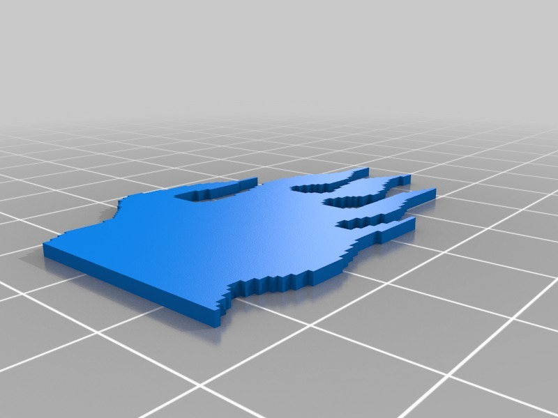
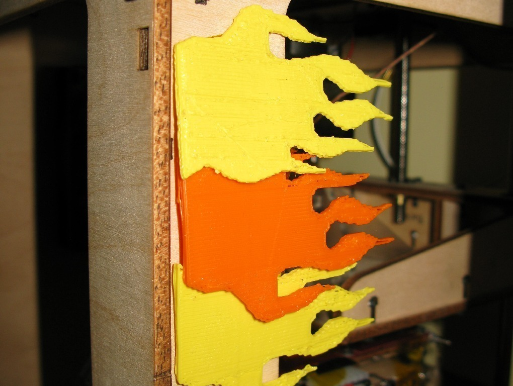

Custom Shop Flames
===============
**Please note: This thing is part of a list that was [automatically generated](https://github.com/carlosgs/export-things) and may have been updated since then. Make sure to check for the current license and authorship.**  

Custom Shop Flames  by MakeALot , published Apr 21, 2011

Description
--------
Print in Red, Orange and Yellow to turn your bot into a bot-rod.

Instructions
--------
Apply liberally. Preferably with a chrome axle and dice hanging from the mirror and re-spray your bot metallic black.  May be better to laser cut?

Files
--------

 [ flames.stl](flames.stl)  

 [ Flames.scad](Flames.scad)  

Pictures
--------

Tags
--------
bot bling , botbling_challenge , flames , openscad  

  

License
--------
Custom Shop Flames by MakeALot is licensed under the Creative Commons - Attribution license.  

By: Mark Durbin (MakeALot)
--------
<http://NestedCube.com/>