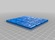

Customizable Dominoes
===============
**Please note: This thing is part of a list that was [automatically generated](https://github.com/carlosgs/export-things) and may have been updated since then. Make sure to check for the current license and authorship.**  

Customizable Dominoes  by MakeALot , published Apr 30, 2014

Description
--------
I was recently asked to upload the SCAD file for the nine spot domino set previously uploaded to Thingiverse so that the thickness of the cards could be changed.(http://www.thingiverse.com/thing:9639)    
 
I thought I'd go one better and allow them to be customised using the Customizer.   

Instructions
--------
None

Files
--------

 [ Dominoes.stl](Dominoes.stl)  

 [ Dominoes.scad](Dominoes.scad)  

Pictures
--------

Tags
--------
customizer , dominoes , dominos  

  

License
--------
Customizable Dominoes by MakeALot is licensed under the Creative Commons - Attribution license.  

By: Mark Durbin (MakeALot)
--------
<http://NestedCube.com/>