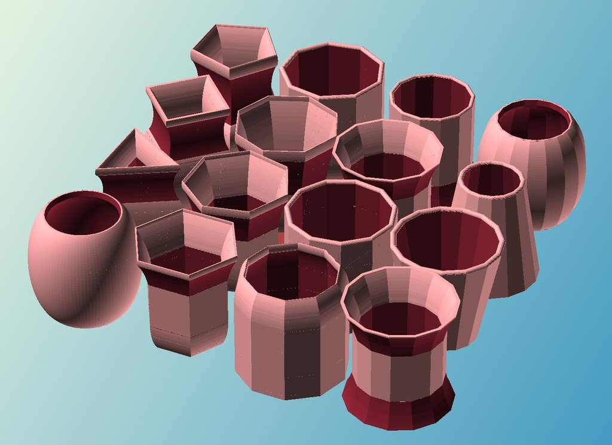

Customizer-able Containers
===============
**Please note: This thing is part of a list that was [automatically generated](https://github.com/carlosgs/export-things) and may have been updated since then. Make sure to check for the current license and authorship.**  

Customizer-able Containers  by MakeALot , published Jan 9, 2013

Description
--------
Test to see if I can make my old OpenSCAD script run in Customizer

Instructions
--------
Working when exported, some artefacts when drawing in customizer.

Files
--------

 [ receptacle.scad](receptacle.scad)  

Tags
--------
customizer  

  

License
--------
Customizer-able Containers by MakeALot is licensed under the Creative Commons - Attribution - Share Alike license.  

By: Mark Durbin (MakeALot)
--------
<http://NestedCube.com/>