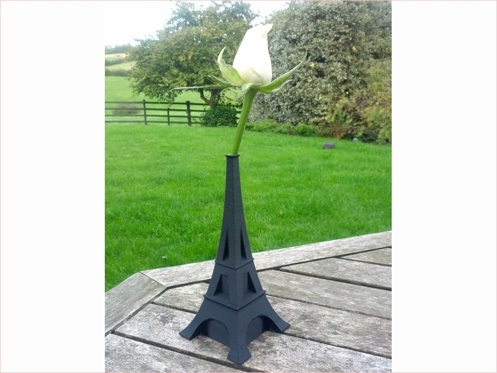
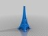

Eiffel Bud Vase
===============
**Please note: This thing is part of a list that was [automatically generated](https://github.com/carlosgs/export-things) and may have been updated since then. Make sure to check for the current license and authorship.**  

Eiffel Bud Vase  by MakeALot , published Oct 16, 2013

Description
--------
A hollow print in the shape of the Eiffel Tower.   
 
__Had to update the files__, the platforms were a little too flat for single perimeter printing. Apologies if you were one of the 2 people who downloaded it.

Instructions
--------
Print with no fill or roof and 2 or more shells to make a vase.

Files
--------

 [ EiffelVase.scad](EiffelVase.scad)  

 [ EiffelVase.stl](EiffelVase.stl)  

Pictures
--------

Tags
--------
Architecture , Eiffel_Tower , Hollow , Vase  

  

License
--------
Eiffel Bud Vase by MakeALot is licensed under the Creative Commons - Attribution - Share Alike license.  

By: Mark Durbin (MakeALot)
--------
<http://NestedCube.com/>