Exposed Pots
===============
**Please note: This thing is part of a list that was [automatically generated](https://github.com/carlosgs/export-things) and may have been updated since then. Make sure to check for the current license and authorship.**  

Exposed Pots  by MakeALot , published Nov 7, 2012

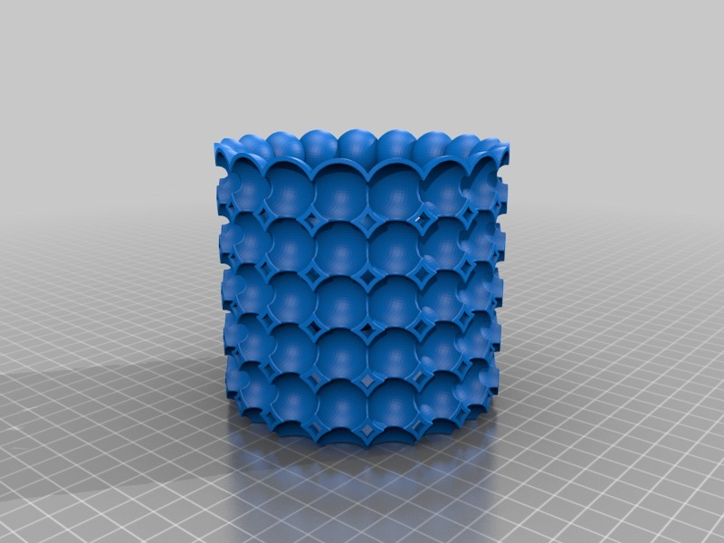

Description
--------
Interestingly shaped pots.

Instructions
--------
Print, fill.

Files
--------
[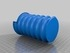](BubblePot3.stl)
 [ BubblePot3.stl](BubblePot3.stl)  

[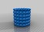](BubblePot1.stl)
 [ BubblePot1.stl](BubblePot1.stl)  

[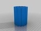](BubblePot4.stl)
 [ BubblePot4.stl](BubblePot4.stl)  

[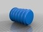](BubblePot2.stl)
 [ BubblePot2.stl](BubblePot2.stl)  

[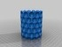](BubblePot5.stl)
 [ BubblePot5.stl](BubblePot5.stl)  

Pictures
--------
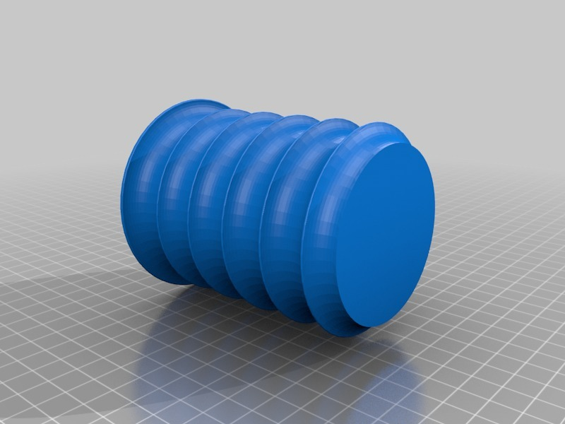
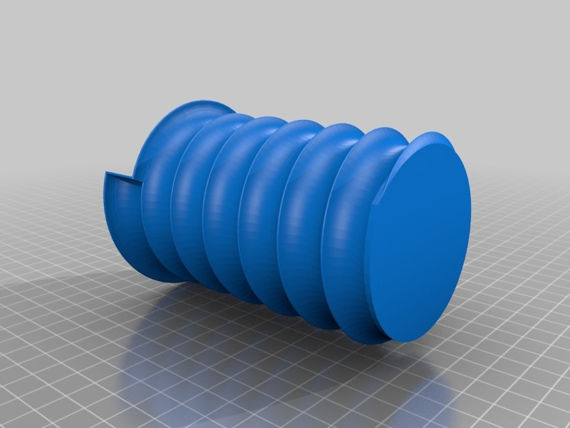
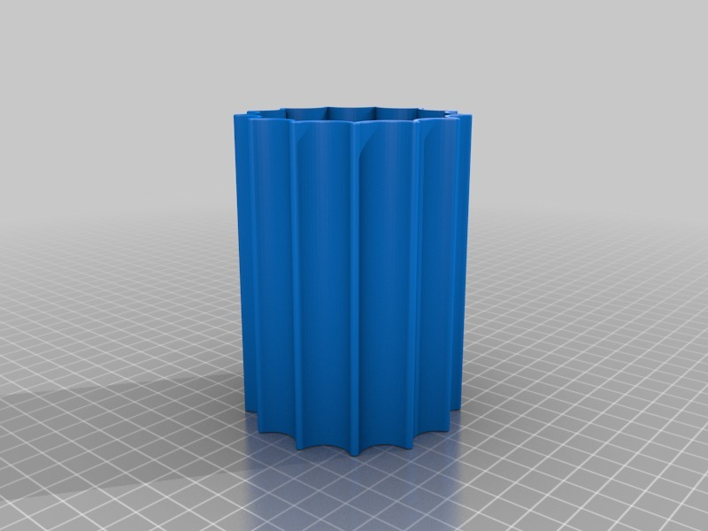
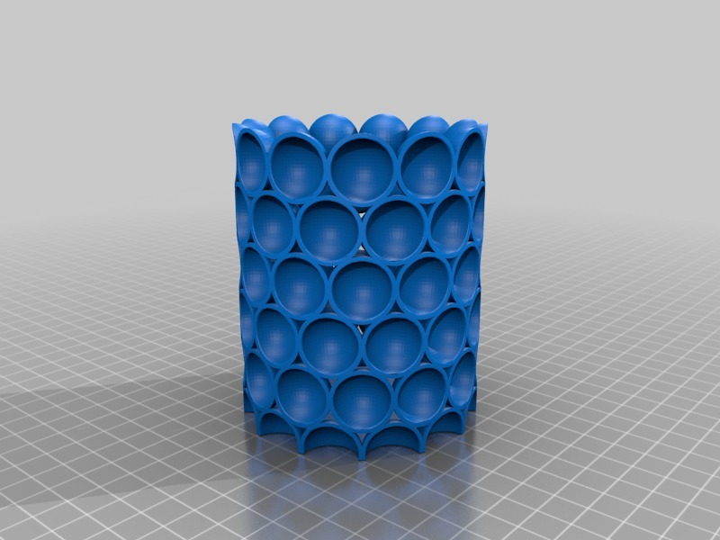
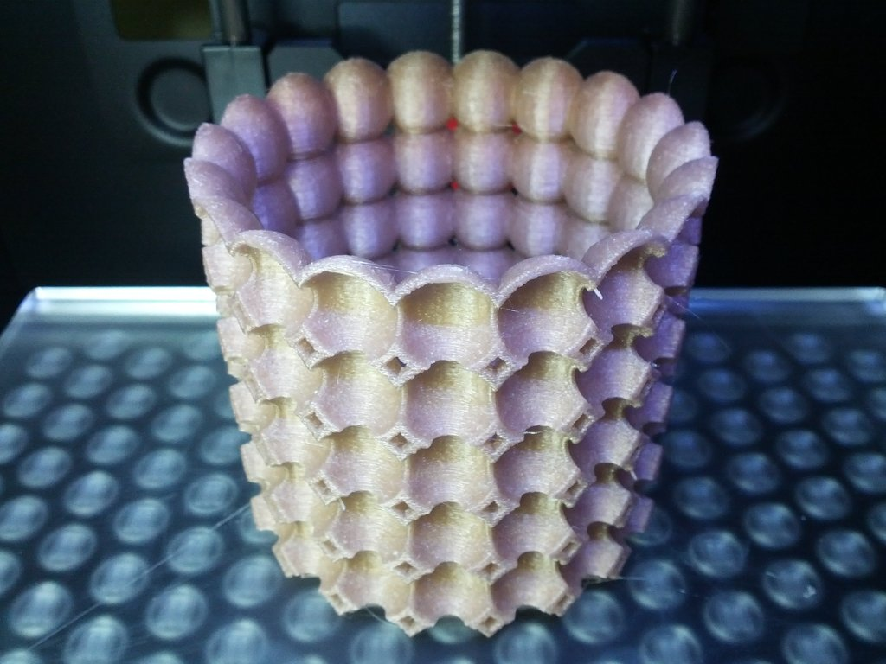

Tags
--------
container , pot  

  

License
--------
Exposed Pots by MakeALot is licensed under the Creative Commons - Attribution license.  

By: Mark Durbin (MakeALot)
--------
<http://NestedCube.com/>