Extending Tube
===============
**Please note: This thing is part of a list that was [automatically generated](https://github.com/carlosgs/export-things) and may have been updated since then. Make sure to check for the current license and authorship.**  

Extending Tube  by MakeALot , published Mar 17, 2011

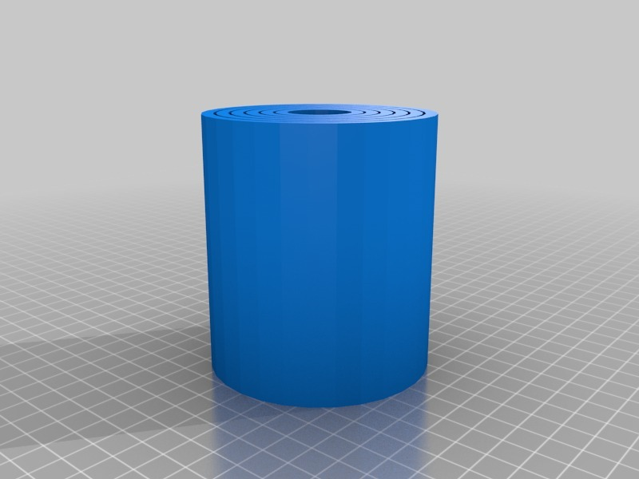

Description
--------
An extending tube printed as a single print. 
 
Extend, twist and push to lock in place. 

Instructions
--------
Print, extend, twist and push to lock in place. 
 
<b><big>If you downloaded the tapered versions don't print them!</big></b> 
Download a new version (TaperedExtendingTube1), I forgot to taper the center tube so it will be joined to the next tube - sorry about that! 
 
I wanted to test how closely I could put moving parts as one print and still move them without lots of cutting afterwards. This design worked without any cleaning up, (apart from removing the raft) 
 
Not too functional as is, but I expect to use the principles from this in other projects. 
 
In the SCAD file, you'll find one main module: 
<b>tube(tubeOuterRadius, tubeHeight, tubeCount, extend); </b> 
 
<b>tubeOuterRadius</b> = either 40,35,30,25 or 20 
<b>tubeHeight</b> = the height in mm (between 30 and 90) 
<b>tubeCount</b> = the number of tubes (1-6 depending on radius) 
<b>extend</b> = 1 to show extended, 0 for printing 
 
The center tube stays quite mobile during the print due to its inability to cool within the mass of the print, so it may be difficult to print a very small inner tube. 
 
Hope this proves useful in mashups! 
 
<b>Update:</b> 
Added a tapered version as suggested by Zomboe (<b>thanks Zomboe</b>) this simplifies the locking mechanism. I haven't printed this yet.

Files
--------
[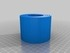](ExtendingTube_40x60x4.stl)
 [ ExtendingTube_40x60x4.stl](ExtendingTube_40x60x4.stl)  

[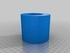](TaperedExtendingTube1.stl)
 [ TaperedExtendingTube1.stl](TaperedExtendingTube1.stl)  

 [ ExtendingTube.stl](ExtendingTube.stl)  

 [ TaperedExtendingTube1.scad](TaperedExtendingTube1.scad)  

 [ extending_tube.scad](extending_tube.scad)  

[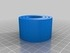](ExtendingTube_25x30x3.stl)
 [ ExtendingTube_25x30x3.stl](ExtendingTube_25x30x3.stl)  

Pictures
--------
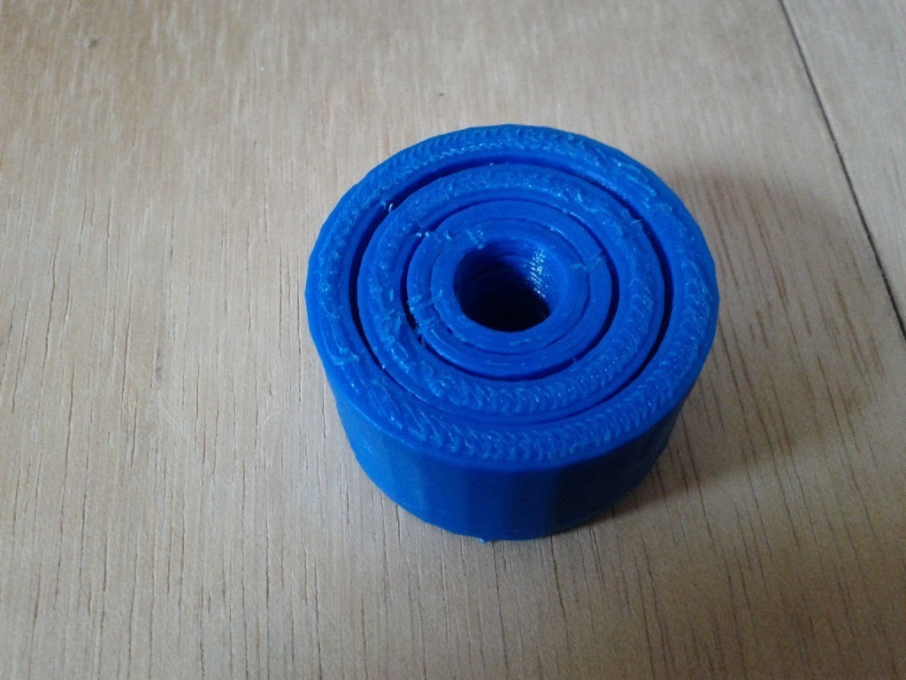
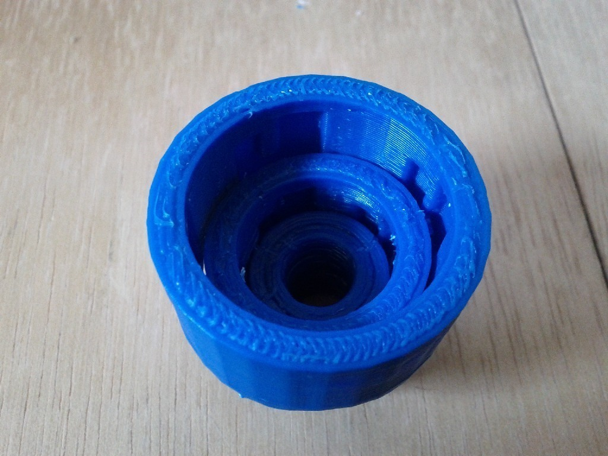
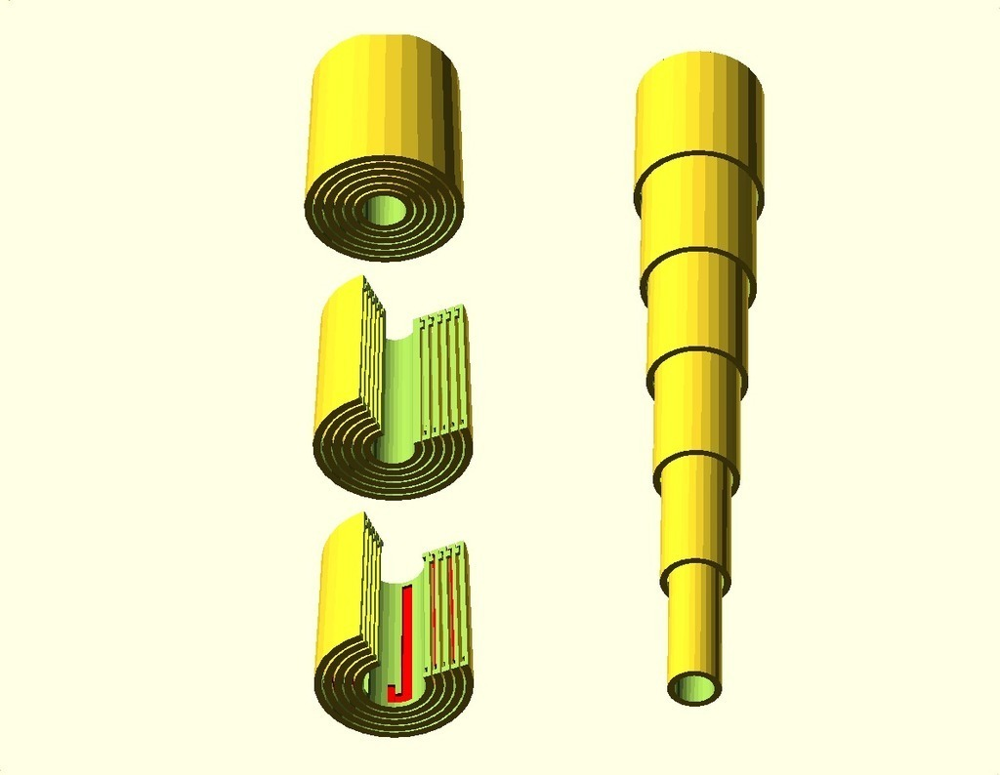
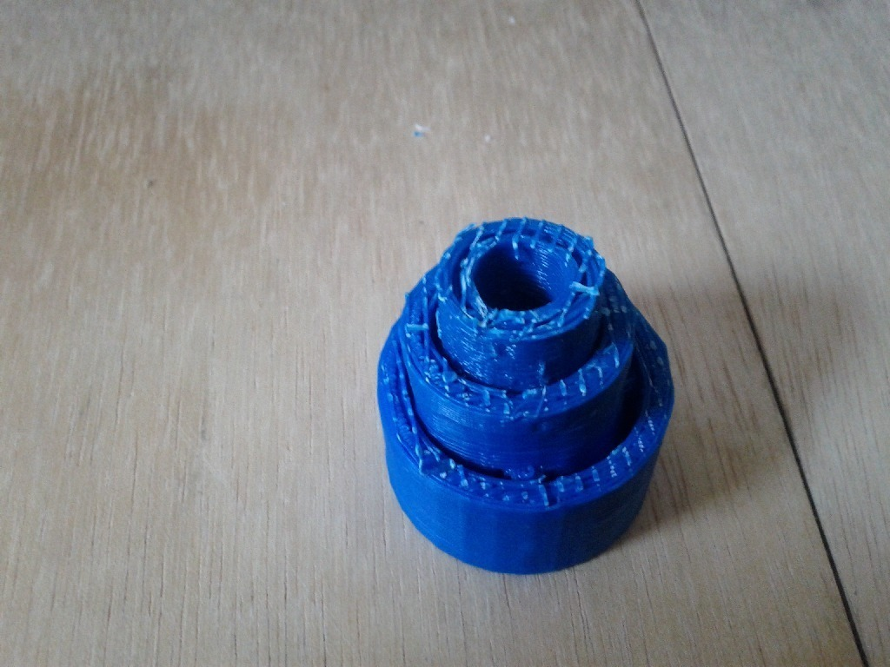
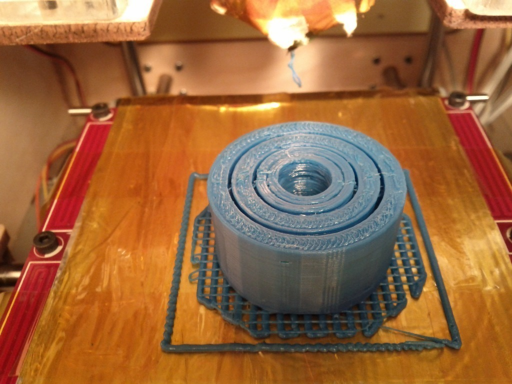
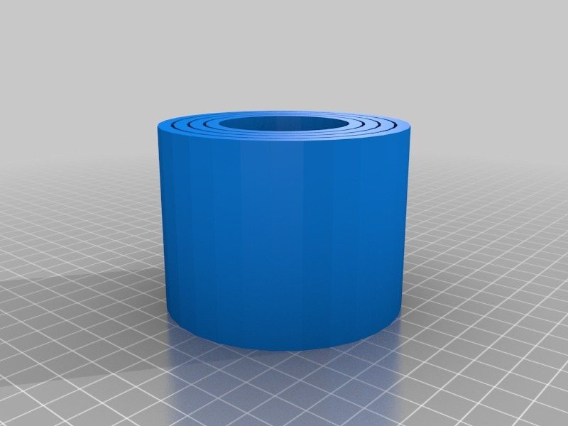
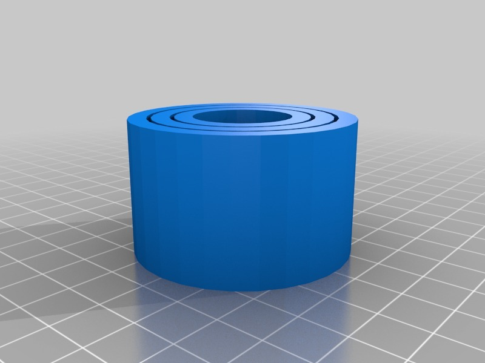
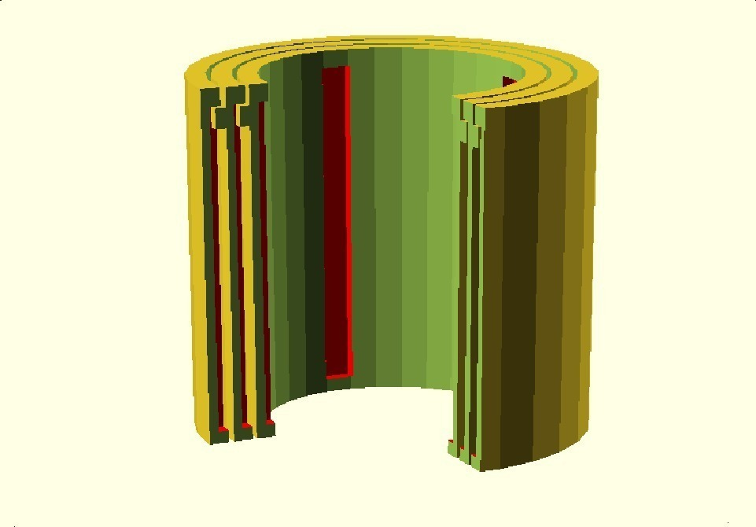
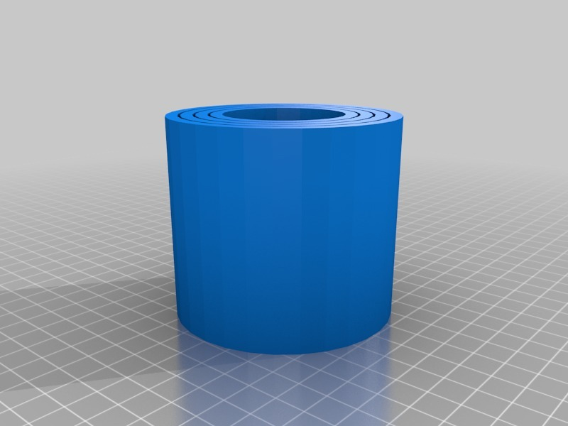

Tags
--------
extending , OpenSCAD , parametric , telescopic , telescoping , tube  

  

License
--------
Extending Tube by MakeALot is licensed under the BSD License license.  

By: Mark Durbin (MakeALot)
--------
<http://NestedCube.com/>