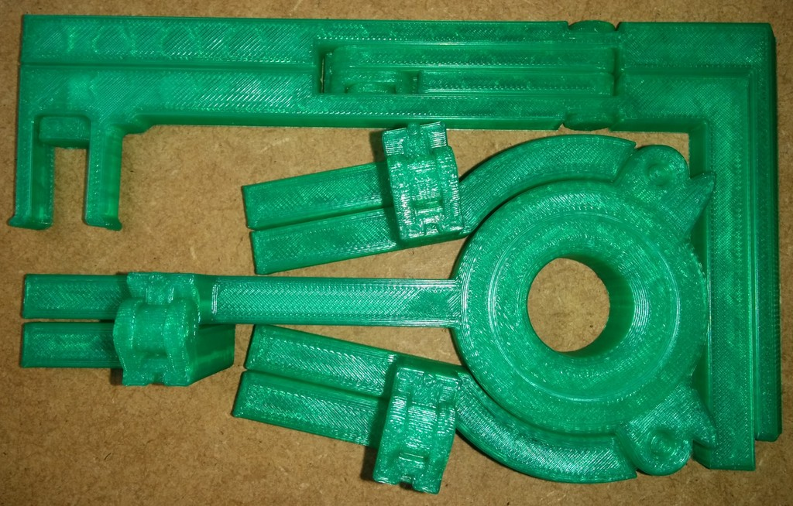
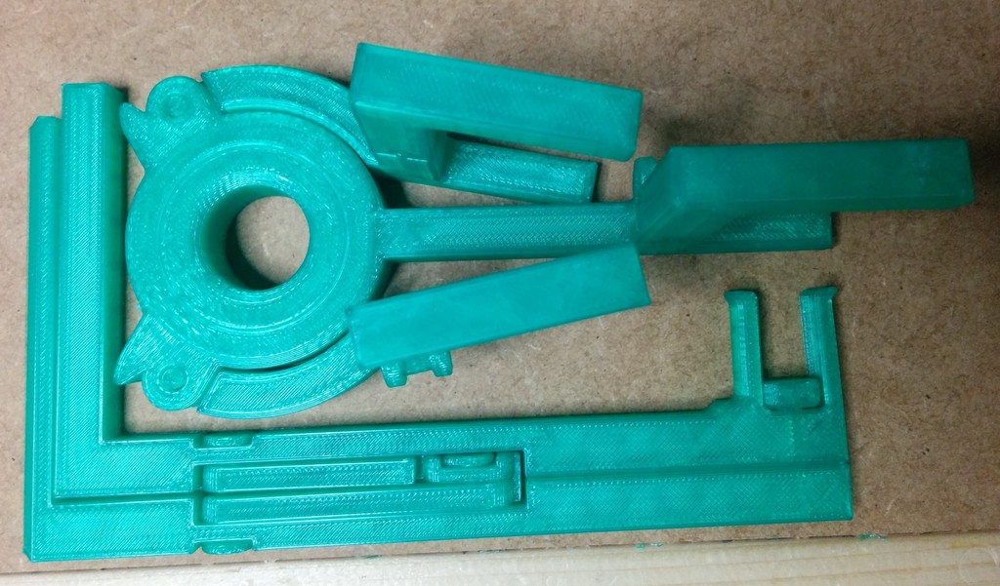

Folded Spool for Proto Pasta coiled filament
===============
**Please note: This thing is part of a list that was [automatically generated](https://github.com/carlosgs/export-things) and may have been updated since then. Make sure to check for the current license and authorship.**  

Folded Spool for Proto Pasta coiled filament  by MakeALot , published Apr 30, 2014

Description
--------
A Print in one go spool and mounting axle with a central roller bearing sized to fit the coils of Proto-Pasta filament.   
 
The spool unfolds to hold a coil of filament 50x30 mm with an internal diameter around 160 mm.   
 
Just unfold the two parts and push the mount into the hub.   
 
Printed in ~3 hours on a Replicator 2 using Makerware "Low" setting i.e. 0.3 mm layer height, 10 % fill, 2 shells, 90 mm/s travel.

Instructions
--------
None

Files
--------

 [ SpoolMount.stl](SpoolMount.stl)  

 [ FoldedSpool.stl](FoldedSpool.stl)  

 [ FoldedSpoolAndMount.stl](FoldedSpoolAndMount.stl)  

Pictures
--------

Tags
--------
bearing , foldable , Print-In-One , Proto-Pasta , Spool  

  

License
--------
Folded Spool for Proto Pasta coiled filament by MakeALot is licensed under the Creative Commons - Attribution license.  

By: Mark Durbin (MakeALot)
--------
<http://NestedCube.com/>