Heading #Chess
===============
**Please note: This thing is part of a list that was [automatically generated](https://github.com/carlosgs/export-things) and may have been updated since then. Make sure to check for the current license and authorship.**  

Heading #Chess  by MakeALot , published Mar 21, 2012

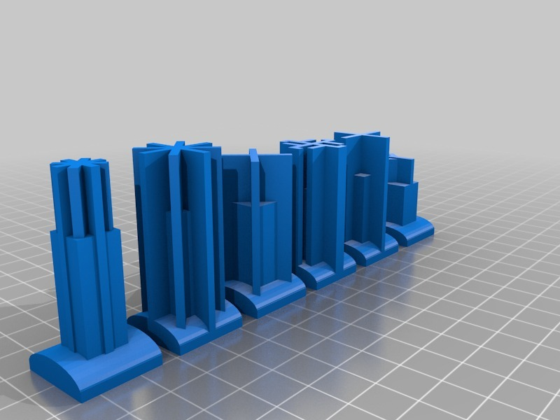

Description
--------
This part was made with Tinkercad. Edit the part online at: <a href="https://tinkercad.com/things/1ssRF47U1Aa" target="_blank" rel="nofollow">tinkercad.com/things/1ssRF47U1Aa</a>

Instructions
--------
print, play.

Files
--------
[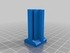](heading_chess_knight.stl)
 [ heading_chess_knight.stl](heading_chess_knight.stl)  

[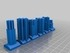](polysoup.stl)
 [ polysoup.stl](polysoup.stl)  

[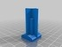](heading_chess_rook.stl)
 [ heading_chess_rook.stl](heading_chess_rook.stl)  

[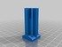](heading_chess_queen.stl)
 [ heading_chess_queen.stl](heading_chess_queen.stl)  

[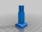](heading_chess_king.stl)
 [ heading_chess_king.stl](heading_chess_king.stl)  

[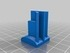](heading_chess_pawn.stl)
 [ heading_chess_pawn.stl](heading_chess_pawn.stl)  

[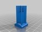](heading_chess_bishop.stl)
 [ heading_chess_bishop.stl](heading_chess_bishop.stl)  

Pictures
--------
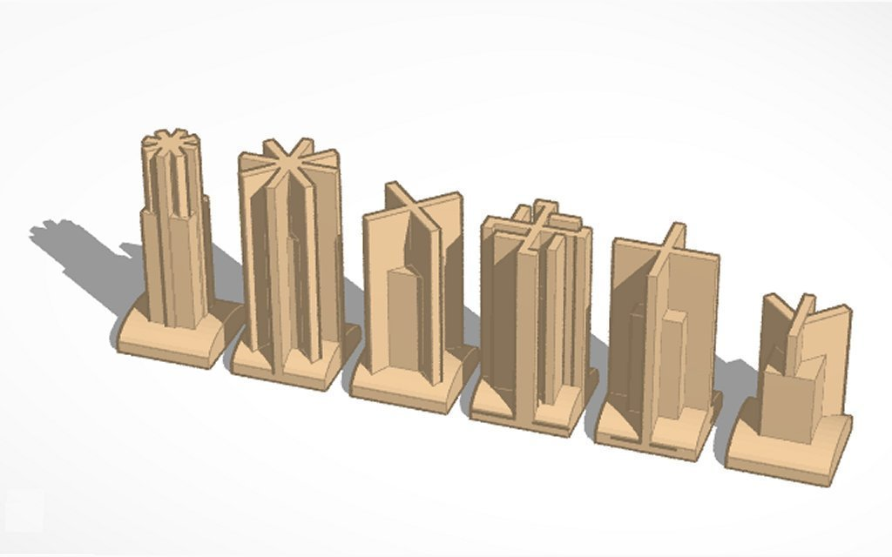
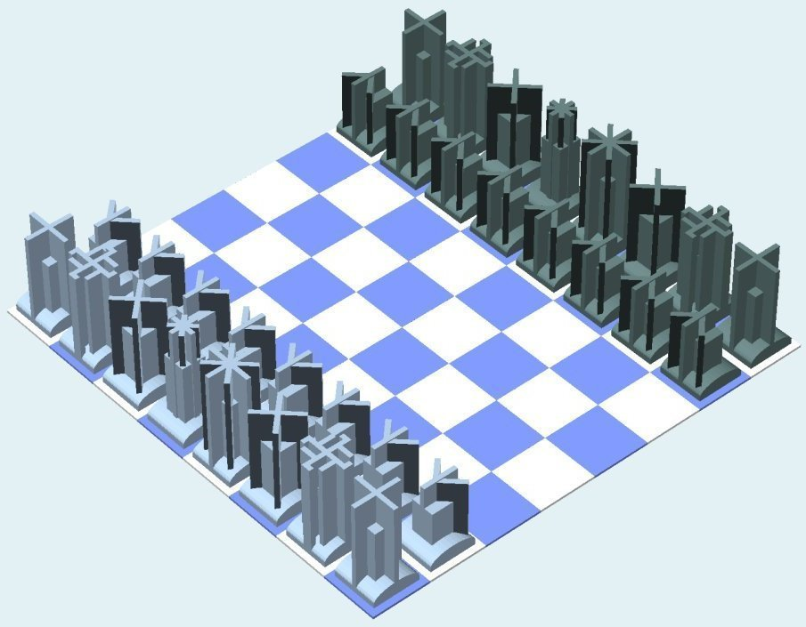
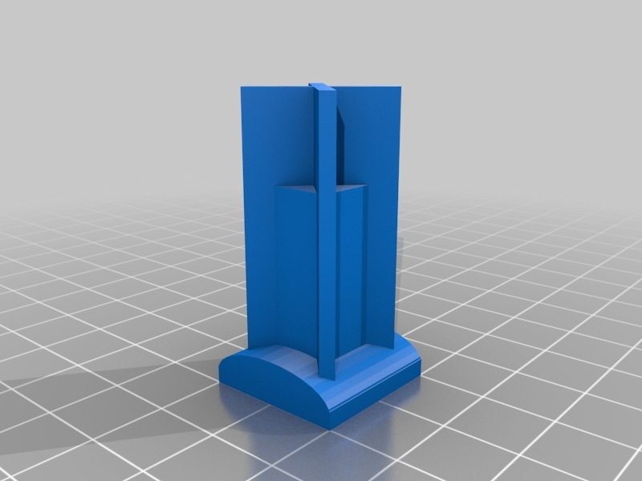
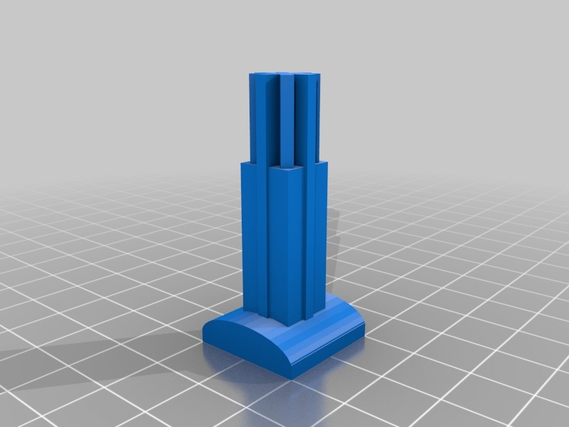
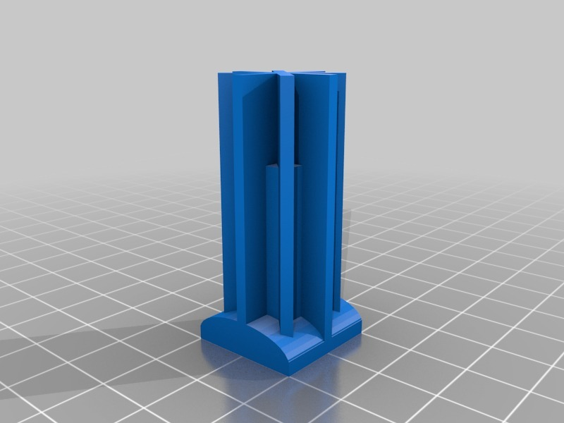
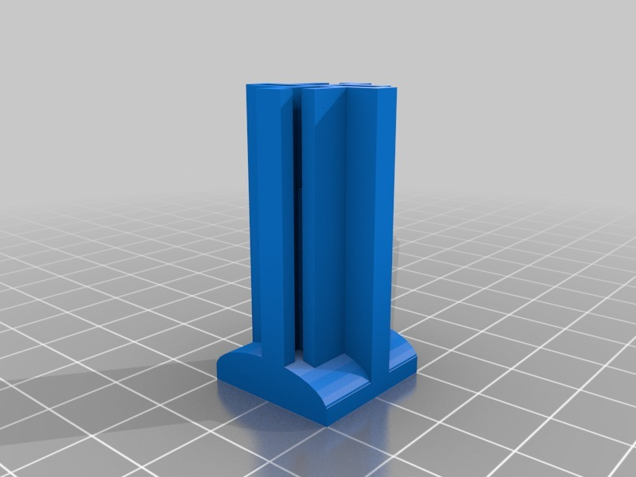
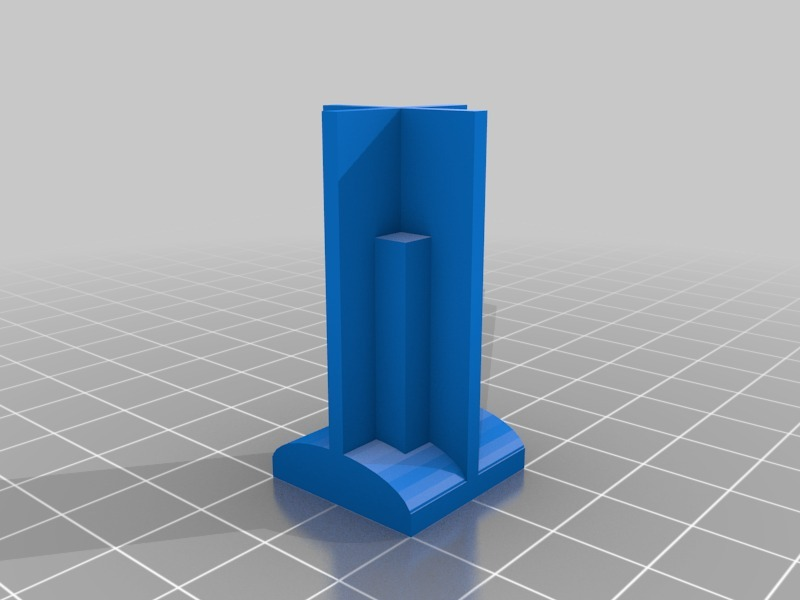
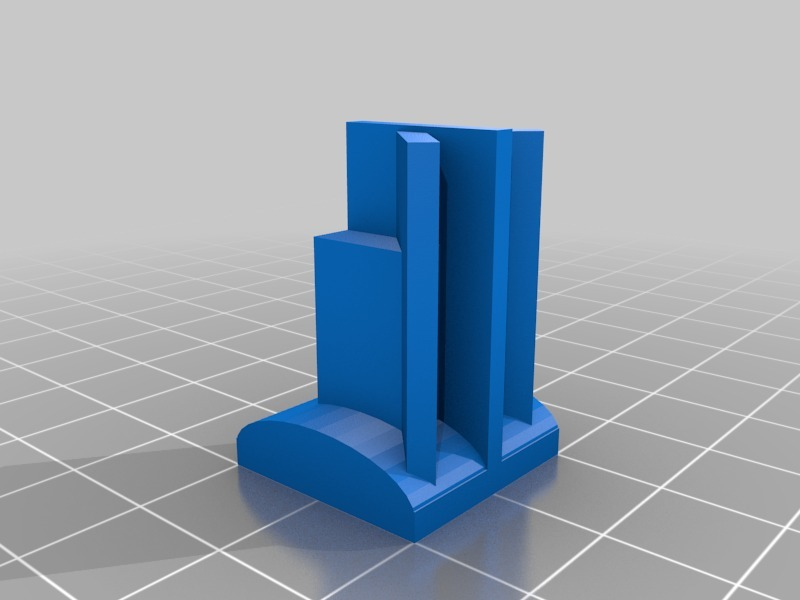

Tags
--------
Chess , TinkerCAD  

  

License
--------
Heading #Chess by MakeALot is licensed under the Creative Commons - Attribution license.  

By: Mark Durbin (MakeALot)
--------
<http://NestedCube.com/>