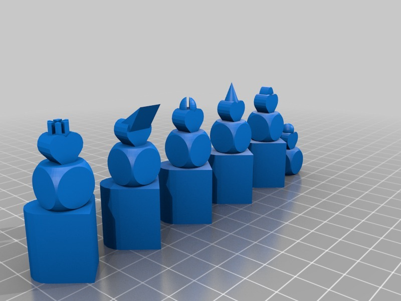
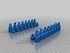
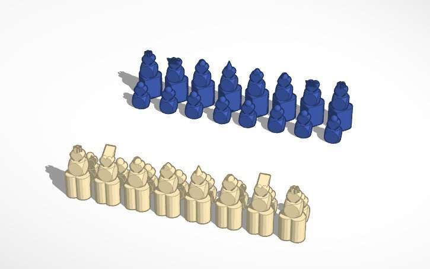
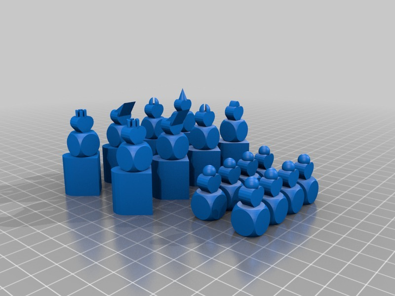
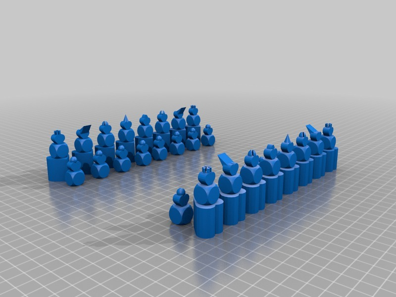

Heart #Chess
===============
**Please note: This thing is part of a list that was [automatically generated](https://github.com/carlosgs/export-things) and may have been updated since then. Make sure to check for the current license and authorship.**  

Heart #Chess  by MakeALot , published Mar 19, 2012

Description
--------
Heart Shaped printable chess set 
This part was made with Tinkercad. Edit the part online at: <a href="https://tinkercad.com/things/c7UAJc7Nnxj" target="_blank" rel="nofollow">tinkercad.com/things/c7UAJc7Nnxj</a>

Instructions
--------
Print and play against your loved one.

Files
--------

 [ ChessBoard.stl](ChessBoard.stl)  

 [ FullSet.stl](FullSet.stl)  

 [ 6Chess.stl](6Chess.stl)  

Pictures
--------

Tags
--------
chess , Tinkercad  

  

License
--------
Heart #Chess by MakeALot is licensed under the Creative Commons - Attribution license.  

By: Mark Durbin (MakeALot)
--------
<http://NestedCube.com/>