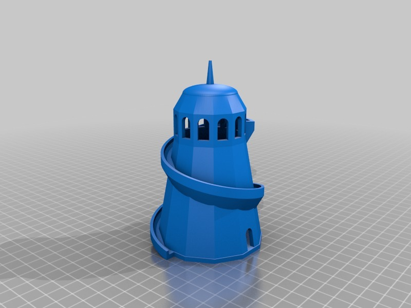

Helter Skelter
===============
**Please note: This thing is part of a list that was [automatically generated](https://github.com/carlosgs/export-things) and may have been updated since then. Make sure to check for the current license and authorship.**  

Helter Skelter  by MakeALot , published Oct 5, 2012

Description
--------
A fairground helter skelter.

Instructions
--------
Take a rug up to the top and slide down on it as fast as you can.

Files
--------

 [ Helter_Skelter.stl](Helter_Skelter.stl)  

Pictures
--------

Tags
--------
fair , faire , fairground , fun_fair , playground , slide  

  

License
--------
Helter Skelter by MakeALot is licensed under the Creative Commons - Attribution license.  

By: Mark Durbin (MakeALot)
--------
<http://NestedCube.com/>