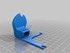
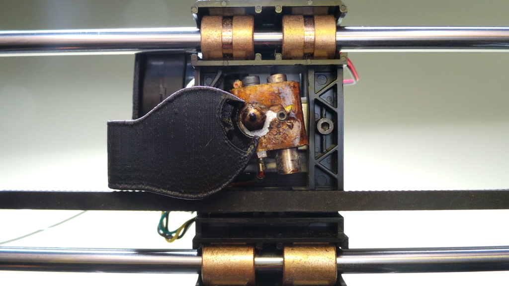
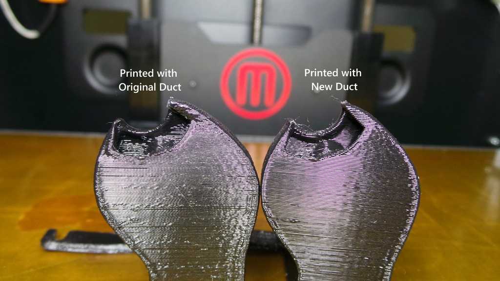

Improved Rep 2 Fan Duct
===============
**Please note: This thing is part of a list that was [automatically generated](https://github.com/carlosgs/export-things) and may have been updated since then. Make sure to check for the current license and authorship.**  

Improved Rep 2 Fan Duct  by MakeALot , published Feb 17, 2013

Description
--------
My original model was OK, but I felt it needed better direction.  This one is a noticeable improvement over the previous one in terms of bridging and fine detail.

Instructions
--------
loosen the bolts, remove old duct, slip in new. 
 
I've included the model for anyone with Alibre Design that wants to play/improve.

Files
--------

 [ FanDuct2Export.zip](FanDuct2Export.zip)  

 [ FanDuct2.stl](FanDuct2.stl)  

 [ FanDuct2.AD_PRT](FanDuct2.AD_PRT)  

Pictures
--------

Tags
--------
None  

  

License
--------
Improved Rep 2 Fan Duct by MakeALot is licensed under the Creative Commons - Attribution license.  

By: Mark Durbin (MakeALot)
--------
<http://NestedCube.com/>