Linear Bearing Y Axis Carriage for ToM
===============
**Please note: This thing is part of a list that was [automatically generated](https://github.com/carlosgs/export-things) and may have been updated since then. Make sure to check for the current license and authorship.**  

Linear Bearing Y Axis Carriage for ToM  by MakeALot , published Sep 15, 2011

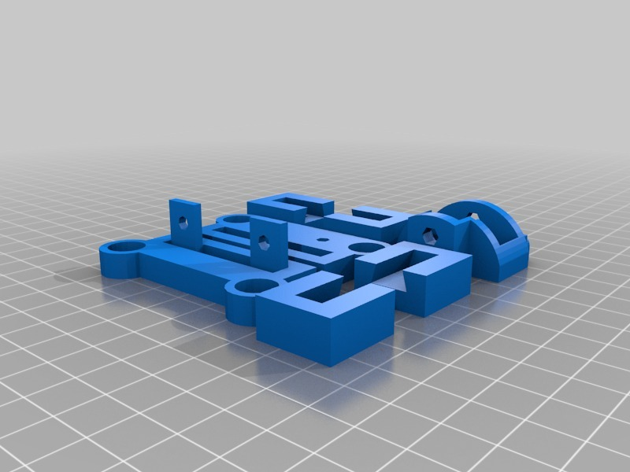

Description
--------
ToM Y Axis Carriage for Linear bearings LMB6UU (3/8") 
 
This is really just a little project that I've been fiddling with over the last few months when I have a moment to spare.  
Purely for my own enjoyment (yes, I know, I should get out more), but you are welcome to try if you wish. 
I'm sure there are a whole raft of engineers ready to tell me that this is wrong in so many ways and I look forward to being enlightened by their candid observations and everyone's improvements &amp; modifications. 
 
For anyone who'd like to try it, it <b>really <i>is</i></b> a work-in-progress and although it works quite happily at 50mm/s feed rate, it is not yet what I would consider finished. 
 
This version requires an X carriage of its own because I've centred the X pulley. As it sits lower on the rods, it gives you &gt; 126mm on the Z axis,  so you'll need to place your HBP very high to stop the Z stage falling off the lead screw.  (I'll make it ride higher in the next version which will give the stepper more clearance over the bed as well). 
<i> 
I should have moved the Y limit switch but to save any hassle I added a long arm to the centre section that operates it in its current position. 
 
I also think the X limit switch should be moved to the side of the carriage to clear the pulley bolt. 
 
I ended up using 4 bearings although I started out with 3.  The inertia of the motor side is too great for the bearings on the right to stop the carriage twisting, I think I may try moving the motor to the right and go back to 3 in a later version. 
 
I also intend to move the bearings closer together and remove more material from the base of the carriage to make it lighter. 
</i> 
 
I'll post some photos of it installed when I get a chance.

Instructions
--------
o Print the 5 plates. 
o Push the bearings into place, you'll need 7 (3+4). 
o Fit the HBP to the X carriage (right at the top of the bolts) 
o Place the end rod supports on the ends of the left and right sections. 
o Attach the motor to the left end. 
o insert the 4 captive nuts into the tensioner/limit switch support. 
o Attach the belt tensioner to the right end using 2 M3x30mm bolts. 
o Attach the limit switch to the right end using 2 M3x12mm bolts. 
o Place the X pulley belt and pulley wheel into the tensioner and drop in 
  an M4 bolt I need to get one the right length and add two nuts, but the  
  current one works at the moment. 
o Insert the X rods through the X carriage bearings 
o Slide the belt into the belt coupler on the X carriage 
o Push the X rods into the end supports 
o Hold the centre section in place and slide on the couplers. 
o Place the pulley belt over the motor and tighten the belt gently 
o place whole carriage into machine 
o Slide the Y belt into the belt coupler on the Y carriage 
o Insert the YRods from the front through the bearings. 
o Attach all cables. 
o Make sure the carriages activate the end stops on the X and Y axis 
o calibrate as normal <b>(taking care to see that the Z stage does not  
  drop off the lead screw)</b> 
 
<b> If this is too confusing, let me know and I'll post some step-by-step photos.</b>

Files
--------

 [ LMB6UU_YBase_SmallParts.stl](LMB6UU_YBase_SmallParts.stl)  

[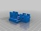](LMB6UU_YBase_Left.stl)
 [ LMB6UU_YBase_Left.stl](LMB6UU_YBase_Left.stl)  

 [ LMB6UU_YBase_Centre.stl](LMB6UU_YBase_Centre.stl)  

 [ ToM_yAxis_LMB6UU_Base.scad](ToM_yAxis_LMB6UU_Base.scad)  

[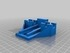](LMB6UU_YBase_Right.stl)
 [ LMB6UU_YBase_Right.stl](LMB6UU_YBase_Right.stl)  

[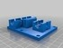](LMB6UUX_Base.stl)
 [ LMB6UUX_Base.stl](LMB6UUX_Base.stl)  

Pictures
--------
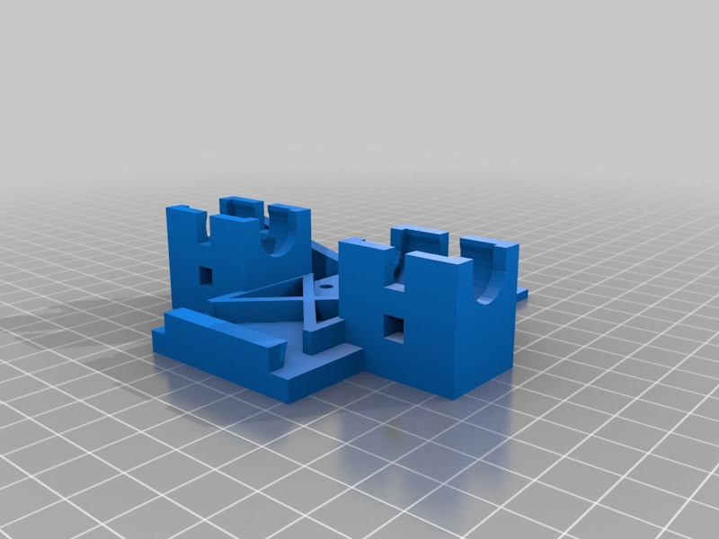
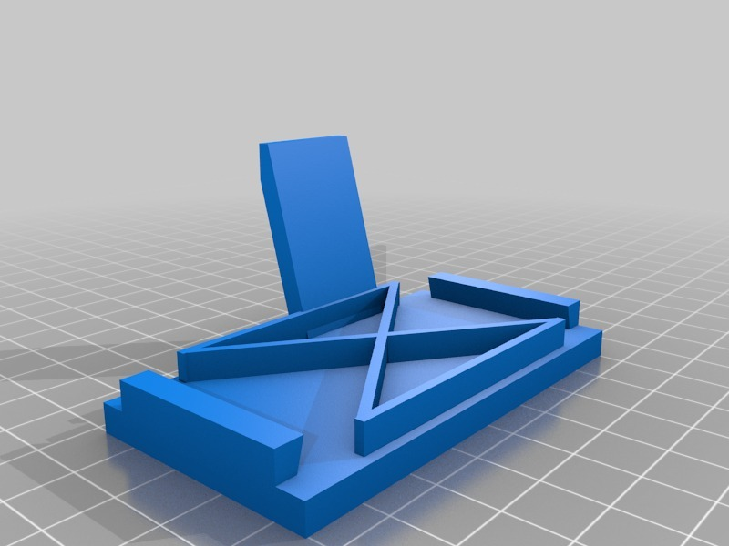
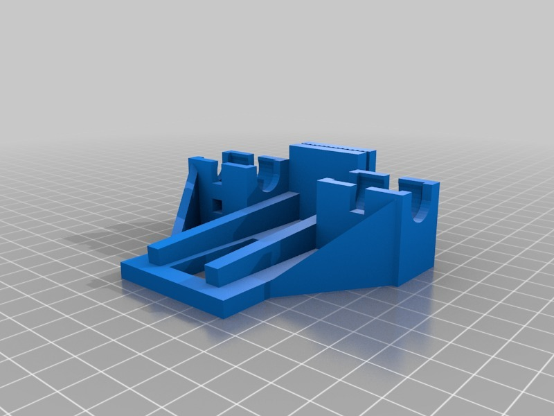
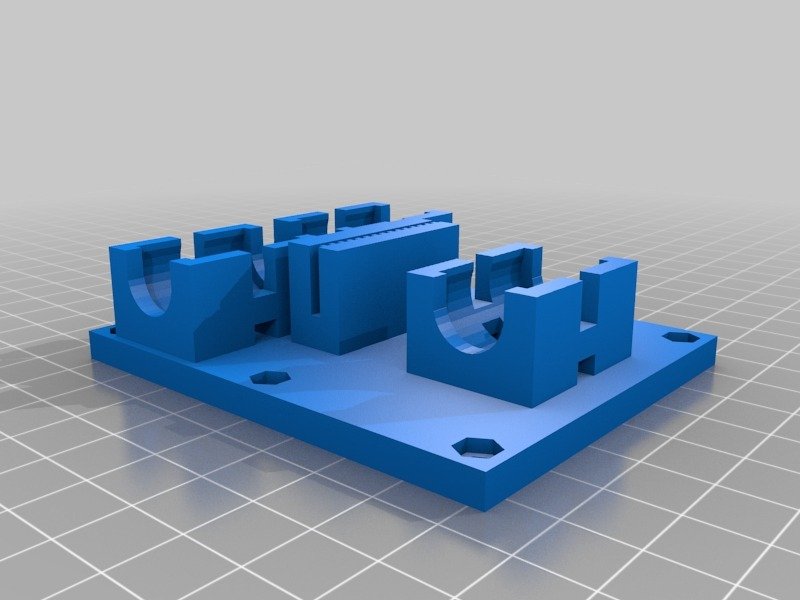
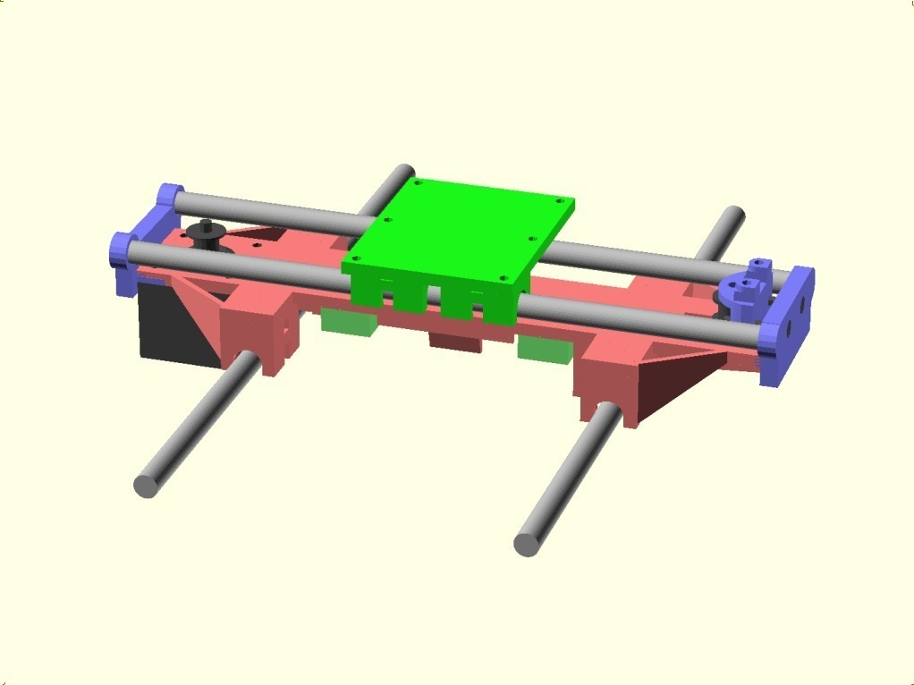
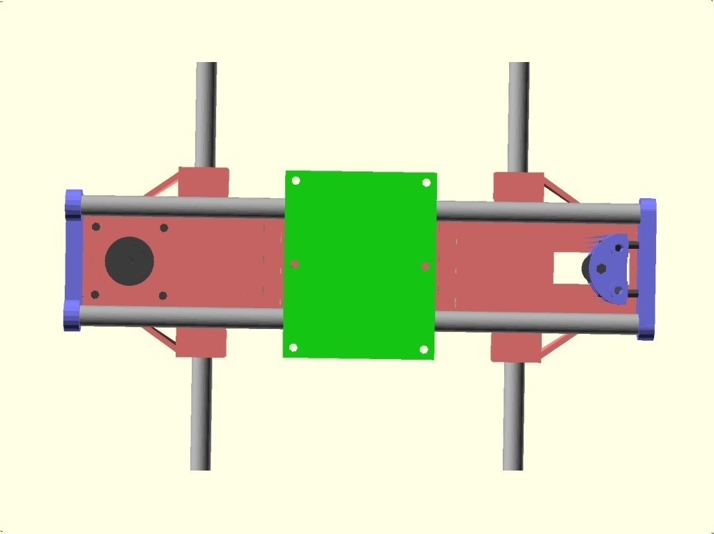
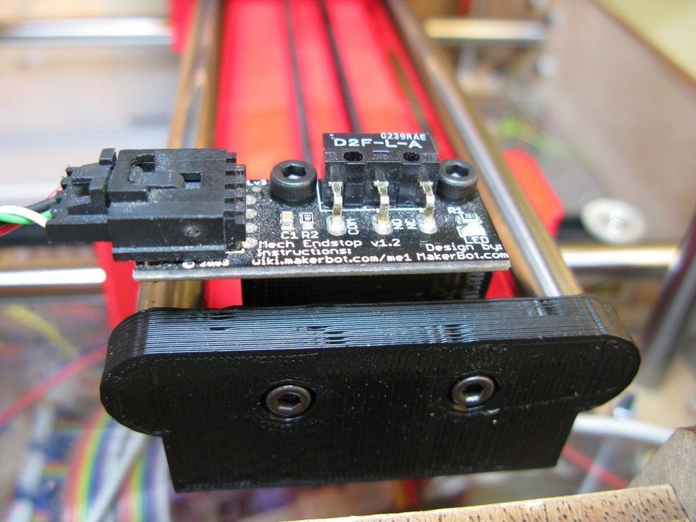
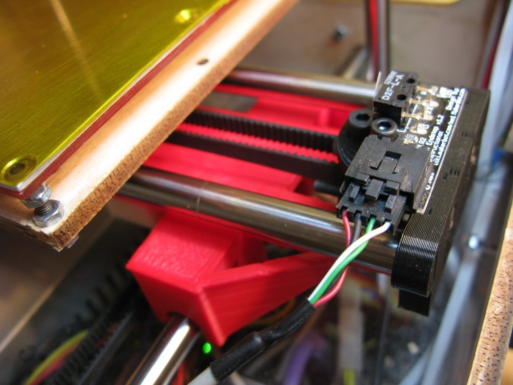
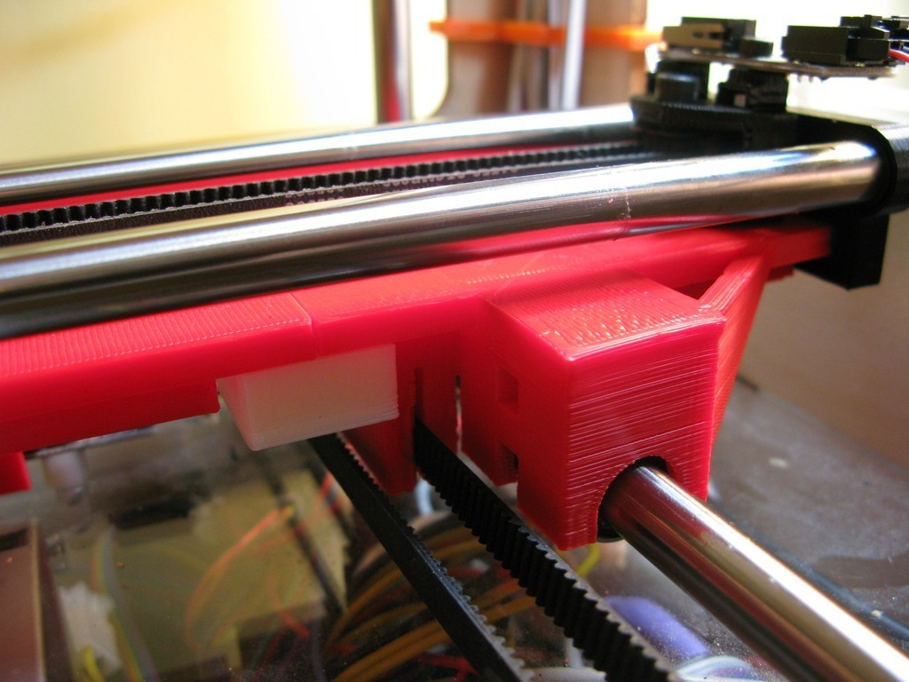
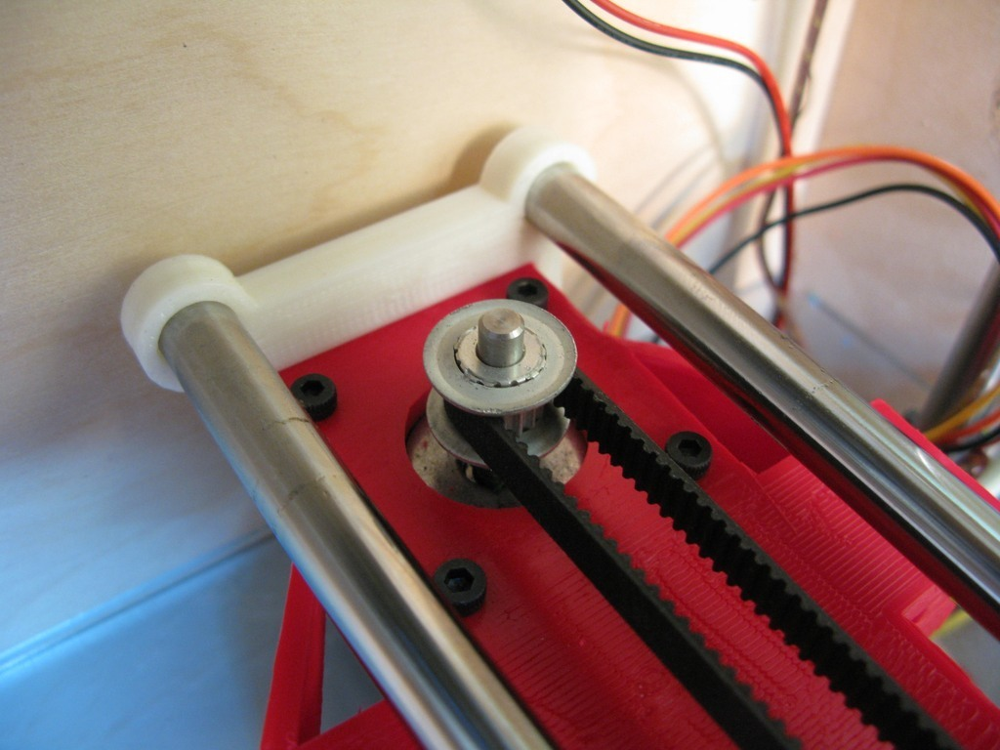
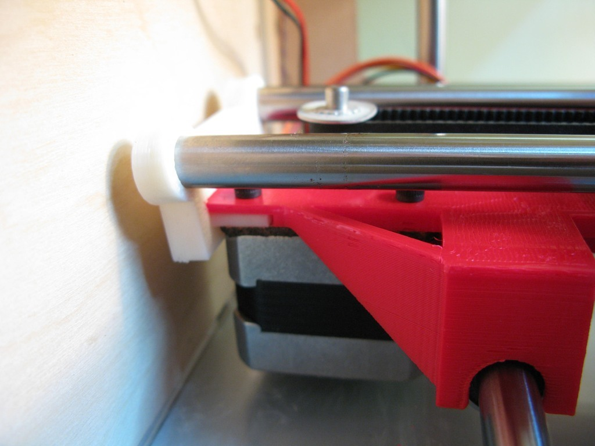
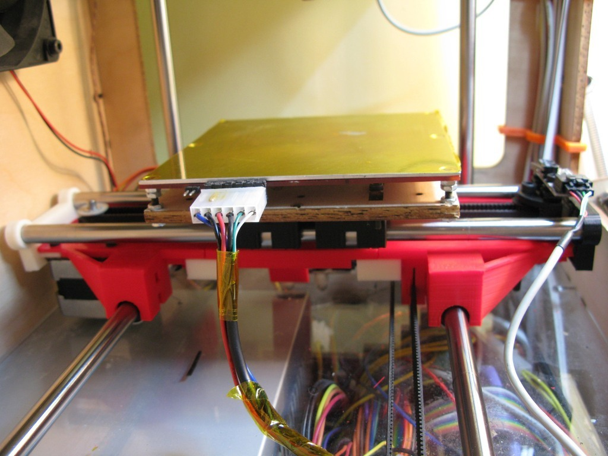

Tags
--------
linear bearing , Thing-o-matic , ToM , Y Axis , Carriage , LMB6UU , openscad , t-o-m , y-axis  

  

License
--------
Linear Bearing Y Axis Carriage for ToM by MakeALot is licensed under the Creative Commons - Attribution license.  

By: Mark Durbin (MakeALot)
--------
<http://NestedCube.com/>