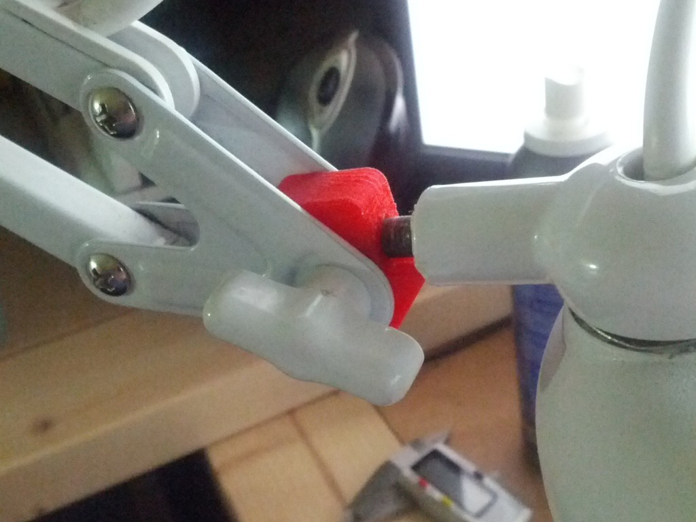
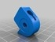
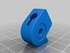
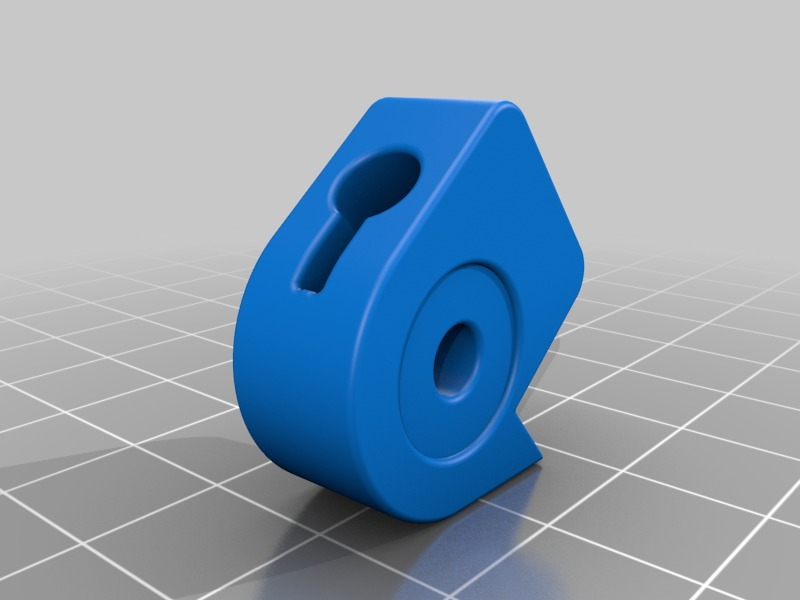
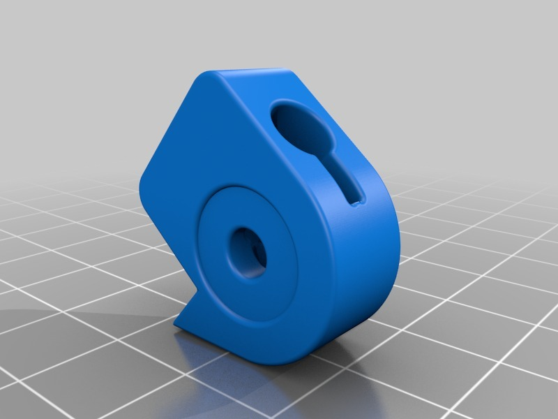
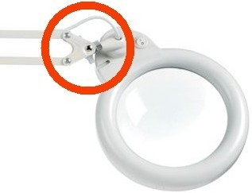
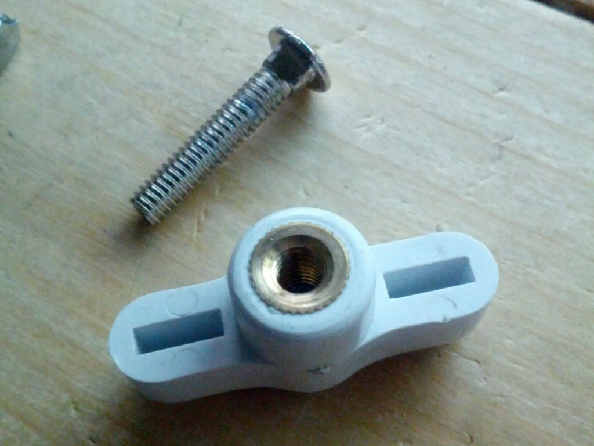
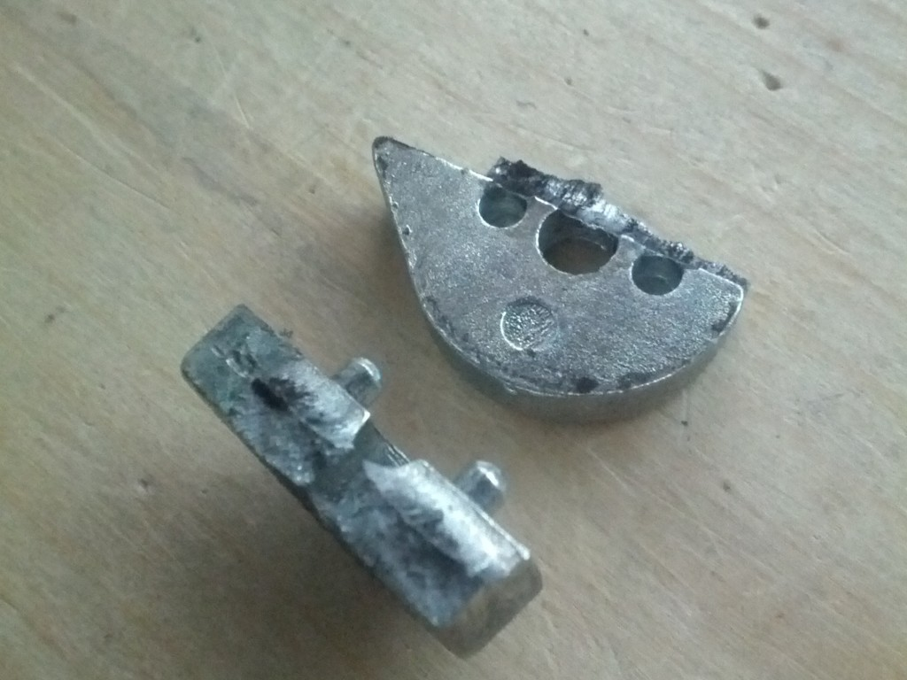
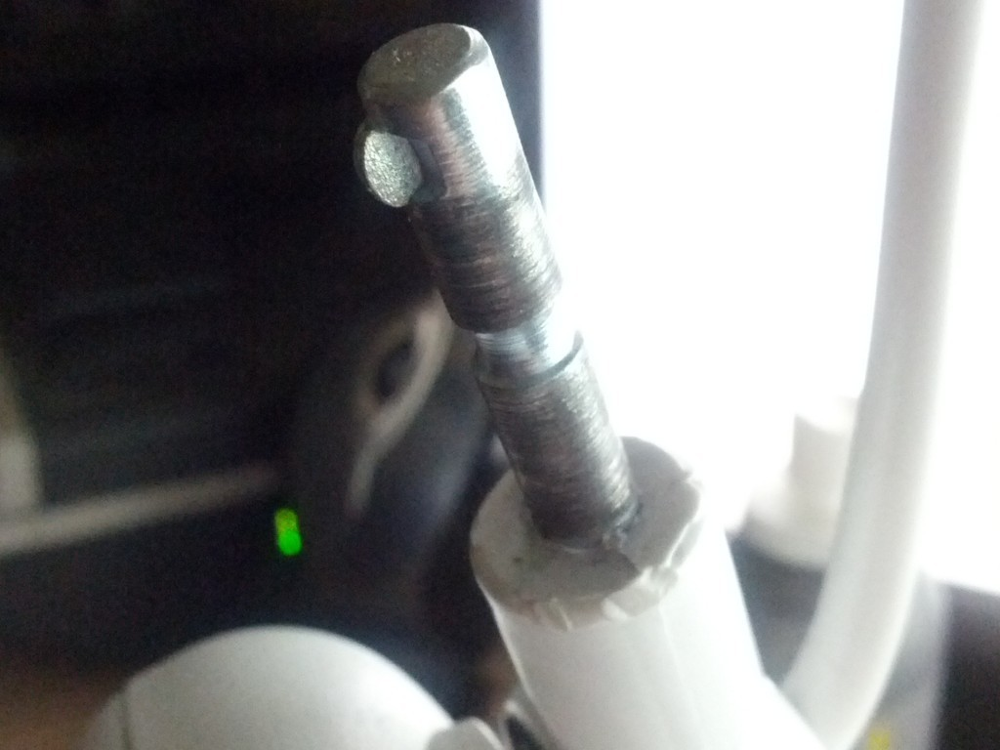

Magnifying Lamp broken clamp replacement
===============
**Please note: This thing is part of a list that was [automatically generated](https://github.com/carlosgs/export-things) and may have been updated since then. Make sure to check for the current license and authorship.**  

Magnifying Lamp broken clamp replacement  by MakeALot , published Nov 19, 2013

Description
--------
I've broken the clamp in the end of my magnifying lamp arm.  The cast metal has crumbled under my constant tightening.   
 
I don't suppose a PLA version will last long, but it's quick to print another.   
 
If anyone else needs one then it's here for you to use.   
 
I suppose I could print it in nylon if it doesn't last.

Instructions
--------
None

Files
--------

 [ LightSquezeLHole.stl](LightSquezeLHole.stl)  

 [ LightSqueze.AD_PRT](LightSqueze.AD_PRT)  

 [ LightSquezeSHole.stl](LightSquezeSHole.stl)  

Pictures
--------

Tags
--------
Arm , Clamp , Lamp , Magnifyer , Repair , tensioner  

  

License
--------
Magnifying Lamp broken clamp replacement by MakeALot is licensed under the Creative Commons - Attribution license.  

By: Mark Durbin (MakeALot)
--------
<http://NestedCube.com/>