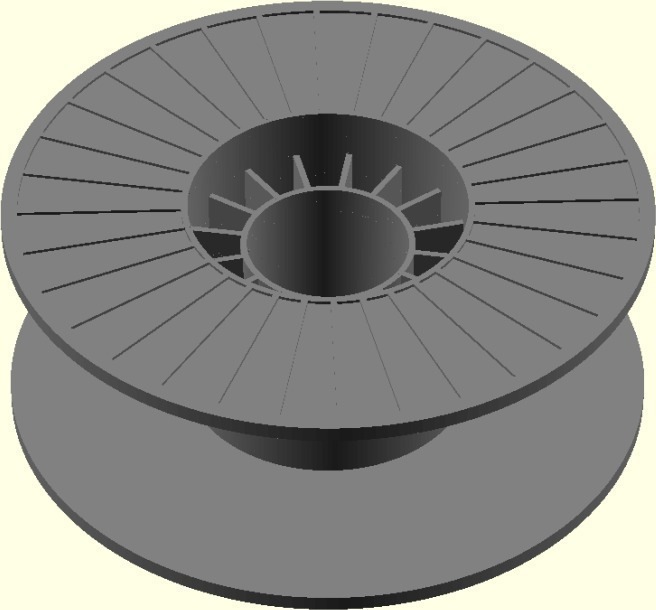
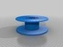
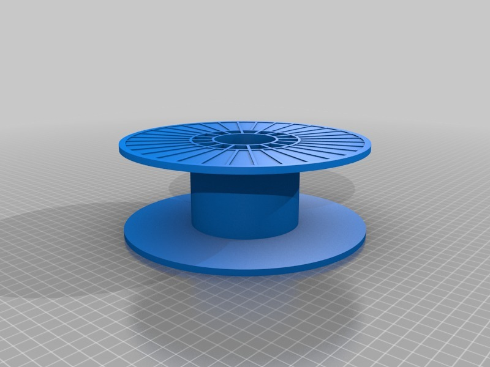

Makerbot Spool model
===============
**Please note: This thing is part of a list that was [automatically generated](https://github.com/carlosgs/export-things) and may have been updated since then. Make sure to check for the current license and authorship.**  

Makerbot Spool model  by MakeALot , published Apr 27, 2011

Description
--------
Model of Makebot spool - unprintable 
This is a model of the Makerbot spool,  I used this to model a printable version. 
 

Instructions
--------
Use in other models as a space holder for the Makerbot spool. 
 

Files
--------

 [ MakerbotSpool.stl](MakerbotSpool.stl)  

 [ MakerbotSpool.scad](MakerbotSpool.scad)  

Pictures
--------

Tags
--------
model , negative_space , openscad , Reel , spool  

  

License
--------
Makerbot Spool model by MakeALot is licensed under the Creative Commons - Attribution license.  

By: Mark Durbin (MakeALot)
--------
<http://NestedCube.com/>