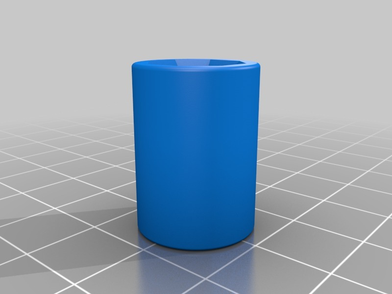
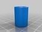
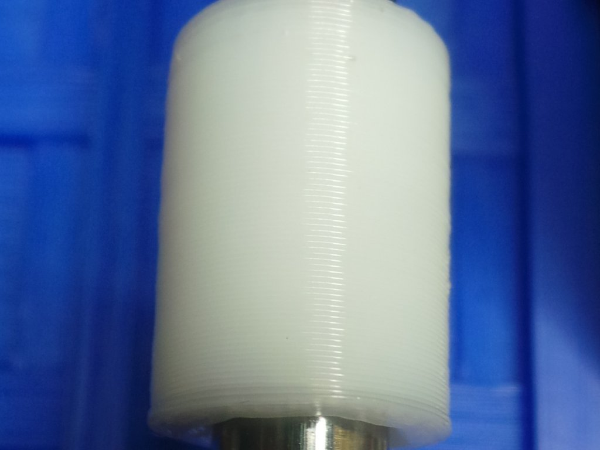
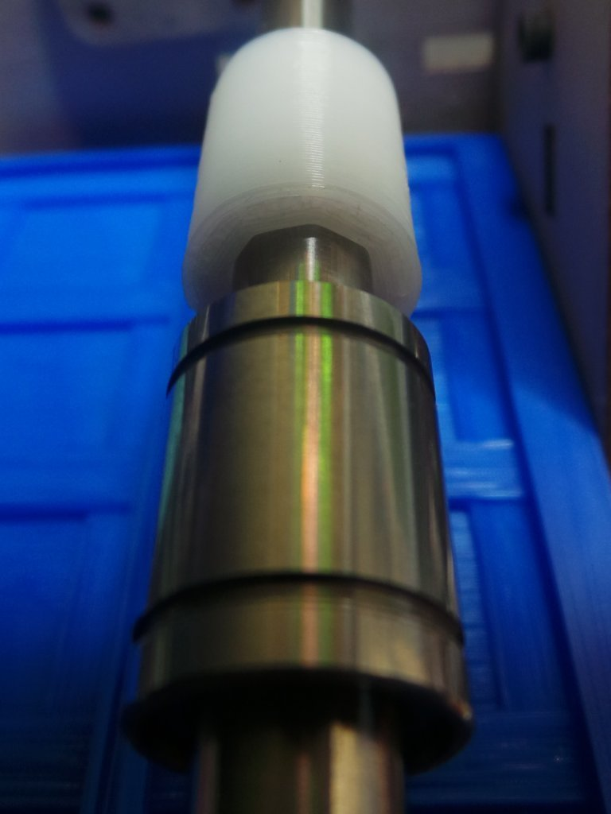

Nylon Linear bearing
===============
**Please note: This thing is part of a list that was [automatically generated](https://github.com/carlosgs/export-things) and may have been updated since then. Make sure to check for the current license and authorship.**  

Nylon Linear bearing  by MakeALot , published Dec 1, 2012

Description
--------
Direct replacement for LMB6UU (3/8") Linear bearing as used in Thing-o-Matic mods. 
 
 

Instructions
--------
Buy some 3mm Taulman 618 Nylon (it's brilliant), print some of these at: 
100% object infill, 0.29mm layer height, 0 extra shells, 245 degrees C, bed 50 degrees on a PVA painted kapton bed. 
 
and use them wherever a design calls for LMB6UU 3/8" ID Linear bearing. 
 
I'm expecting them to last well, but even if they only last a short while, at $20/lb (454 grammes), each bearing cost $0.10, compared with $5 for the LMB6UU. 
 
BTW, the Nylon does not de-laminate, so I'm going to print some linear mounting blocks and upgrade all of my ToM carriages. 

Files
--------

 [ 38_LinearBearing.stl](38_LinearBearing.stl)  

Pictures
--------

Tags
--------
Linear_bearing , LMB6UU , Nylon  

  

License
--------
Nylon Linear bearing by MakeALot is licensed under the Creative Commons - Attribution license.  

By: Mark Durbin (MakeALot)
--------
<http://NestedCube.com/>