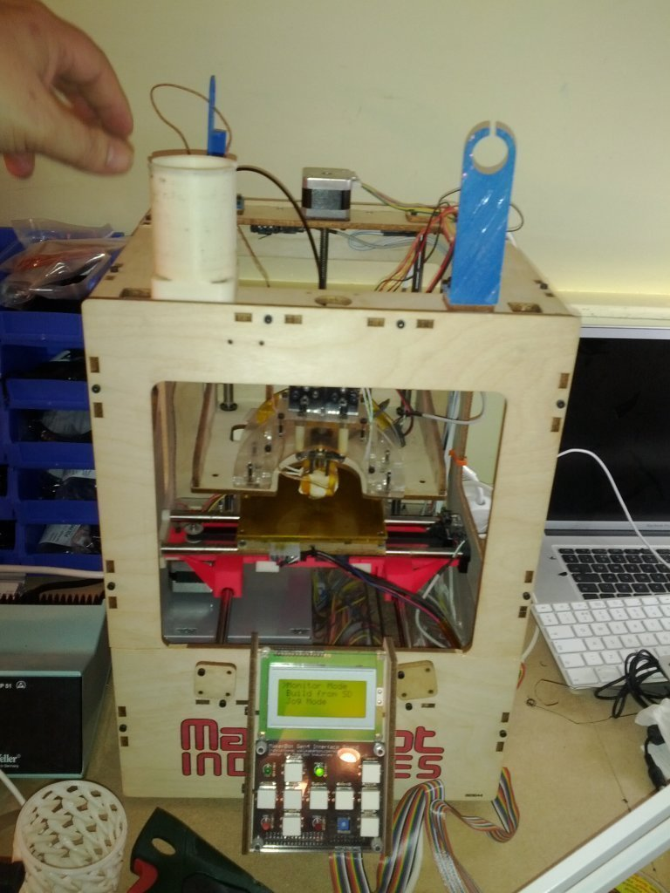
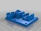
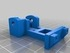
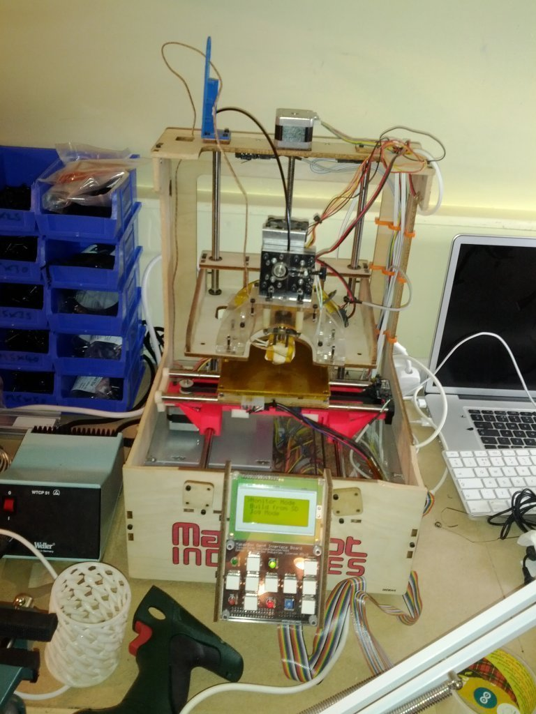
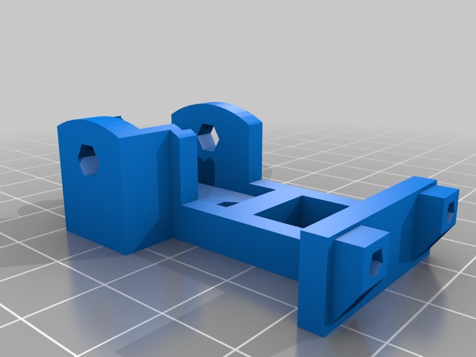
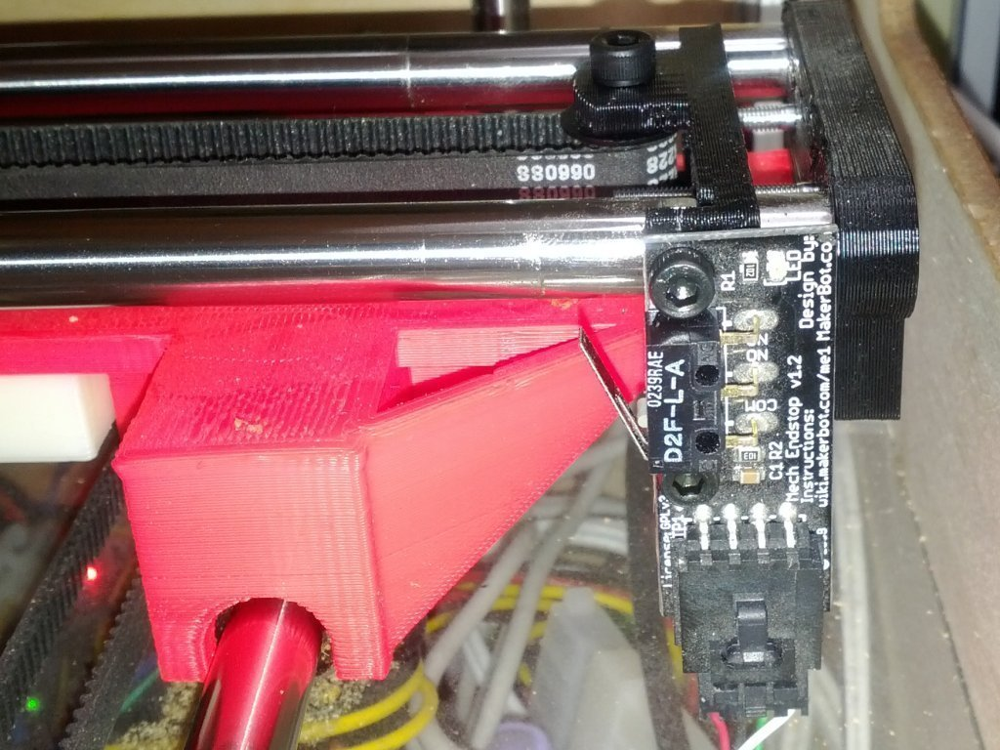
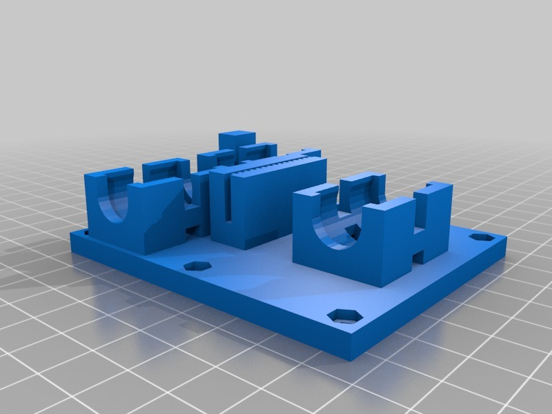
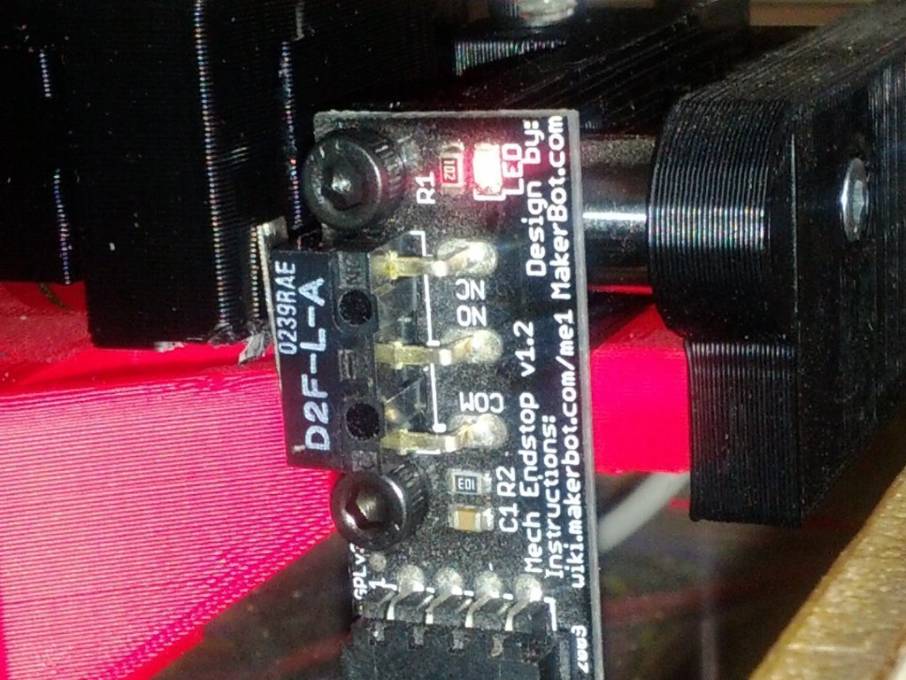
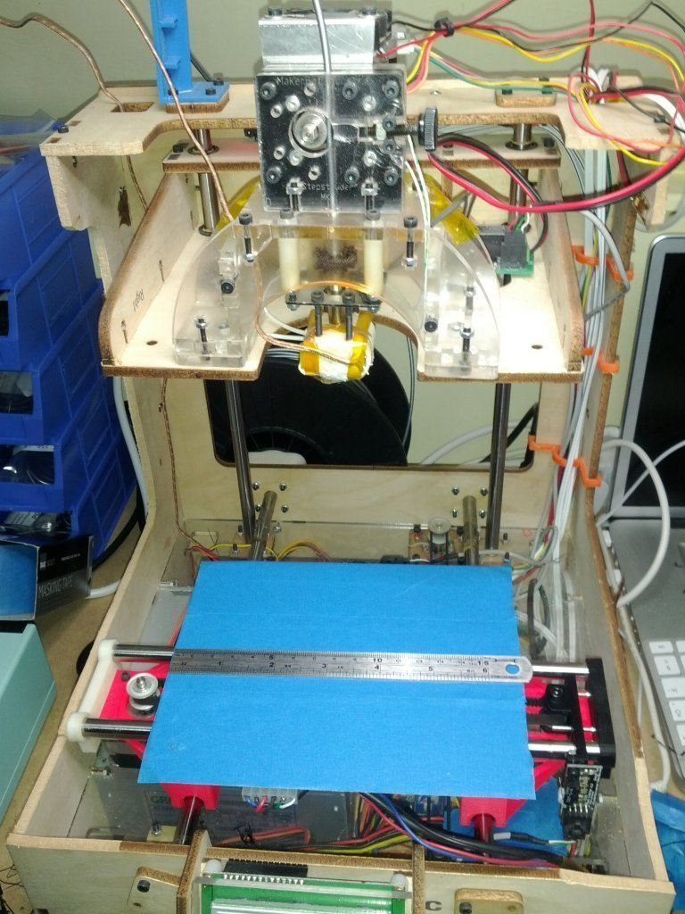

Open Top ToM
===============
**Please note: This thing is part of a list that was [automatically generated](https://github.com/carlosgs/export-things) and may have been updated since then. Make sure to check for the current license and authorship.**  

Open Top ToM  by MakeALot , published Feb 24, 2012

Description
--------
I wanted to hack, so I literally hacked the top off my ToM.   
 
I assume someone must have done this before, but I can't see one in Thingiverse. 
 
There is a plan...  ... (hushed tones)  I'm going to make the X Carriage run to its full potential  
i.e. the belt length between the pulleys - approx. 160mm. and the Y carriage run to the front of the machine approx. 130mm. 
This should give me a build platform of 150 X, 120 Y and 120 Z without much trouble.   
I'll need to print using PLA so that I don't need all that space heated, but I don't think that will be a problem. 
 
I'm afraid all the people who use this in public will need to put HOT warnings on the exposed parts, but it's not as if they were behind glass before. 
 
For those of you who don't wish to chop the top off your ToM, you can still use this carriage mod to give you 150 x 80 x 120 prints.

Instructions
--------
So, take your ToM to a work bench. 
Grab your handy Jigsaw and hack off the top (of the ToM). 
 
don't cut through your LED strip stuck round the inside top (like I did, duh!) and make sure any cables are clear of the saw blade. 
 
Move your trusty spool holder to the back of the machine. 
 
I was amazed that I didn't even need to adjust my Z zero position, its just as rigid as before.   Although I'll keep an eye on it and reinforce the back corners with aluminium (aluminum) angle if necessary. 
 
If you want to follow along here, you'll need to have the Y carriage <a href="http://www.thingiverse.com/thing:11601" target="_blank" rel="nofollow">thingiverse.com/thing:11601</a>. 
 
<b>Update:</b> 
 o I've redesigned the pulley block, moving the limit switch to the front allowing the table to run to the end of the x travel. 
 o I've updated the X carriage to trigger the endstop 
 o I've now got <b>150mm</b> travel on the X Axis, I need to add a wider hot plate 
 
 - added new aluminium plate for HBP 165x140 
 - printed item 155 * 80 * 60 (x,y,z) 
 - printed item 186 * 30 x 40 (x,y,z) placed diagonally 
 
Can't really get the Y any larger without moving the head centre (as the rear columns of the case interfere with the bed) 
But overall, I'm very happy with my new extended ToM. :)

Files
--------

 [ pullyBlock.scad](pullyBlock.scad)  

 [ ToM_xAxis_LM8UU_Base_SideES.stl](ToM_xAxis_LM8UU_Base_SideES.stl)  

 [ pullyBlock.stl](pullyBlock.stl)  

 [ ToM_xAxis_LM8UU_Base_SideES.scad](ToM_xAxis_LM8UU_Base_SideES.scad)  

Pictures
--------

Tags
--------
C_cab , extended , extended_bed , Hack , open_top , ToM  

  

License
--------
Open Top ToM by MakeALot is licensed under the Creative Commons - Attribution license.  

By: Mark Durbin (MakeALot)
--------
<http://NestedCube.com/>