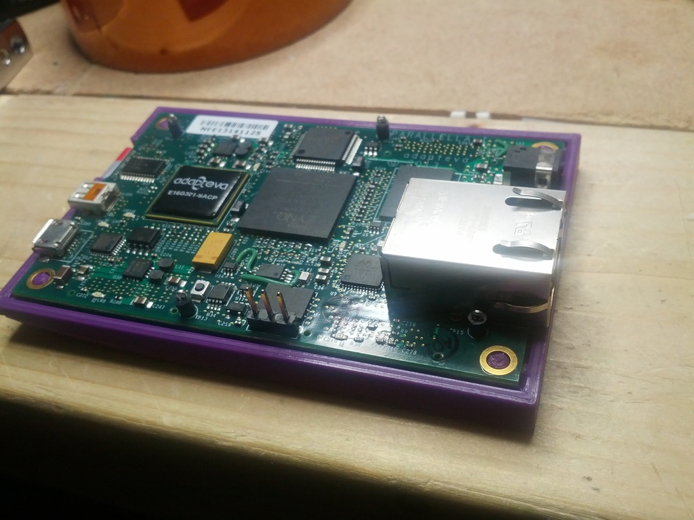
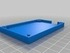
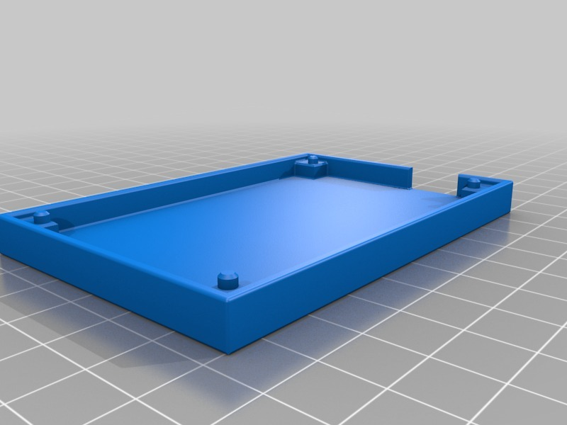
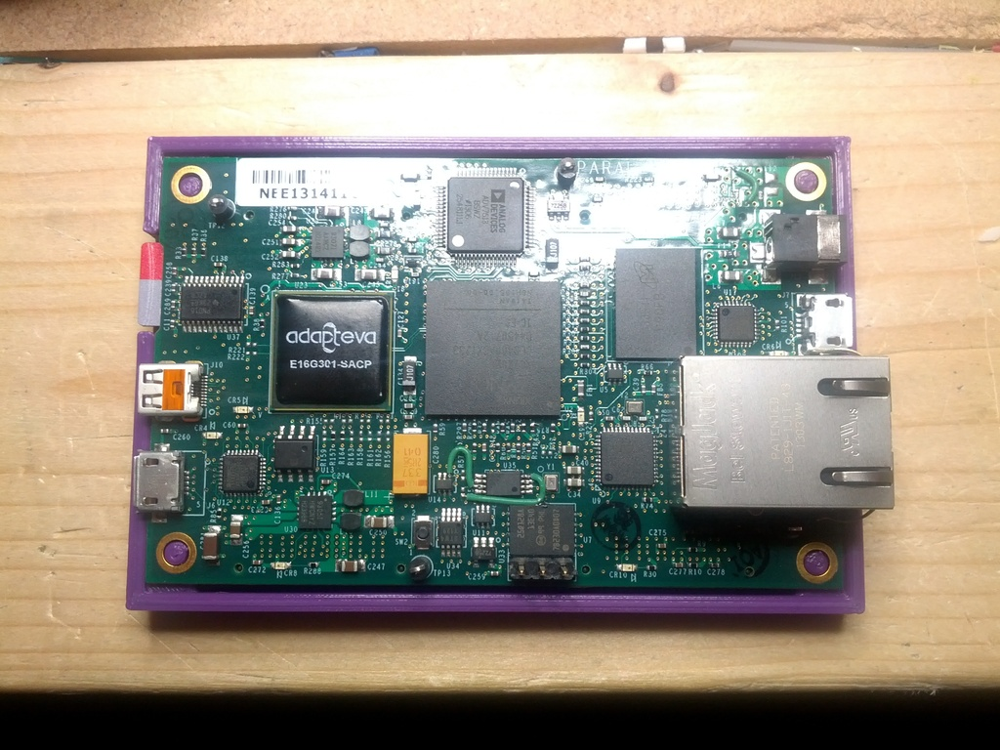
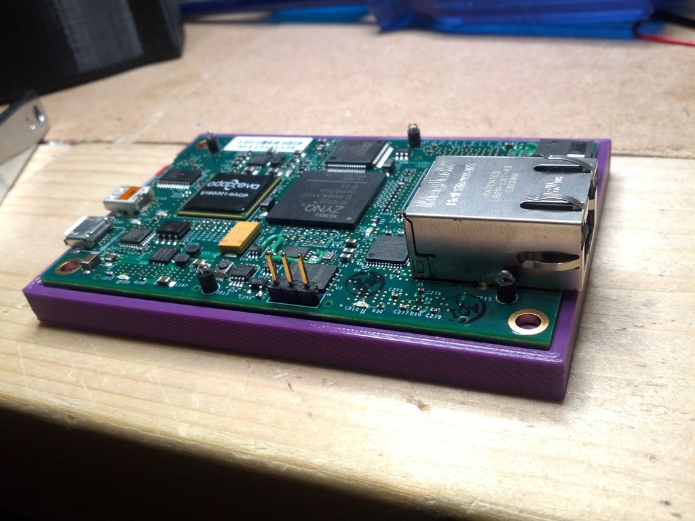

Parallella Coaster
===============
**Please note: This thing is part of a list that was [automatically generated](https://github.com/carlosgs/export-things) and may have been updated since then. Make sure to check for the current license and authorship.**  

Parallella Coaster  by MakeALot , published Aug 1, 2013

Description
--------
I've just received an Adapteva Parallella Single Board Computer and need something to keep me from shorting out the pins on the back of the PCB while I evaluate it. Here's a quick print for anyone who is in the same boat.   
 
<a href="http://www.adapteva.com/products/eval-kits/parallella/" target="_blank" rel="nofollow">adapteva.com/products/eval-kits/parallella/</a>  
 
<a href="http://www.faberdashery.co.uk/products-page/print-materials/princely-purple/" target="_blank" rel="nofollow">faberdashery.co.uk/products-page/print-materials/princely-purple/</a>  

Instructions
--------
None

Files
--------

 [ ParallelaCoaster.stl](ParallelaCoaster.stl)  

Pictures
--------

Tags
--------
adaptiva , coaster , faberdashery , parallella , SBC  

  

License
--------
Parallella Coaster by MakeALot is licensed under the Creative Commons - Attribution - Share Alike license.  

By: Mark Durbin (MakeALot)
--------
<http://NestedCube.com/>