Parisian Goblet for picnics
===============
**Please note: This thing is part of a list that was [automatically generated](https://github.com/carlosgs/export-things) and may have been updated since then. Make sure to check for the current license and authorship.**  

Parisian Goblet for picnics  by MakeALot , published Sep 11, 2011

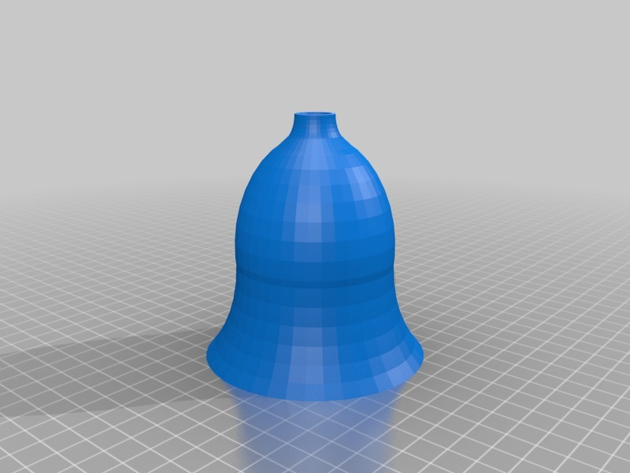

Description
--------
Large wine glass that conveniently packs down for travelling. 
 
Thanks to Aubenc for the threads: <a href="http://www.thingiverse.com/thing:8796" target="_blank" rel="nofollow">thingiverse.com/thing:8796</a> 

Instructions
--------
Print n * Top + n * Base where n=number of glasses required. 
Print with zero extra shells to get a nice and solid, water tight goblet. 
 
Given the size, they take a fair while to print. You may want to print these a few days ahead of the picnic, so I published them now ready for next summer. 
 
At this size, the goblet holds a large glass of wine. You may want to scale both parts appropriately if you would prefer sherry on your safari. 
 
Scaling to 50% on the x&amp;y axis would probably give a good approximation of a champagne flute, for those wishing to celebrate their good fortune.  
 
<b>Update:</b>SCAD uploaded.

Files
--------

 [ ParisianPicnicGoblet.scad](ParisianPicnicGoblet.scad)  

[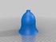](ParisianGobletTop.stl)
 [ ParisianGobletTop.stl](ParisianGobletTop.stl)  

[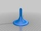](ParisianGobletBase.stl)
 [ ParisianGobletBase.stl](ParisianGobletBase.stl)  

 [ StemThreadedRod.stl](StemThreadedRod.stl)  

[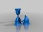](ParisianGobletCombinations.stl)
 [ ParisianGobletCombinations.stl](ParisianGobletCombinations.stl)  

 [ ParisianGobletTop_Adjusted.stl](ParisianGobletTop_Adjusted.stl)  

Pictures
--------
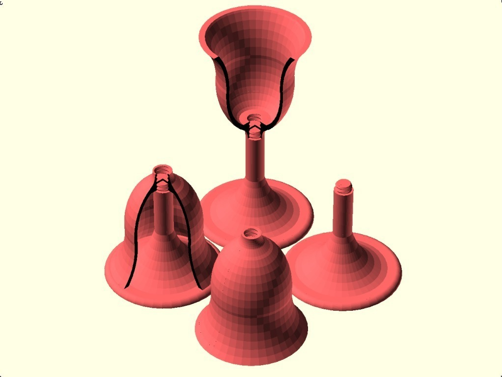
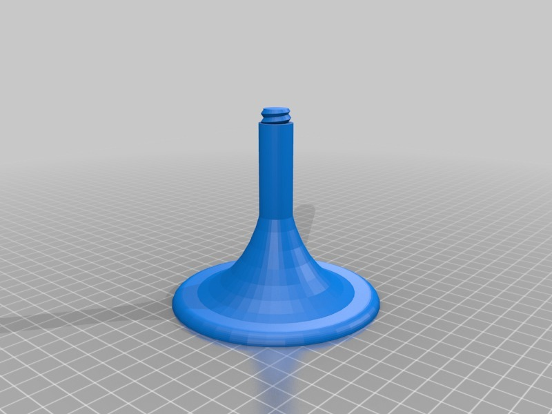
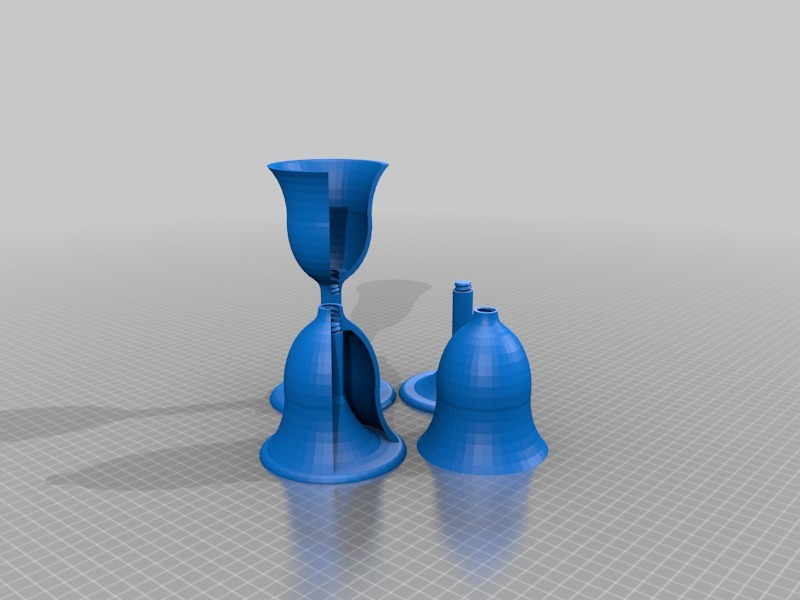
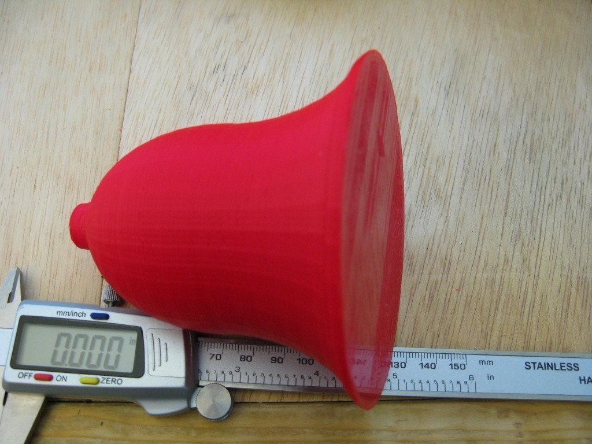
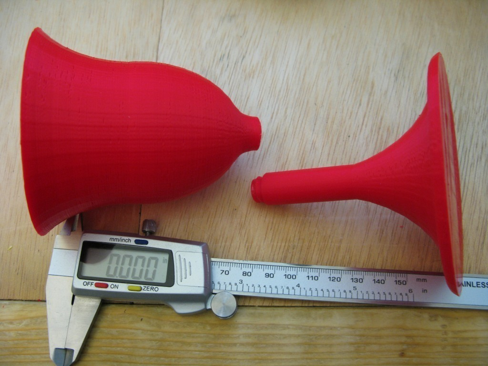
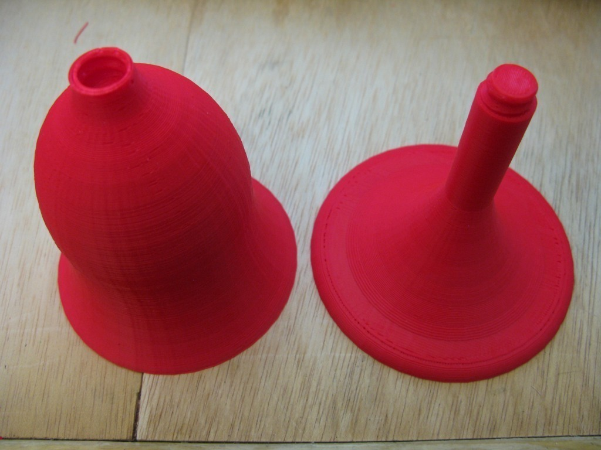
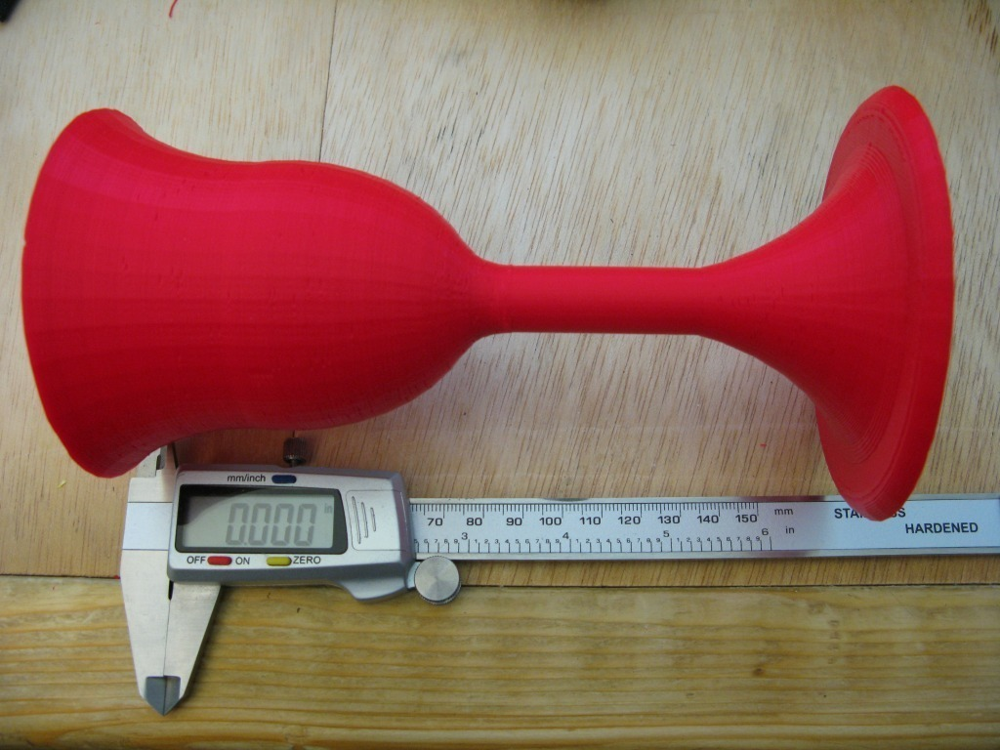
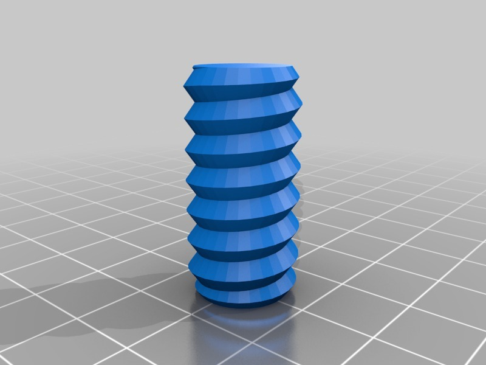

Tags
--------
cup , drink , goblet , openscad , picnic  

  

License
--------
Parisian Goblet for picnics by MakeALot is licensed under the Creative Commons - Attribution license.  

By: Mark Durbin (MakeALot)
--------
<http://NestedCube.com/>