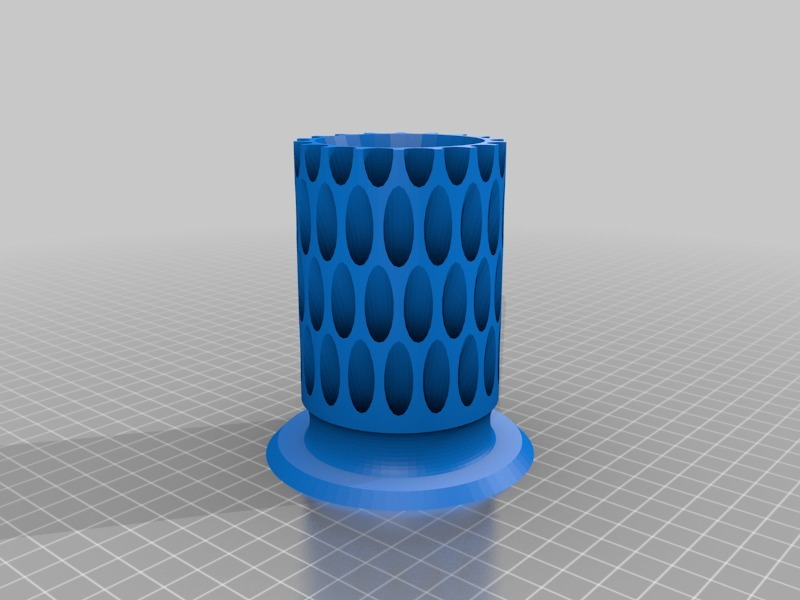
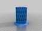
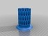
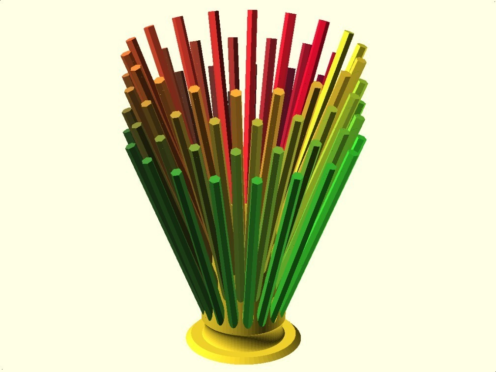
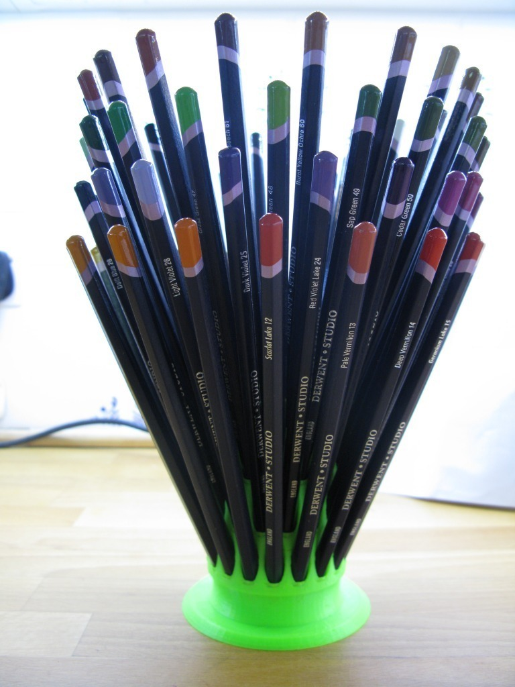
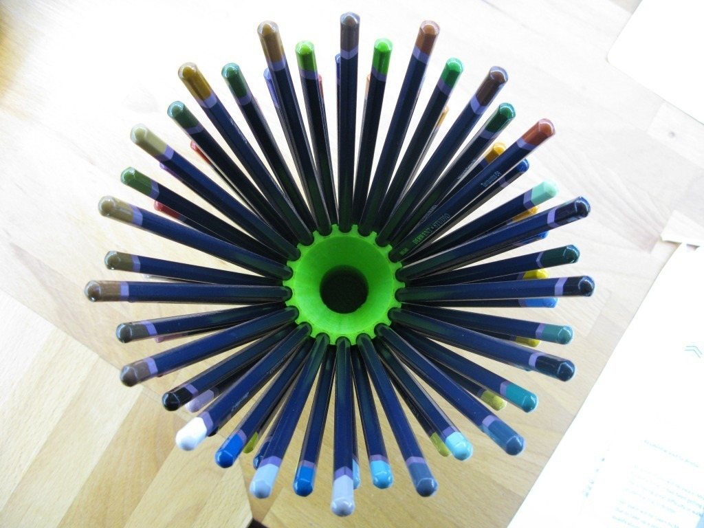

Pencil Cone
===============
**Please note: This thing is part of a list that was [automatically generated](https://github.com/carlosgs/export-things) and may have been updated since then. Make sure to check for the current license and authorship.**  

Pencil Cone  by MakeALot , published Jun 14, 2011

Description
--------
Pencil Cone pot 
Storage for 72 pencils and a little extra space in the middle for anything else.

Instructions
--------
Look, dowels just don't do it for me, OK? I'm cutting back slowly, I've stopped sleeping with a pencil behind my ear. I can quit any time I like - but I just had to make <b>one</b> more model. 
 
My daughter want's to know when she can have her pencils back! - soon honey, soon...

Files
--------

 [ PencilCone.scad](PencilCone.scad)  

 [ PencilCone2_fixed.stl](PencilCone2_fixed.stl)  

 [ PencilCone2.stl](PencilCone2.stl)  

Pictures
--------

Tags
--------
cone , fan , pot , openscad , pencil , pencil_holder  

  

License
--------
Pencil Cone by MakeALot is licensed under the Creative Commons - Attribution license.  

By: Mark Durbin (MakeALot)
--------
<http://NestedCube.com/>