Pencils Fan
===============
**Please note: This thing is part of a list that was [automatically generated](https://github.com/carlosgs/export-things) and may have been updated since then. Make sure to check for the current license and authorship.**  

Pencils Fan  by MakeALot , published Jun 3, 2011

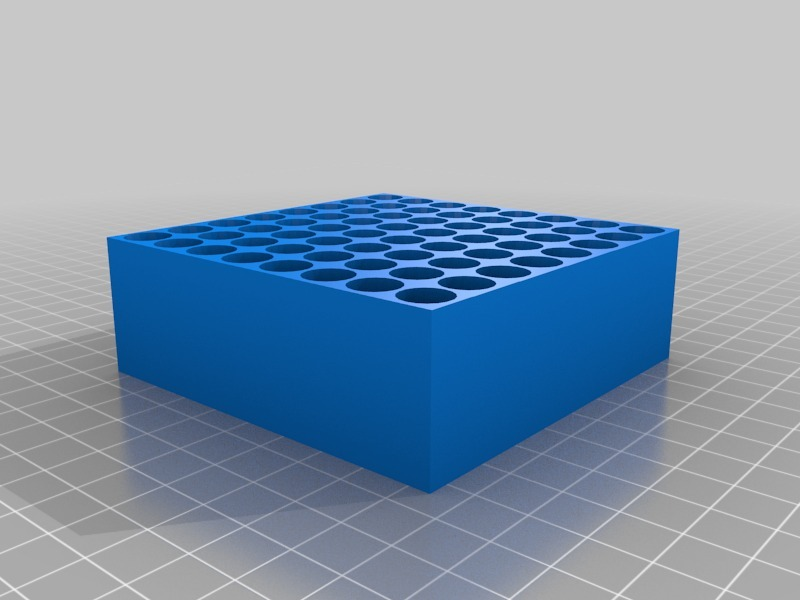

Description
--------
Pencils in more accessible rows. 
 
Whilst the other pencil designs I have uploaded are attractive enough as art, they lack much practical application. This design spreads the pencils enough for you to insert and replace them easily, displays all of them so you can find the one you are looking for, stays reasonably balanced when you remove a few, accepts differing diameter pencils, hides the sharp ends, and looks reasonably OK if a little utilitarian.  I don't know how well it will function with a mixture of long and short pencils, I suspect that you'll need to place the shorter pencils in the closest holes. 

Instructions
--------
Count your pencils, pick your size and print... 
 
I started with PencilsInRows.stl <b>(don't bother printing)</b>, but it took an age to slice and &gt; 8 hours to print. I thought to myself, there has to be a better way, so I reduced the plastic to the minimum, reduced the complexity to the minimum, I did slice through the holes diagonally to improve the gcode, but skeinforge didn't understand and got very confused, so I let it work out the tool path for these. 
 
The most complex CubeTube81 only takes 2 hours and meets all the usability goals I set myself. 
 
I've run out of time to work on these now, but if you'd like to have a go, to make them more stable, I suggest you flip it over and add a flat base that protrudes enough so that you can hold it down when you pull out a pencil. 
 
<b>I think I'm done with pencils now...</b>

Files
--------
[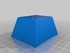](CubeTube30.stl)
 [ CubeTube30.stl](CubeTube30.stl)  

[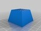](CubeTube25.stl)
 [ CubeTube25.stl](CubeTube25.stl)  

[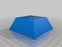](CubeTube64.stl)
 [ CubeTube64.stl](CubeTube64.stl)  

[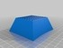](CubeTube56.stl)
 [ CubeTube56.stl](CubeTube56.stl)  

[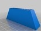](CubeTube18.stl)
 [ CubeTube18.stl](CubeTube18.stl)  

[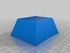](CubeTube42.stl)
 [ CubeTube42.stl](CubeTube42.stl)  

[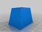](CubeTube12.stl)
 [ CubeTube12.stl](CubeTube12.stl)  

[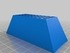](CubeTube36l.stl)
 [ CubeTube36l.stl](CubeTube36l.stl)  

[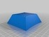](CubeTube72.stl)
 [ CubeTube72.stl](CubeTube72.stl)  

 [ CubeTubePencil.scad](CubeTubePencil.scad)  

[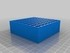](PencilsInRows.stl)
 [ PencilsInRows.stl](PencilsInRows.stl)  

[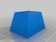](CubeTube20.stl)
 [ CubeTube20.stl](CubeTube20.stl)  

[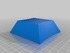](CubeTube81.stl)
 [ CubeTube81.stl](CubeTube81.stl)  

[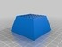](CubeTube36.stl)
 [ CubeTube36.stl](CubeTube36.stl)  

[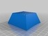](CubeTube49.stl)
 [ CubeTube49.stl](CubeTube49.stl)  

 [ PencilsInRows.scad](PencilsInRows.scad)  

[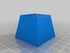](CubeTube16.stl)
 [ CubeTube16.stl](CubeTube16.stl)  

[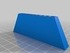](CubeTube9.stl)
 [ CubeTube9.stl](CubeTube9.stl)  

Pictures
--------
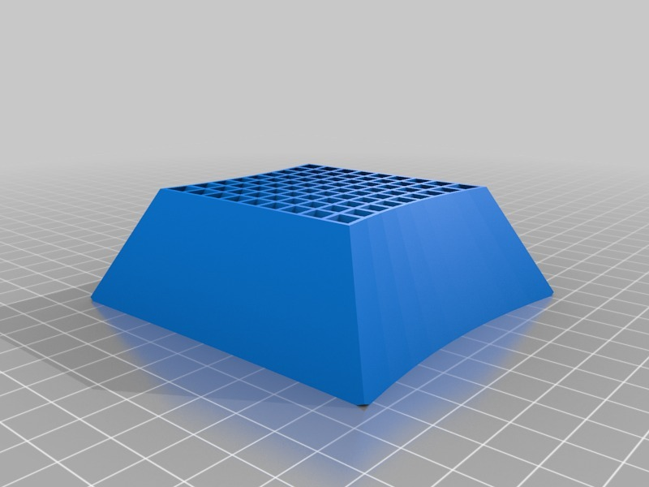
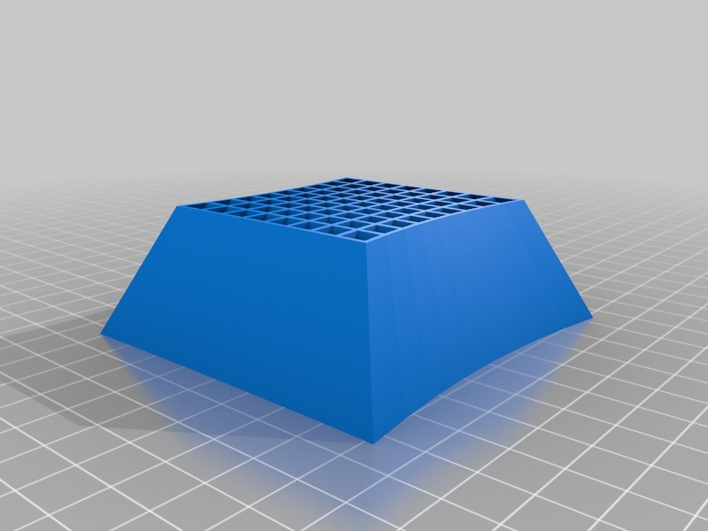
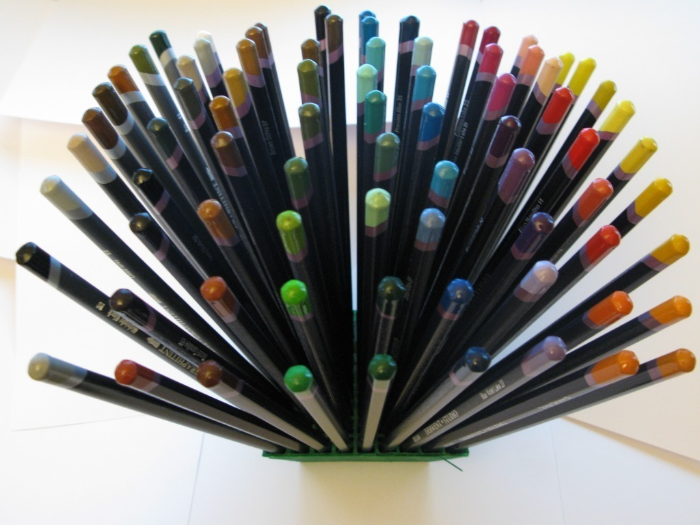
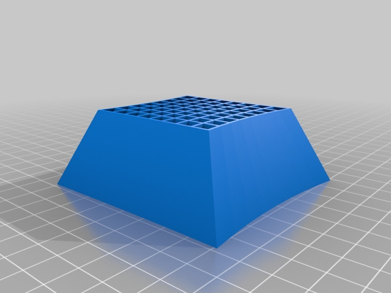
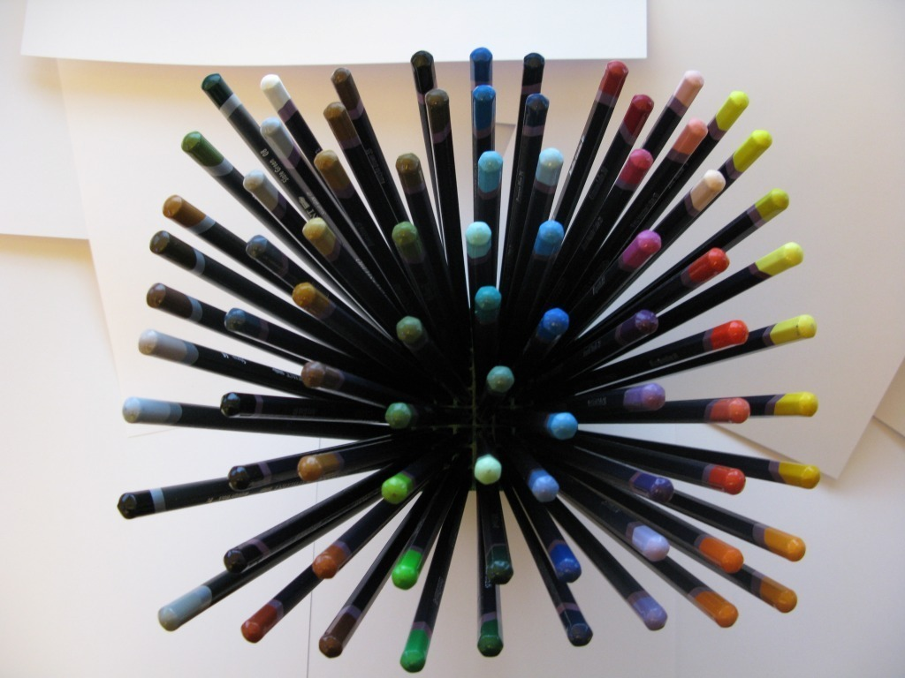
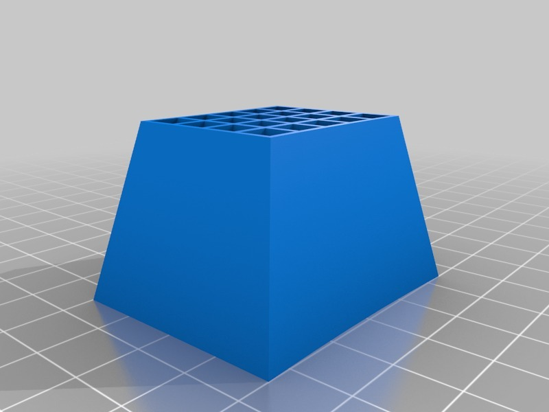
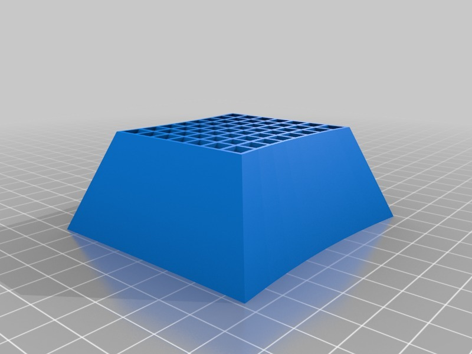
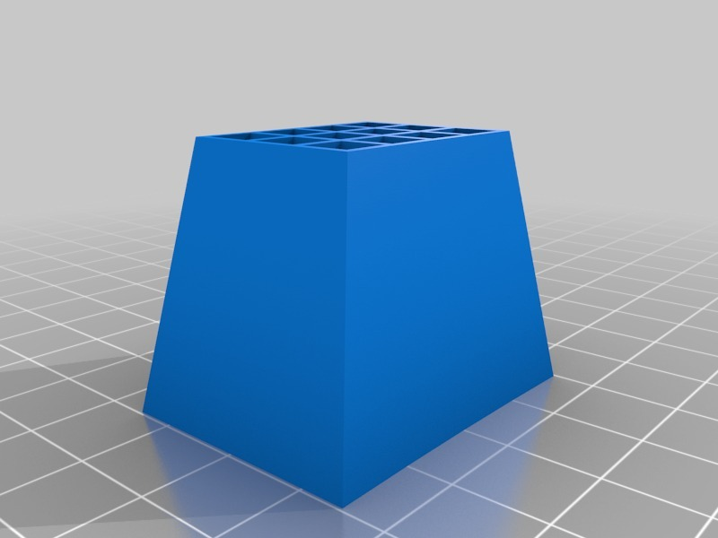
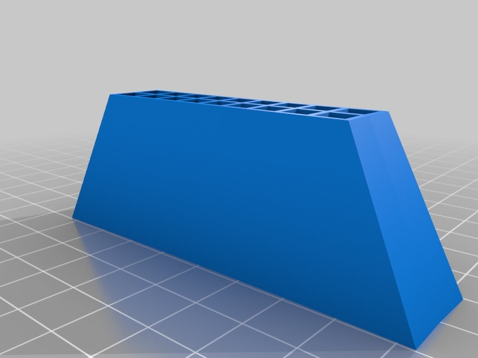
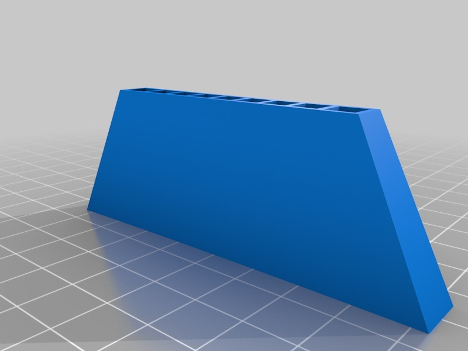
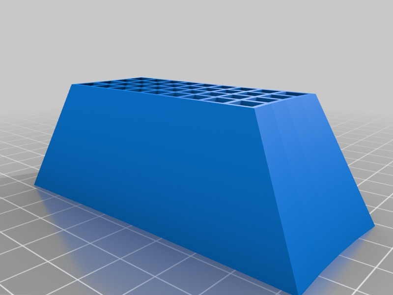
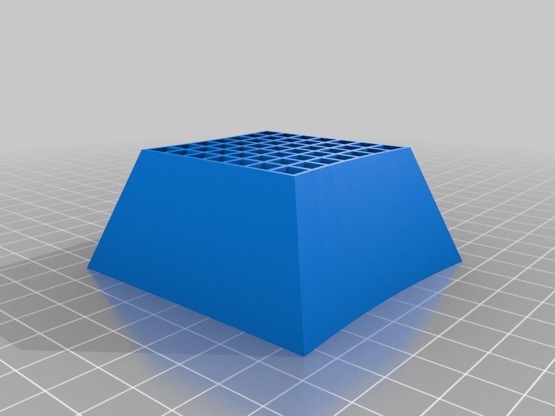
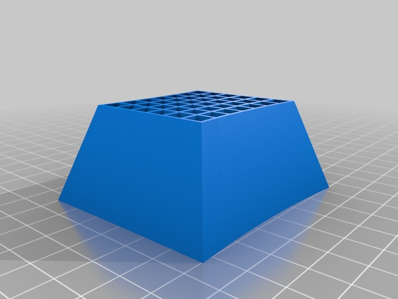
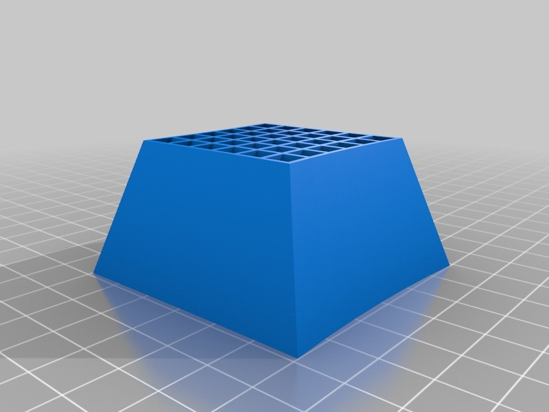
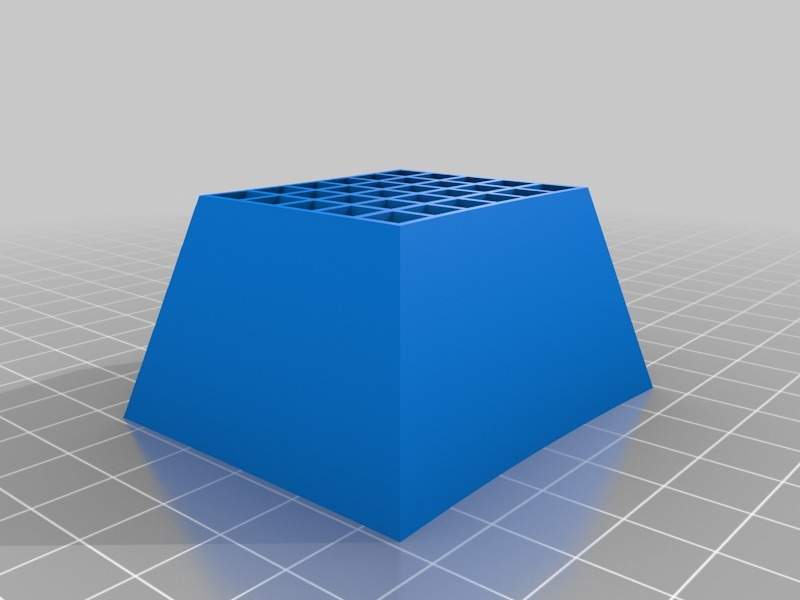
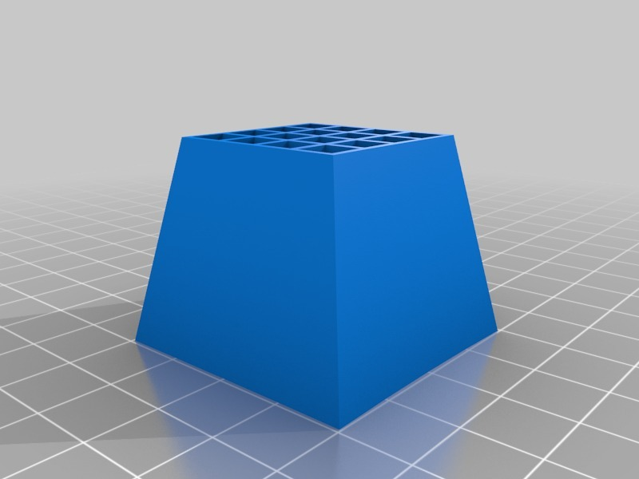
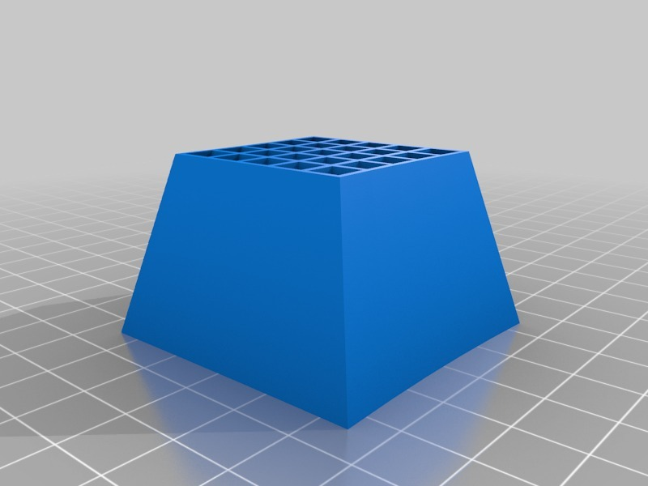

Tags
--------
holder , openscad , pencil , pencilfan  

  

License
--------
Pencils Fan by MakeALot is licensed under the Creative Commons - Attribution license.  

By: Mark Durbin (MakeALot)
--------
<http://NestedCube.com/>