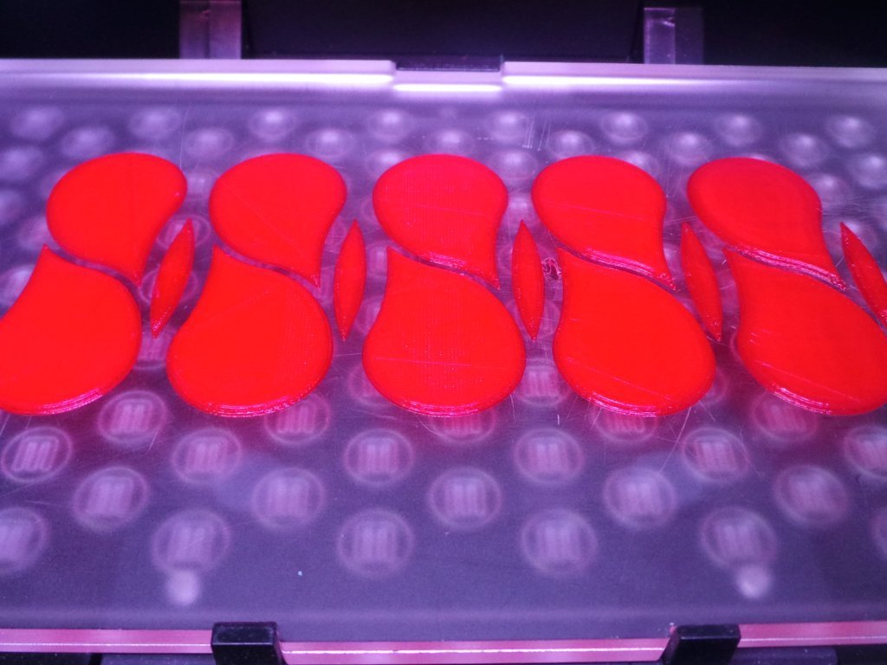
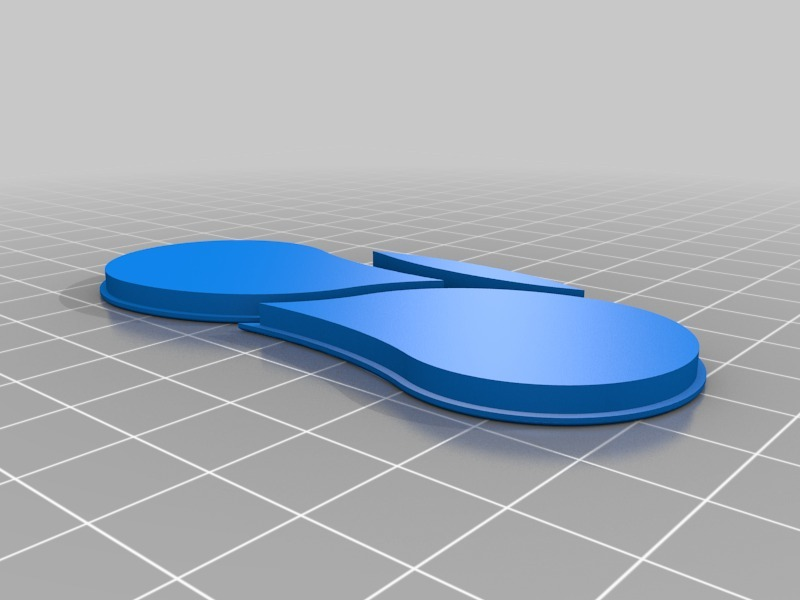

Pseudo Stained Glass lamp
===============
**Please note: This thing is part of a list that was [automatically generated](https://github.com/carlosgs/export-things) and may have been updated since then. Make sure to check for the current license and authorship.**  

Pseudo Stained Glass lamp  by MakeALot , published Dec 3, 2012

Description
--------
An art deco style lamp shade.

Instructions
--------
I thought of turning it upside-down and mounting it on a straight tube with a couple of long printed leaves like a tulip. 
 
Print one Lamp and as many and varied colours of Lamp Glass, the glass just pushes in from behind.

Files
--------

 [ Lamp1.stl](Lamp1.stl)  

 [ Lamp1Glass.stl](Lamp1Glass.stl)  

Pictures
--------

Tags
--------
art_deco , lamp , lamp_shade , stained_glass  

  

License
--------
Pseudo Stained Glass lamp by MakeALot is licensed under the Creative Commons - Attribution license.  

By: Mark Durbin (MakeALot)
--------
<http://NestedCube.com/>