Things designed by Mark Durbin (MakeALot) from Thingiverse
===============

**Please note: This list of things was [automatically generated](https://github.com/carlosgs/export-things). Make sure to check the individual licenses and authorships.**  
1. [Exposed Pots](Exposed-Pots/)
--------
[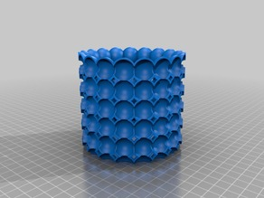](Exposed-Pots/)  

2. [Replicator 2 small spool holder](Replicator-2-small-spool-holder/)
--------
[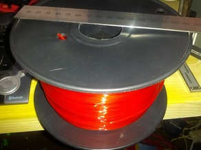](Replicator-2-small-spool-holder/)  

3. [Big Ben](Big-Ben/)
--------
  

4. [Springless, drop In ToM MK6+ replacement](Springless-drop-In-ToM-MK6-replacement/)
--------
[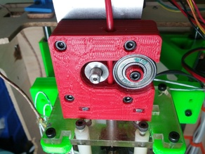](Springless-drop-In-ToM-MK6-replacement/)  

5. [Helter Skelter](Helter-Skelter/)
--------
[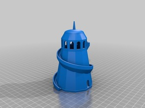](Helter-Skelter/)  

6. [Lutyens bench](Lutyens-bench/)
--------
[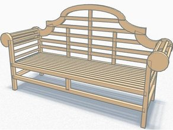](Lutyens-bench/)  

7. [Striped 73 Knot](Striped-73-Knot/)
--------
[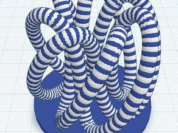](Striped-73-Knot/)  

8. [Lewis #Chess](Lewis-Chess/)
--------
[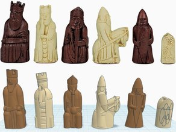](Lewis-Chess/)  

9. [Knotted Chalice #Chess](Knotted-Chalice-Chess/)
--------
[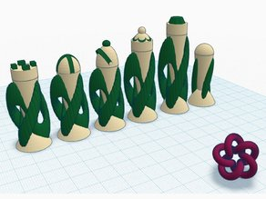](Knotted-Chalice-Chess/)  

10. [Tea Set #Chess](Tea-Set-Chess/)
--------
[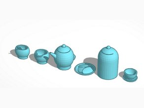](Tea-Set-Chess/)  

11. [Battery #Chess](Battery-Chess/)
--------
[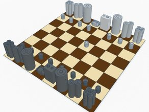](Battery-Chess/)  

12. [Component #Chess](Component-Chess/)
--------
[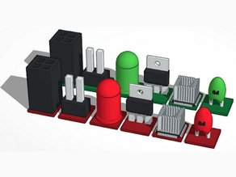](Component-Chess/)  

13. [LG Inspired #Chess](LG-Inspired-Chess/)
--------
[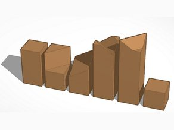](LG-Inspired-Chess/)  

14. [Lanier Graham #Chess](Lanier-Graham-Chess/)
--------
[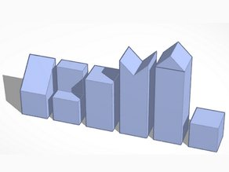](Lanier-Graham-Chess/)  

15. [Thai - Ouk Chatrang #Chess](Thai-Ouk-Chatrang-Chess/)
--------
[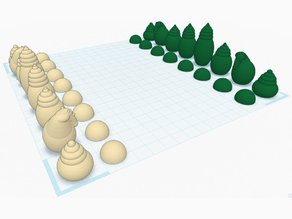](Thai-Ouk-Chatrang-Chess/)  

16. [Amsterdam House #Chess](Amsterdam-House-Chess/)
--------
[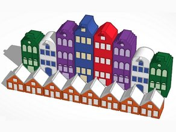](Amsterdam-House-Chess/)  

17. [Nishapur #Chess](Nishapur-Chess/)
--------
[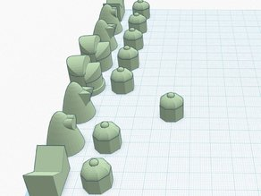](Nishapur-Chess/)  

18. [Crown #Chess](Crown-Chess/)
--------
  

19. [Who #Chess](Who-Chess/)
--------
[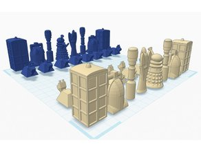](Who-Chess/)  

20. [Android #Chess](Android-Chess/)
--------
[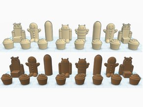](Android-Chess/)  

21. [Trad #Chess](Trad-Chess/)
--------
[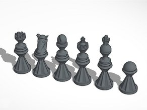](Trad-Chess/)  

22. [Choco #Chess](Choco-Chess/)
--------
[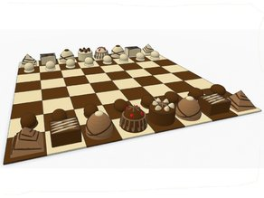](Choco-Chess/)  

23. [Trash Can #Chess](Trash-Can-Chess/)
--------
[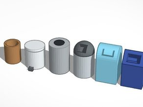](Trash-Can-Chess/)  

24. [PlayBlock Block #Chess](PlayBlock-Block-Chess/)
--------
[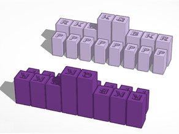](PlayBlock-Block-Chess/)  

25. [Spooky #Chess](Spooky-Chess/)
--------
[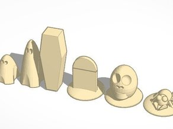](Spooky-Chess/)  

26. [Heading #Chess](Heading-Chess/)
--------
[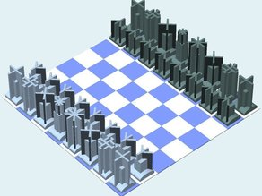](Heading-Chess/)  

27. [Column #Chess](Column-Chess/)
--------
[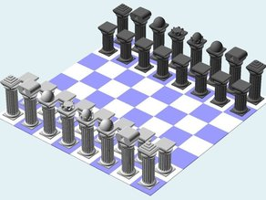](Column-Chess/)  

28. [Diamond Hourglass #Chess](Diamond-Hourglass-Chess/)
--------
[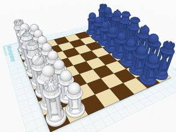](Diamond-Hourglass-Chess/)  

29. [Bud Vase](Bud-Vase/)
--------
[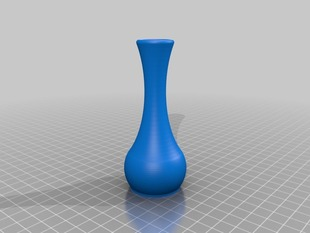](Bud-Vase/)  

30. [Ball #Chess](Ball-Chess/)
--------
[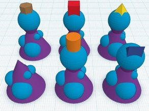](Ball-Chess/)  

31. [Heart #Chess](Heart-Chess/)
--------
[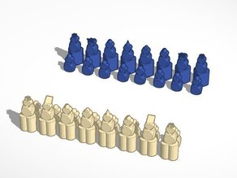](Heart-Chess/)  

32. [Rhombic dodecahemioctahedron play set](Rhombic-dodecahemioctahedron-play-set/)
--------
[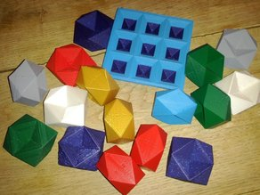](Rhombic-dodecahemioctahedron-play-set/)  

33. [iFlown (with Awe-chute)](iFlown-with-Awe-chute/)
--------
[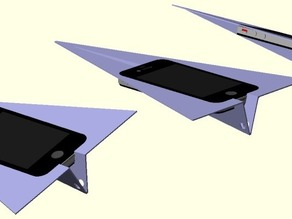](iFlown-with-Awe-chute/)  

34. [Open Top ToM](Open-Top-ToM/)
--------
[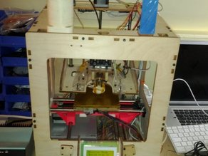](Open-Top-ToM/)  

35. [Crumpet](Crumpet/)
--------
[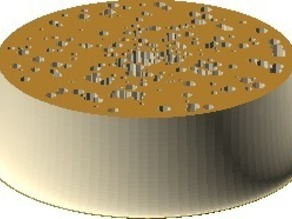](Crumpet/)  

36. [Rhombic Dodecahemioctahedron](Rhombic-Dodecahemioctahedron/)
--------
[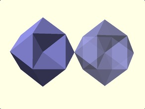](Rhombic-Dodecahemioctahedron/)  

37. [Super Bowl](Super-Bowl/)
--------
[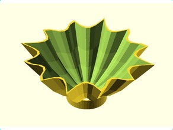](Super-Bowl/)  

38. [Cupped Sculptures](Cupped-Sculptures/)
--------
[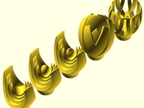](Cupped-Sculptures/)  

39. [Klein Bottle from simple primitives](Klein-Bottle-from-simple-primitives/)
--------
[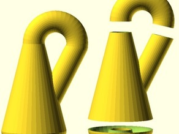](Klein-Bottle-from-simple-primitives/)  

40. [TBuser Icon test Pot](TBuser-Icon-test-Pot/)
--------
[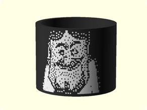](TBuser-Icon-test-Pot/)  

41. [basic receptacles](basic-receptacles/)
--------
[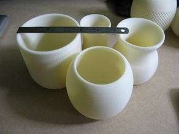](basic-receptacles/)  

42. [two colour calibration cubes](two-colour-calibration-cubes/)
--------
[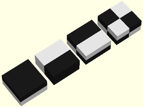](two-colour-calibration-cubes/)  

43. [Slotted bowl with lid](Slotted-bowl-with-lid/)
--------
[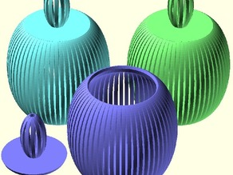](Slotted-bowl-with-lid/)  

44. [Checked Gingham 2 Part Picnic Parisian Goblet](Checked-Gingham-2-Part-Picnic-Parisian-Goblet/)
--------
[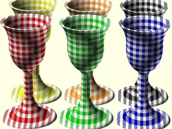](Checked-Gingham-2-Part-Picnic-Parisian-Goblet/)  

45. [XOR-able objects](XOR-able-objects/)
--------
[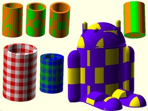](XOR-able-objects/)  

46. [Peeled Bre](Peeled-Bre/)
--------
[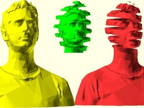](Peeled-Bre/)  

47. [Two Colour(Color) Spiral Cup](Two-Colour-Color-Spiral-Cup/)
--------
[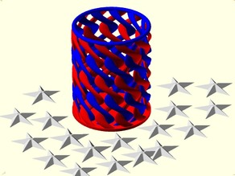](Two-Colour-Color-Spiral-Cup/)  

48. [Linear Bearing Y Axis Carriage for ToM](Linear-Bearing-Y-Axis-Carriage-for-ToM/)
--------
[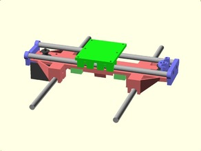](Linear-Bearing-Y-Axis-Carriage-for-ToM/)  

49. [Bell with integral clapper](Bell-with-integral-clapper/)
--------
[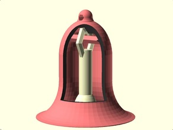](Bell-with-integral-clapper/)  

50. [Bells or Bowls](Bells-or-Bowls/)
--------
[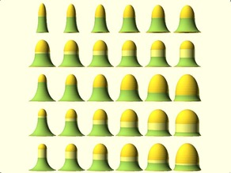](Bells-or-Bowls/)  

51. [Parisian Goblet for picnics](Parisian-Goblet-for-picnics/)
--------
[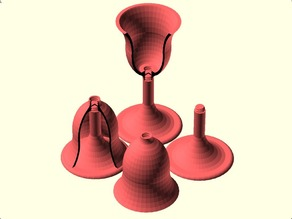](Parisian-Goblet-for-picnics/)  

52. [MB Robot #2,#3,#4....](MB-Robot-2-3-4/)
--------
[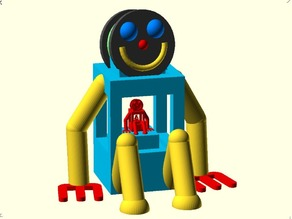](MB-Robot-2-3-4/)  

53. [MB Robot #1](MB-Robot-1/)
--------
  

54. [Heart Bracelet](Heart-Bracelet/)
--------
  

55. [Pen lid Garden set](Pen-lid-Garden-set/)
--------
  

56. [Set of Dominoes for printing](Set-of-Dominoes-for-printing/)
--------
  

57. [Linear Bearing  X Axis Carriage for ToM](Linear-Bearing-X-Axis-Carriage-for-ToM/)
--------
  

58. [Pencil Cone](Pencil-Cone/)
--------
  

59. [Side Stackable Component Bins / Louvre Panel Trays](Side-Stackable-Component-Bins-Louvre-Panel-Trays/)
--------
  

60. [Bre heads are better than one](Bre-heads-are-better-than-one/)
--------
  

61. [Pencils Fan](Pencils-Fan/)
--------
  

62. [Spiro-Coasters](Spiro-Coasters/)
--------
  

63. [Spiropot](Spiropot/)
--------
  

64. [Bezier Heart Bracelet in OpenScad](Bezier-Heart-Bracelet-in-OpenScad/)
--------
  

65. [Pencil holder dome (safety reversible)](Pencil-holder-dome-safety-reversible/)
--------
  

66. [Hyperboloid pencil holder](Hyperboloid-pencil-holder/)
--------
  

67. [Hyperboloid with base, desktop pencil holder](Hyperboloid-with-base-desktop-pencil-holder/)
--------
  

68. [Makerbot Spool model](Makerbot-Spool-model/)
--------
  

69. [Yet Another Printable Spool - Crank](Yet-Another-Printable-Spool-Crank/)
--------
  

70. [ToM filament guide](ToM-filament-guide/)
--------
  

71. [BraceletX](BraceletX/)
--------
  

72. [Yet Another Printable Spool](Yet-Another-Printable-Spool/)
--------
  

73. [Custom Shop Flames](Custom-Shop-Flames/)
--------
  

74. [Octo(pie and mash)up](Octo-pie-and-mash-up/)
--------
  

75. [Plain Goblet](Plain-Goblet/)
--------
  

76. [Tartan ABS available in 3mm and 1.75mm](Tartan-ABS-available-in-3mm-and-1-75mm/)
--------
  

77. [Maker Logo Bracelet IX](Maker-Logo-Bracelet-IX/)
--------
  

78. [Bracelet VIII](Bracelet-VIII/)
--------
  

79. [Bracelet VII](Bracelet-VII/)
--------
  

80. [Bracelet VI](Bracelet-VI/)
--------
  

81. [Bracelet V](Bracelet-V/)
--------
  

82. [Bracelet IV](Bracelet-IV/)
--------
  

83. [Bracelet III](Bracelet-III/)
--------
  

84. [linkBracelet (or Ring when scaled!)](linkBracelet-or-Ring-when-scaled/)
--------
  

85. [bracelet II](bracelet-II/)
--------
  

86. [Ball Maze](Ball-Maze/)
--------
  

87. [Asus EeeTop All-In-One PC Pole Mount](Asus-EeeTop-All-In-One-PC-Pole-Mount/)
--------
  

88. [Extending Tube](Extending-Tube/)
--------
  

89. [Offset Bowl](Offset-Bowl/)
--------
  

90. [Pencil Bolt Case](Pencil-Bolt-Case/)
--------
  

91. [Bolt Pencil Case](Bolt-Pencil-Case/)
--------
  

92. [Spiral Cup II](Spiral-Cup-II/)
--------
  

93. [Twisted bracelet](Twisted-bracelet/)
--------
  

94. [Parametric Knot](Parametric-Knot/)
--------
  

95. [Spiral Pencil/Candle/Toothbrush Cup](Spiral-Pencil-Candle-Toothbrush-Cup/)
--------
  

96. [Can anyone turn this picture file into a 3d printable .stl](Can-anyone-turn-this-picture-file-into-a-3d-printable-stl/)
--------
  

97. [Android Honeycomb device rest](Android-Honeycomb-device-rest/)
--------
  

98. [Android Device Rest](Android-Device-Rest/)
--------
  

99. [ToM Extruder Relay Fix](ToM-Extruder-Relay-Fix/)
--------
  

100. [3D Knot](3D-Knot/)
--------
  

  

License
--------
Please check the individual pages for each design

By: Mark Durbin (MakeALot)
--------
<http://NestedCube.com/>
