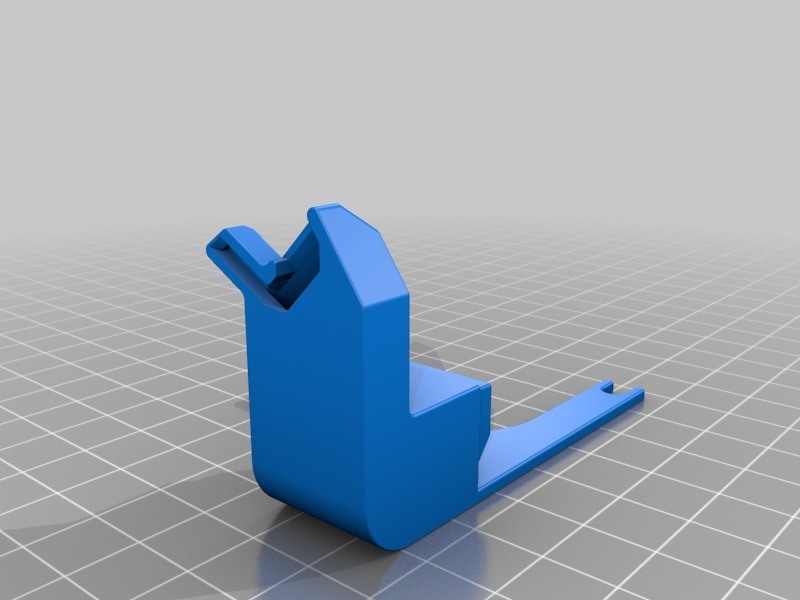
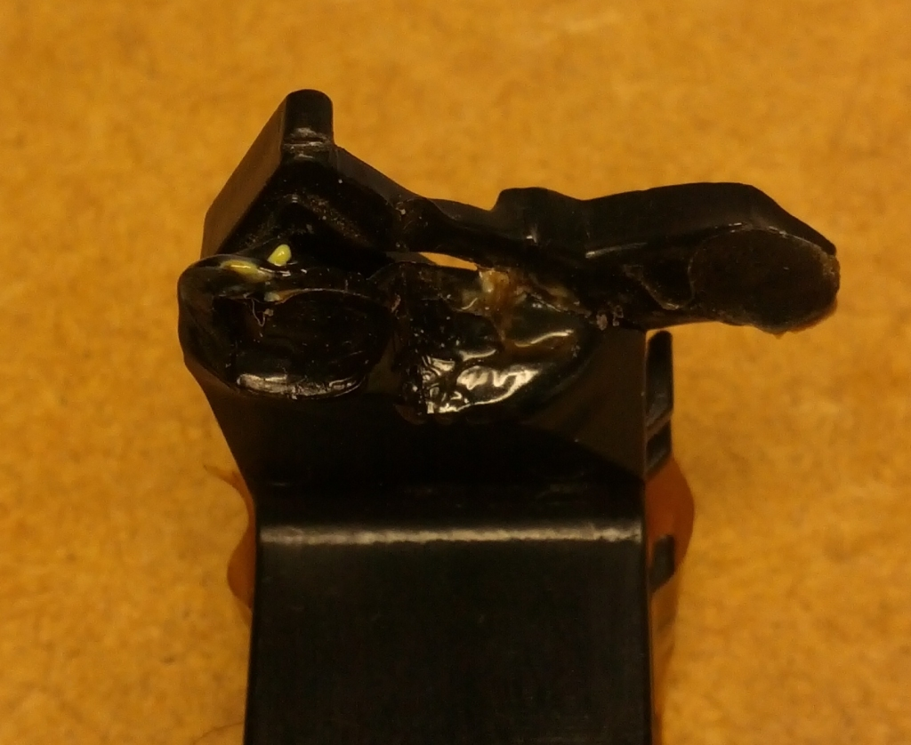
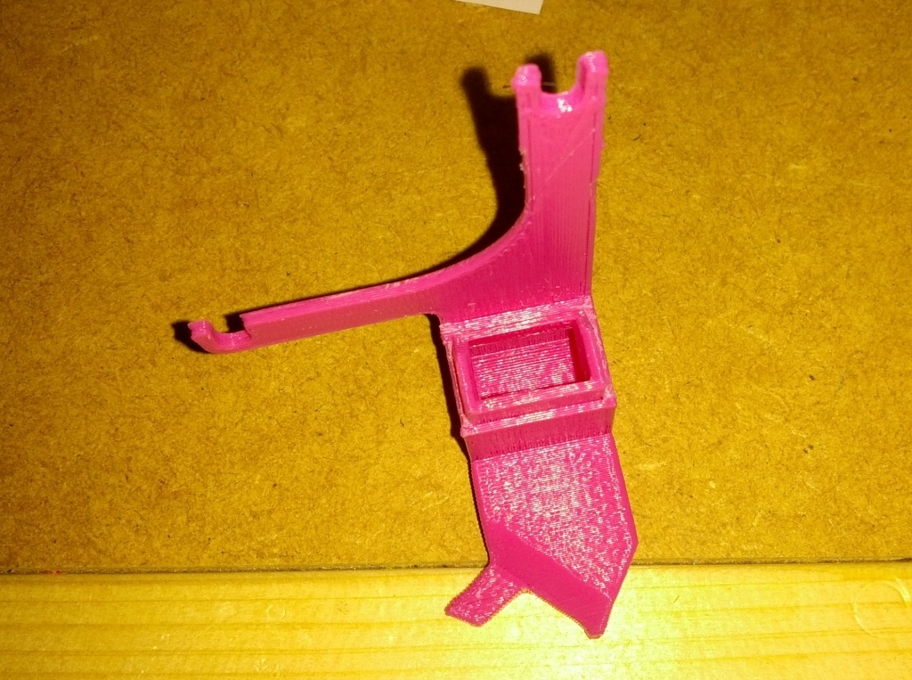
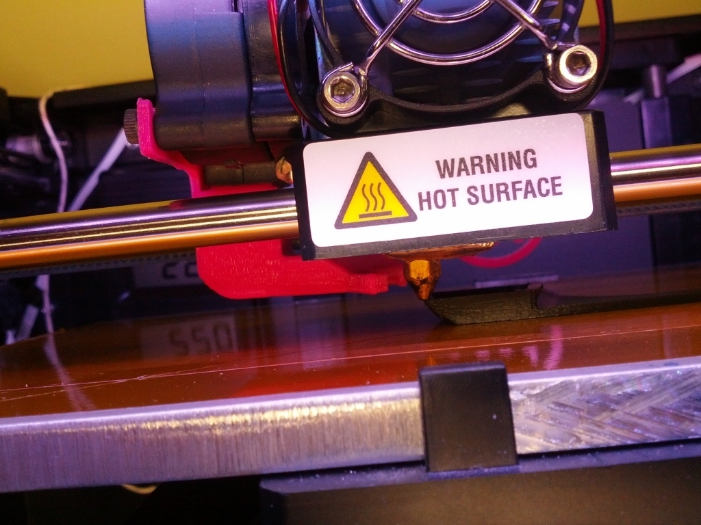

Replicator 2 Fan Duct replacement
===============
**Please note: This thing is part of a list that was [automatically generated](https://github.com/carlosgs/export-things) and may have been updated since then. Make sure to check for the current license and authorship.**  

Replicator 2 Fan Duct replacement  by MakeALot , published Feb 2, 2013

Description
--------
Yesterday, my fan duct broke off during a print and spent some time in the company of the hot end before I could recover it. 
 
I then had to attach it with tape.   
 
I thought I'd better model a new one before this fell off again and was no longer usable. 
 
I'm afraid my model may not be as accurate as I would like in the melted area as I never studied it prior to the hug with the head, so I don't know what it should look like.

Instructions
--------
If the same happens to you, loosen and remove the old one and slot in this replacement in from below. 
 
I've included the model for anyone with Alibre Design that wants to play/improve. 

Files
--------

 [ FanDuct.AD_PRT](FanDuct.AD_PRT)  

 [ FanDuct.stl](FanDuct.stl)  

Pictures
--------

Tags
--------
duct , Fan , Makerbot , repair , Replicator2 , Replicator_2  

  

License
--------
Replicator 2 Fan Duct replacement by MakeALot is licensed under the Creative Commons - Attribution license.  

By: Mark Durbin (MakeALot)
--------
<http://NestedCube.com/>