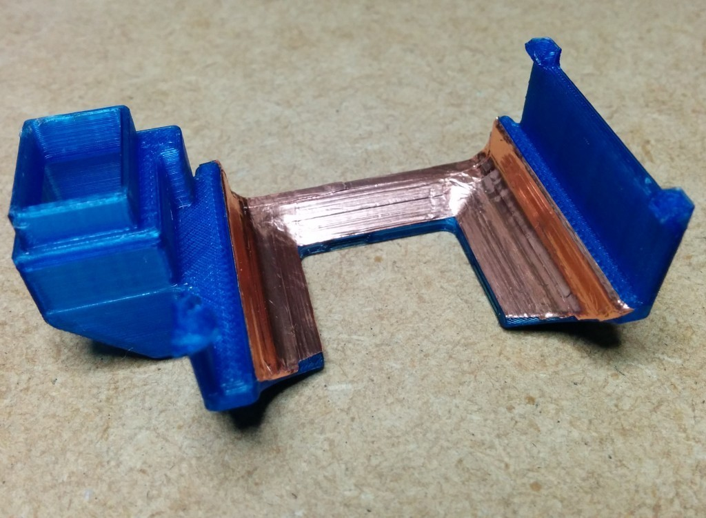
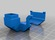
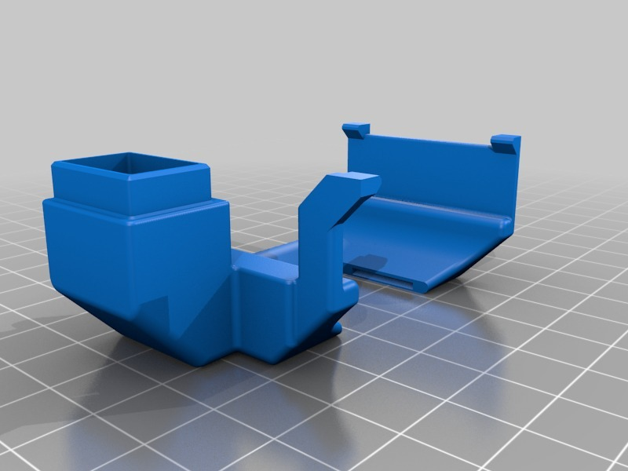
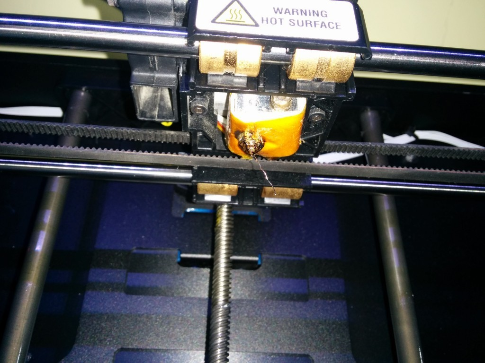
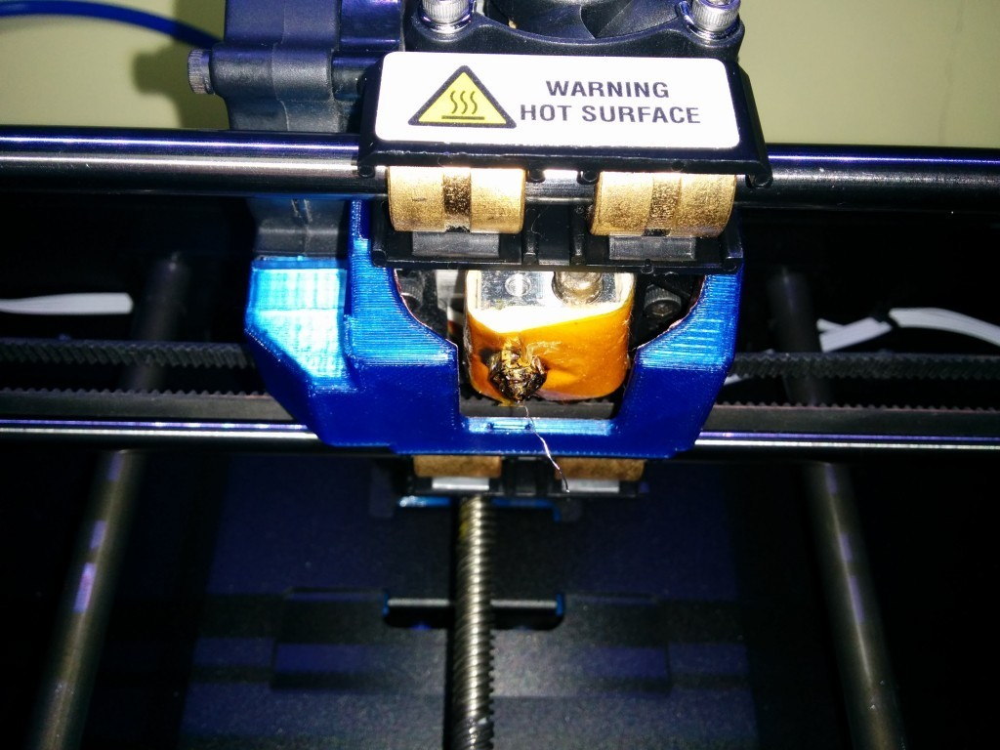
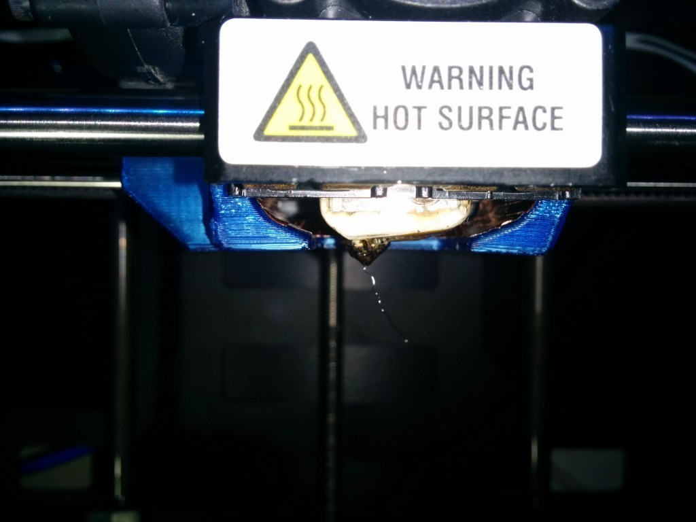
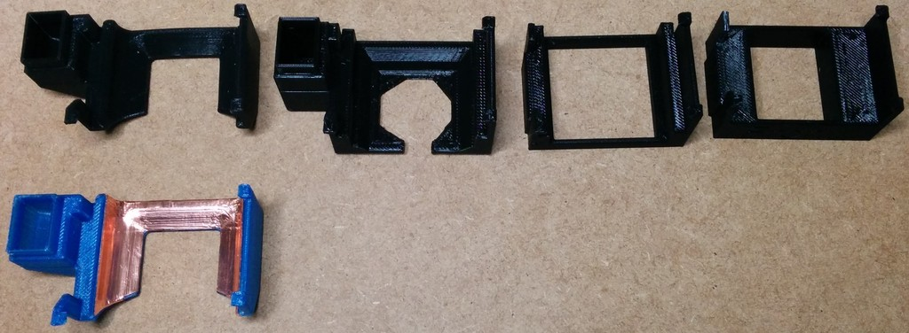
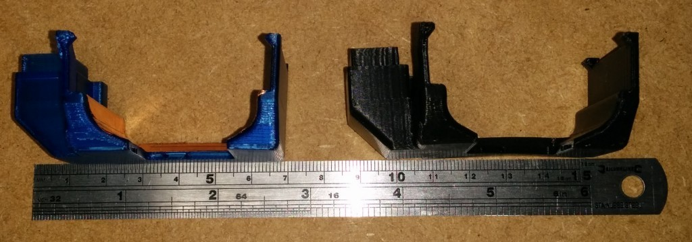

Replicator 2 Fan Duct revisited
===============
**Please note: This thing is part of a list that was [automatically generated](https://github.com/carlosgs/export-things) and may have been updated since then. Make sure to check for the current license and authorship.**  

Replicator 2 Fan Duct revisited  by MakeALot , published Mar 22, 2014

Description
--------
I've recently been printing using NinjaFlex (which is brilliant BTW). On angled thin walled prints, the Replicator 2 output cooling fan would sometimes push the filament to the right causing it miss the layer below.   
 
I wanted to remedy this by having the air come from both sides.   
 
My previous version of the fan duct suffered on some machines by being too low and as it was supported on one side, would hang down on the right.   
 
I realised that I could support the duct by clipping it on both sides of the carriage.   
 
I started out by making something that would clip on, then I attached it to the fan and then added the air ducts.  The first attempt enclosed the heating element too much and was too low.   
 
After printing for about three hours, a PLA version of the final design started to soften in the middle which meant that the clips at the sides became loose.   
 
I reprinted it in T-Glass and for good measure, I applied some copper tape to dissipate some of the heat.   
 
The one photographed (blue) has printed continuously for 10 hours at 250 degrees (Nylon) and shows no signs of melting.  It was cool to the touch when I removed it after the print.   
 
I have marked this as work-in-progress as I have only used it for a few days and it may need adjusting.   
 
Some air flow analysis would certainly help, but I'm afraid I don't have any such tools :( so I'll have to settle for the empirical approach...  Unless you can help?   
 
__Update__   
I found the airflow from the small holes was too powerful, I've produced a version with wider holes that is more gentle whilst still providing air from 3 sides.

Instructions
--------
Remove the old fan duct by loosening the two screws on the left of the carriage and sliding it down.   
 
Re tighten the screws right against the fan, taking care not to over tighten them as they are inserted directly into the plastic ( they have no metal threaded inserts).   
 
To attach the fan duct. Hook the two clips over the right hand side of the carriage and gently push the left hand side up into the fan, make sure that the front left clip is hooked onto the carriage.   
 
Given the orientation of the print, the vertical columns that hold the clips could be snapped off if bent too far while attaching, I haven't broken any off, so it's reasonably robust.   
 
The fan duct can be removed and replaced without any screws etc.   
 
I've included my Replicator 2 Makerware settings in a file called TGlass.json for any one who'd like to know the print settings I used.

Files
--------

 [ TGlass.json](TGlass.json)  

 [ ReplicatorFanDuct2.stl](ReplicatorFanDuct2.stl)  

 [ ReplicatorFanDuct2_wider_holes.stl](ReplicatorFanDuct2_wider_holes.stl)  

Pictures
--------

Tags
--------
duct , fan , fan_duct , Replicator_2  

  

License
--------
Replicator 2 Fan Duct revisited by MakeALot is licensed under the Creative Commons - Attribution - Share Alike license.  

By: Mark Durbin (MakeALot)
--------
<http://NestedCube.com/>