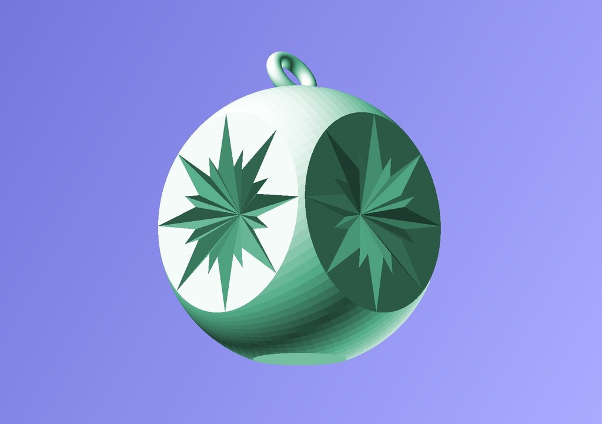
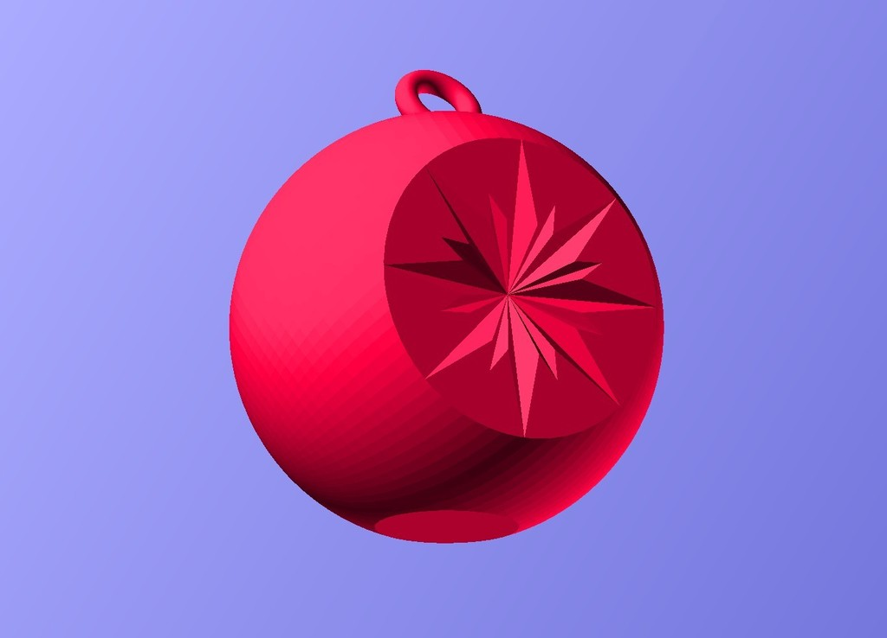
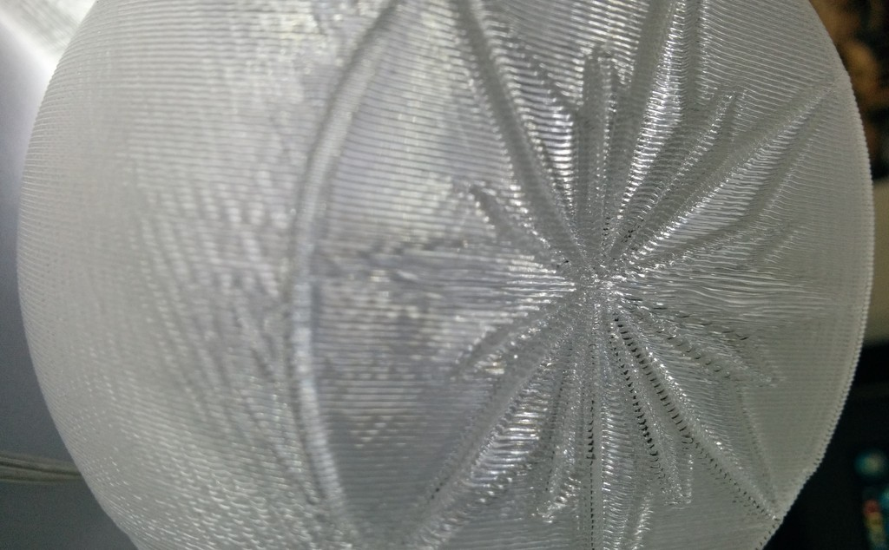
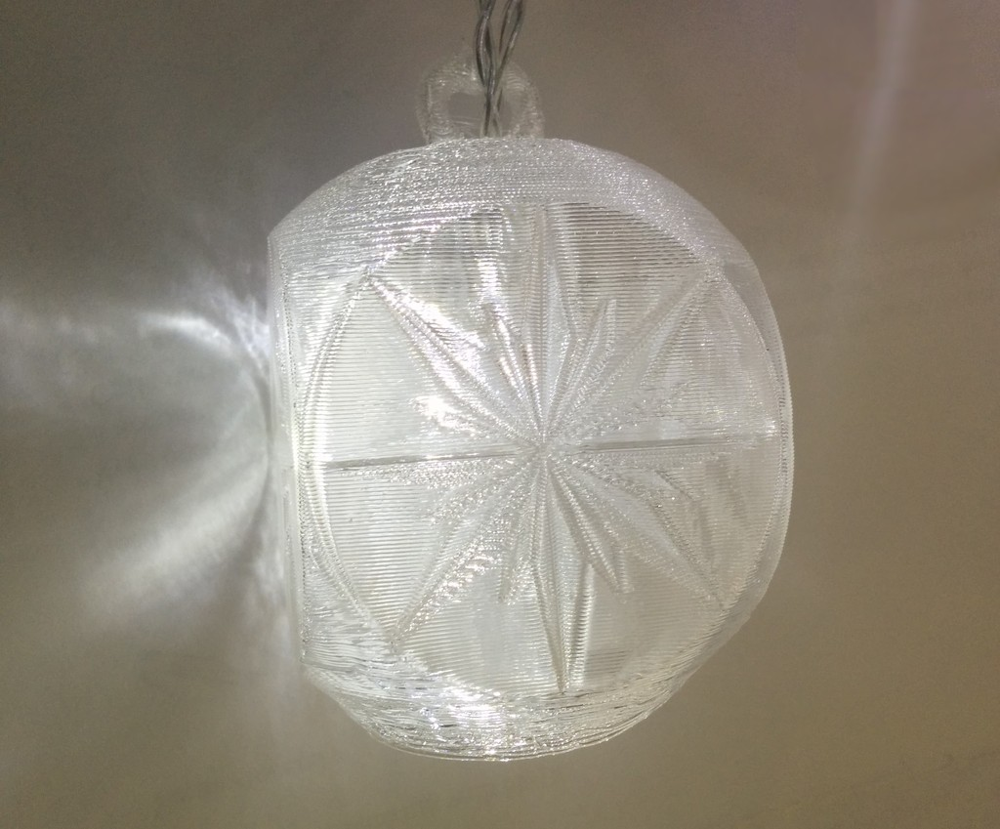
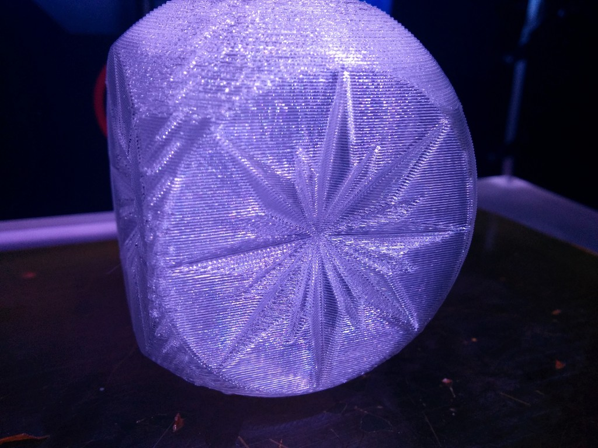

Retro Bauble
===============
**Please note: This thing is part of a list that was [automatically generated](https://github.com/carlosgs/export-things) and may have been updated since then. Make sure to check for the current license and authorship.**  

Retro Bauble  by MakeALot , published Nov 27, 2013

Description
--------
Attempt to capture the look of the 1960's indented glass baubles my parents had on their tree.   
 
Prints very nicely with 2 perimeters and no fill.

Instructions
--------
None

Files
--------

 [ starBauble.stl](starBauble.stl)  

 [ starBauble2Side.stl](starBauble2Side.stl)  

 [ starBauble.scad](starBauble.scad)  

Pictures
--------

Tags
--------
bagatelle , Bauble , bibelot , Christmas , Christmas_ornaments , christmas_tree , curiosity , frippery , furbelow , gewgaw , gimcrack , gimmick , knick-knack , MakerBotOrnaments , novelty , Ornament , plaything , toy , Tree , trifle , trinket  

  

License
--------
Retro Bauble by MakeALot is licensed under the Creative Commons - Attribution license.  

By: Mark Durbin (MakeALot)
--------
<http://NestedCube.com/>